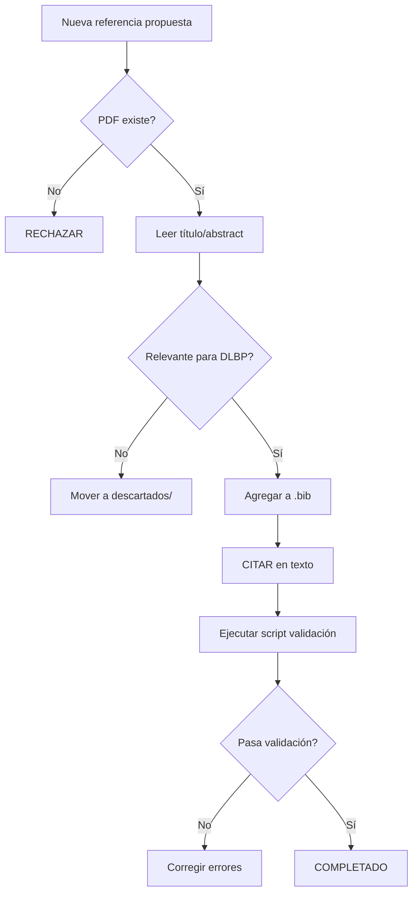

# Reglas Personalizadas para Agentes - Workspace OBC

## 📌 Contexto del Workspace
Este workspace contiene el anteproyecto de maestría sobre **DLBP (Disassembly Line Balancing Problem) aplicado a la industria avícola colombiana**, con enfoque en metaheurísticas.

---

## 🎯 Reglas Generales de Trabajo

### 1. Validación Bibliográfica
**SIEMPRE** antes de hacer cambios a archivos `.bib`:

```powershell
# Script de validación obligatorio
$md_content = Get-Content "anteproyecto_dlbp_coproductos.md" -Raw;
$citations = [regex]::Matches($md_content, "@([a-zA-Z0-9_-]+)") | ForEach-Object { $_.Groups[1].Value } | Sort-Object -Unique;
$bib_content = Get-Content "referencias_dlbp.bib" -Raw;
$bib_keys = [regex]::Matches($bib_content, "@.*?{([a-zA-Z0-9_-]+),") | ForEach-Object { $_.Groups[1].Value } | Sort-Object -Unique;

# Identificar desalineaciones
$unused = $bib_keys | Where-Object { $_ -notin $citations };
$missing = $citations | Where-Object { $_ -notin $bib_keys };
```

**Razón:** Evitar el error de tener 60 referencias en `.bib` pero solo 28 citadas.

---

### 2. Manejo de PDFs

#### Regla de Oro: PDF-First Validation
**NUNCA confíes en el nombre del archivo PDF**. SIEMPRE:
1. Abre el PDF
2. Lee el título y abstract
3. Verifica autores y año
4. Confirma relevancia antes de agregar al `.bib`

**Ejemplo del error que debes evitar:**
- Archivo: `sensors-22-03920-v3.pdf`
- Nombre sugiere: "Sensores en avicultura"
- Contenido real: "Predictive Approach for DLBP" (Paprocka2022)

#### Separación de PDFs
- **Conservar en `data/`:** Solo PDFs con citas ACTIVAS en el markdown
- **Mover a `data/descartados/`:** PDFs validados como N/A (irrelevantes)
- **Regla crítica:** Antes de mover a descartados, ejecutar el script de validación

---

### 3. Gestión de Referencias

#### Un Solo Archivo `.bib`
- **Archivo maestro:** `referencias_dlbp.bib`
- **NO mantener:** `referencias_locales.bib` (genera inconsistencias)
- **Formato de entrada:**
```bibtex
@article{CiteKey2024,
  author    = {Apellido, Nombre},
  title     = {Título completo del artículo},
  journal   = {Nombre de la revista},
  year      = {2024},
  volume    = {XX},
  number    = {X},
  pages     = {XXX--XXX},
  doi       = {10.XXXX/xxxxxx},
  note      = {Descripción breve del aporte + ruta al PDF si existe}
}
```

#### Prioridades de Referencias
1. **Alta prioridad (mantener):** DLBP directo, metaheurísticas, industria avícola
2. **Media prioridad:** Optimización general aplicable al problema
3. **Baja prioridad (descartar):** Genéricos sin conexión clara

---

### 4. Protocolo de Citación

#### Antes de Agregar una Nueva Referencia
1. ✅ Verificar que el PDF existe en `data/`
2. ✅ Leer metadata (título, autores, año, journal)
3. ✅ Evaluar relevancia (¿Aporta al DLBP/metaheurísticas/avicultura?)
4. ✅ Agregar entrada al `.bib` con `note` descriptivo
5. ✅ **CITAR en el texto** (no solo agregar al `.bib`)
6. ✅ Ejecutar script de validación

#### Formato de Cita en Markdown
```markdown
[@CiteKey2024]
[@CiteKey2024; @OtraCita2023]
```

---

### 5. Detección de Citas "Fantasma"

**Señales de alerta:**
- Cita con métricas muy específicas (e.g., "reducción del 23%")
- Referencia a empresa/proyecto local sin DOI
- Archivo PDF inexistente o no coincide con metadata

**Acción:** Investigar a fondo. Si no hay fuente verificable → **ELIMINAR**

**Ejemplo histórico:**
- `@AltairOptimization2019` - Eliminada (no verificable)

---

### 6. Nomenclatura de Archivos

#### PDFs
- Formato preferido: `apellido-year-titulo-corto.pdf`
- Alternativa aceptable: `doi_XX.XXXX_journal.year.pdf`
- **Evitar:** Nombres genéricos como `paper1.pdf`, `ref_temp.pdf`

#### CiteKeys
- Formato: `AutorAñoTemaCorto` (e.g., `Paprocka2022`, `Mete2022`)
- **NO usar:** Caracteres especiales, guiones al inicio, números solos

---

### 7. Reportes de Validación

Antes de finalizar una sesión de trabajo bibliográfico, **SIEMPRE generar:**

```markdown
# Reporte de Validación Bibliográfica
**Fecha:** YYYY-MM-DD

## Métricas
- Citas en MD: XX
- Entradas en BIB: XX
- Coincidencia: XX% 

## Referencias no usadas
[Lista]

## Referencias faltantes
[Lista]

## Acciones recomendadas
[Lista]
```

---

### 8. Artifacts Críticos

#### Mantener Actualizados
1. `task.md` - Checklist de trabajo actual
2. `FINAL_PROJECT_ANALYSIS_REPORT.md` - Estado del proyecto
3. `CHECKPOINT_XX_RESUMEN_EJECUTIVO.md` - Resumen de cada sesión mayor

#### Generar Cuando
- **Validación de referencia:** `REF-XX_validation.md`
- **Corrección de error:** `REF-XX_corrected.md`
- **Decisión importante:** `decision_TEMA.md`

---

### 9. Comandos Útiles (PowerShell)

#### Contar referencias
```powershell
Select-String -Path "referencias_dlbp.bib" -Pattern "^@" | Measure-Object
```

#### Buscar cita en markdown
```powershell
Select-String -Path "anteproyecto_dlbp_coproductos.md" -Pattern "@NombreCita"
```

#### Listar PDFs en data/
```powershell
Get-ChildItem "data/" -Filter "*.pdf" | Select-Object Name
```

---

### 10. Red Flags - Cuándo Detener y Consultar

🚨 **DETÉN EL TRABAJO** si:
1. El script de validación muestra >5 referencias desalineadas
2. Encuentras una cita sin archivo PDF correspondiente
3. Un PDF no coincide con la entrada del `.bib`
4. El usuario menciona "referencias faltantes" o "duplicadas"

**Acción:** Ejecutar auditoría completa antes de continuar.

---

## 🎓 Filosofía de Trabajo

### Calidad > Cantidad
- 30 referencias excelentes > 60 referencias mediocres
- Cada cita debe APORTAR al argumento

### Honestidad Académica
- NO inventar referencias
- NO confiar en fuentes no verificables
- SÍ eliminar citas "fantasma"

### Documentación Exhaustiva
- Cada decisión importante → artifact
- Cada error corregido → nota en reporte
- Cada validación → script reutilizable

---

## 🔄 Workflow Estándar para Nueva Referencia



---

### 11. Documentación Continua Obligatoria
**Regla de Oro:** Todo avance técnico (código, modelos, experimentos) debe reflejarse inmediatamente en la carpeta `documentacion/`.

- **Ubicación:** Centralizar toda la documentación en `documentacion/`.
- **Sincronización:** No considerar una tarea "Terminada" (Done) hasta que su documentación (plan, readme, o reporte) esté actualizada.
- **Evidencia:** Los cambios en código sin actualización de documentación asociada serán considerados incompletos.

---

### 12. Protocolo de Búsqueda Bibliográfica

#### Bases de Datos (en orden de prioridad)
1. **Scopus** (Acceso Institucional UTP) - Primera opción
2. **Web of Science** (Acceso Institucional)
3. **Google Scholar** (Acceso libre, menor calidad)

#### Queries Estándar para el Proyecto
```
Q1: ("disassembly line balancing" OR "DLBP") AND ("stochastic" OR "uncertain")
Q2: ("disassembly line balancing") AND ("genetic algorithm" OR "tabu search" OR "hybrid")
Q3: ("food processing" OR "poultry") AND ("optimization" OR "line balancing")
Q4: ("assembly line balancing") AND ("multi-objective" OR "pareto")
```

#### Flujo de Trabajo Usuario ↔ Agente
1. **Usuario ejecuta búsqueda** en Scopus con credenciales UTP
2. **Usuario reporta:** # resultados + Top 5 papers (título + DOI)
3. **Agente genera:** Entradas BibTeX automáticas desde DOI
4. **Agente integra:** Actualiza `referencias_dlbp.bib` + cita en documentos
5. **Validación:** Ejecutar script de consistencia citas↔bib

#### Almacenamiento de Papers
- **Ruta:** `data/papers_nuevos/`
- **Nomenclatura:** `Autor_Año_TituloCorto.pdf`

#### Guía Detallada
Ver: `documentacion/GUIA_BUSQUEDA_BIBLIOGRAFICA.md`

## 📞 Recursos de Emergencia

Si encuentras un problema crítico:
1. Consulta `FINAL_PROJECT_ANALYSIS_REPORT.md`
2. Revisa `CHECKPOINT_XX_RESUMEN_EJECUTIVO.md` más reciente
3. Ejecuta script de validación completo
4. Documenta el problema en nuevo artifact
5. **PREGUNTA AL USUARIO** antes de eliminar/modificar masivamente

---

**Última actualización:** 26 de Noviembre de 2025  
**Versión:** 1.0  
**Mantenedor:** Agentes del workspace OBC
