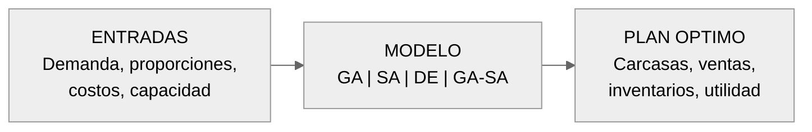
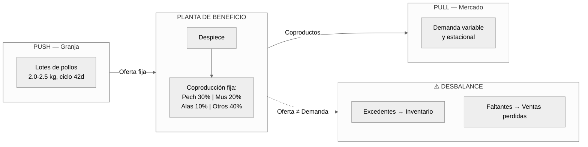
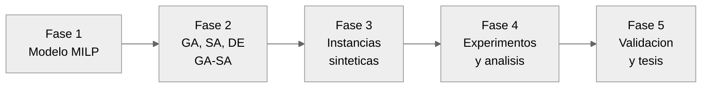

<!-- PRIMERA PORTADA: Simple -->
\begin{titlepage}
    \centering
    \thispagestyle{empty}
    
    \vspace*{2cm}
    
    {\LARGE \textbf{Modelo de Optimización para la Planificación de Coproductos con Metaheurísticas en la Industria Avícola}}
    
    \vspace{3cm}
    
    {\large Daniel Andrés Castañeda Rodríguez}
    
    \vspace{3cm}
    
    \includegraphics[width=16cm]{logo_utp.png}
    
    \vspace{3cm}
    
    {\normalsize Universidad Tecnológica de Pereira}
    
    \vspace{0.3cm}
    
    {\normalsize Maestría en Investigación de Operaciones y Estadística}
    
    \vspace{0.5cm}
    
    {\normalsize Febrero 2026}
    
\end{titlepage}

\newpage

<!-- SEGUNDA PORTADA: Académica detallada -->
\begin{titlepage}
    \centering
    \thispagestyle{empty}
    
    \vspace*{1cm}
    
    {\large \textbf{UNIVERSIDAD TECNOLÓGICA DE PEREIRA}}
    
    \vspace{0.3cm}
    
    {\normalsize Facultad de Ingeniería Industrial}
    
    \vspace{0.3cm}
    
    {\normalsize Maestría en Investigación de Operaciones y Estadística}
    
    \vspace{2cm}
    
    {\Large \textbf{ANTEPROYECTO DE INVESTIGACIÓN}}
    
    \vspace{1cm}
    
    {\large \textbf{Modelo de Optimización para la Planificación de Coproductos con Metaheurísticas en la Industria Avícola}}
    
    \vspace{2cm}
    
    {\normalsize \textbf{Presentado por:}}
    
    \vspace{0.3cm}
    
    Daniel Andrés Castañeda Rodríguez
    
    \vspace{1cm}
    
    {\normalsize \textbf{Director:}}
    
    \vspace{0.3cm}
    
    Ing. Eliana Mirledy Ocampo Toro, PhD.
    
    \vspace{1cm}
    
    {\normalsize \textbf{Línea de Investigación:}}
    
    \vspace{0.3cm}
    
    Optimización y Modelado Matemático
    
    \vspace{2cm}
    
    Pereira, Colombia
    
    Febrero, 2026
    
\end{titlepage}

\newpage

\tableofcontents

\newpage

## Nota de Actualización Metodológica (10 de marzo de 2026)

Este documento corresponde al **anteproyecto** y conserva su formulación original de hipótesis, métricas y plan experimental.  
Para la ejecución final del proyecto (fases 4 y 5, tesis y sustentación), se aplicaron ajustes metodológicos para mayor rigor:

1. La inferencia principal se consolidó en análisis **bloqueado por instancia**.
2. En H3 se distinguió un **endpoint primario** (inventario promedio total) y un **endpoint secundario exploratorio** (baja rotación), debido al tamaño muestral informativo en baja rotación.
3. Se fortaleció la validación externa con series mensuales FENAVI por tipo de variable y análisis de correlación con desfases temporales.

Los resultados y conclusiones oficiales deben leerse en `tesis/tesis_coproductos.md`, `experiments/results/statistical_tests.json` y la documentación de `documentacion/planes/proyecto_v3/`.

---

## Resumen Ejecutivo

Este anteproyecto propone el desarrollo de un **modelo de optimización para la planificación de coproductos** en la industria avícola colombiana, resuelto mediante **técnicas metaheurísticas**. El problema central abordado es el desbalance estructural entre la oferta rígida de coproductos (determinada por la anatomía del ave) y la demanda variable del mercado: un problema de **producción conjunta (joint production)** donde el procesamiento de cada carcasa genera múltiples productos en proporciones fijas que no se alinean con la demanda. Utilizando un enfoque **cuantitativo y experimental (simulación)**, se implementarán y compararán técnicas metaheurísticas (Algoritmos Genéticos, Recocido Simulado, Evolución Diferencial y un híbrido GA-SA) para maximizar la rentabilidad del proceso de despiece. La investigación se fundamenta en evidencia empírica local, como el estudio de Solano-Blanco et al. en Santa Marta, que demostró mejoras en costos de hasta un **8.6%** mediante planificación integrada con modelos estocásticos [@SolanoBlanco2022].

La industria avícola colombiana, un pilar económico con una producción anual superior a 1.7 millones de toneladas de carne de pollo [@FENAVI2024], enfrenta el desafío de optimizar el aprovechamiento de coproductos. La gestión ineficiente de este desbalance genera pérdidas económicas significativas, incluyendo altos costos de inventario, desperdicio de productos y oportunidades de venta perdidas.

Este problema de optimización combinatoria, clasificado como NP-hard por su naturaleza multi-periodo, multi-producto y estocástica, requiere enfoques avanzados como las metaheurísticas para encontrar soluciones de alta calidad en tiempos razonables. A pesar de la creciente investigación en optimización de cadenas de suministro avícolas [@Yazdekhasti2021; @Tahraoui2025], existe una notable escasez de estudios que integren metaheurísticas para la planificación operativa de coproductos bajo incertidumbre, especialmente en el contexto colombiano.

Este proyecto busca cerrar esta brecha, desarrollando un modelo de optimización avanzado que integre la estocasticidad de la demanda, las restricciones de producción conjunta y las particularidades del procesamiento avícola. La implementación de metaheurísticas permitirá generar una herramienta de apoyo a la decisión que mejore la rentabilidad, reduzca el desperdicio y fortalezca la competitividad del sector.

---

## 1. Introducción

### 1.1. El Problema de Producción Conjunta en la Industria Avícola

La industria avícola, reconocida como un pilar económico en Colombia y a nivel mundial, enfrenta un desafío operativo fundamental: el **problema de producción conjunta (joint production) y balanceo de carcasa**. Este problema surge de la discrepancia inherente entre la oferta de coproductos, que se derivan en proporciones relativamente fijas del despiece de cada ave, y la demanda variable y a menudo desalineada del mercado para cada uno de esos cortes (pechuga, alas, muslos, vísceras, etc.). Se trata de un problema clásico de **optimización de mezcla de producción bajo restricciones de co-producción** [@Heij2021; @Gicquel2017].

La industria avícola opera bajo una dinámica compleja de **"Push" (Empuje) y "Pull" (Tracción)**. Por un lado, el factor "Push" proviene de la granja: una vez que las aves alcanzan su peso de mercado, deben ser procesadas inmediatamente, generando una oferta fija de coproductos (alas, pechugas, muslos) en proporciones biológicamente determinadas. Por otro lado, el factor "Pull" es la demanda del mercado, que es estocástica, estacional y a menudo desbalanceada respecto a la oferta anatómica (alta demanda de pechuga pero baja de alas, por ejemplo).

Un plan de ventas que, por ejemplo, prioriza la comercialización de pechuga para maximizar ingresos, inevitablemente genera una sobreoferta de otros coproductos como alas y patas. Si no se gestiona adecuadamente, este excedente debe ser almacenado (incrementando costos de refrigeración), vendido a precios de liquidación o incluso desechado, ocasionando pérdidas económicas significativas y un desperdicio de recursos valiosos.

Este conflicto genera ineficiencias operativas significativas, como la acumulación de inventarios de baja rotación, la venta de productos premium a precios de liquidación, y la pérdida de oportunidades de mercado. Estudios recientes en Colombia [@SolanoBlanco2022] y en planificación de plantas de beneficio avícola [@Tahraoui2025] demuestran que la aplicación de modelos matemáticos avanzados de optimización puede mitigar estos efectos y mejorar la sostenibilidad financiera y ambiental del sector.

### 1.2. Relevancia Económica y Contexto Nacional

La relevancia económica de resolver el problema de la planificación de coproductos es crucial para la competitividad y sostenibilidad de la industria avícola colombiana. Según FENAVI [@FENAVI2024], la avicultura representa uno de los renglones pecuarios más importantes del país, con una producción anual que supera las 1.7 millones de toneladas de carne de pollo. La agroindustria avícola aporta aproximadamente 0.52% del valor agregado bruto nacional [@DANE2024].

Una gestión optimizada de la producción conjunta permite:

*   **Reducir costos de inventario:** Minimizando la acumulación de productos de baja rotación.
*   **Maximizar ingresos:** Aprovechando oportunidades de mercado para cortes de alta demanda.
*   **Mejorar la eficiencia operativa:** Optimizando las cantidades procesadas por periodo.
*   **Reducir el desperdicio:** Contribuyendo a la sostenibilidad ambiental del sector.

El problema de planificación de coproductos bajo demanda estocástica es un problema de optimización combinatoria clasificado como **NP-hard**. La demostración formal de esta complejidad se remonta al trabajo seminal de Florian et al. [-@Florian1980] y Bitran y Yanasse [-@BitranYanasse1982], quienes probaron que incluso el caso mono-producto del Capacitated Lot-Sizing Problem (CLSP) con costos fijos de setup es NP-hard [@Goren2016]. Rahmani et al. [-@Rahmani2025] confirman que la extensión a dos etapas estocásticas preserva esta complejidad, y Mahdieh et al. [-@Mahdieh2018] demuestran que agregar restricciones de lote mínimo y setup crossover la incrementan aún más. Esta complejidad computacional ha motivado el desarrollo de enfoques metaheurísticos para encontrar soluciones de alta calidad en tiempos de cómputo razonables.

La literatura reciente en optimización de cadenas de suministro avícolas [@SolanoBlanco2022; @Yazdekhasti2021; @Tahraoui2025] y en planificación de producción para la industria alimentaria [@Ahumada2009; @Amorim2014] ha demostrado la viabilidad de modelos matemáticos para la planificación integrada. Sin embargo, estos trabajos emplean predominantemente métodos exactos (MILP/CPLEX) que resultan intratables para instancias de gran escala con incertidumbre.

Este anteproyecto se centra en abordar este desafío mediante el desarrollo de un **modelo de optimización para la planificación de coproductos**, resuelto con **técnicas metaheurísticas** (Algoritmos Genéticos, Recocido Simulado, Evolución Diferencial e híbridos) [@AkbariAghghaleh2025; @Slama2021]. El objetivo es desarrollar una herramienta de apoyo a la decisión que permita a las empresas del sector mejorar su planificación, reducir sus pérdidas y fortalecer su competitividad en un mercado cada vez más exigente.

---

## 2. Planteamiento del Problema

### 2.1. Problema Central

El problema central que aborda esta investigación es el **desbalance estructural** entre la oferta de coproductos generada por el proceso de despiece avícola y la **demanda estocástica y heterogénea del mercado**. Este desajuste, resultado directo de la naturaleza de **producción conjunta (joint production)** del negocio avícola [@Heij2021], se traduce en una cascada de ineficiencias operativas y pérdidas económicas que impactan a toda la cadena de valor.

La **Figura 1** describe el problema como un sistema de entrada/salida: dado un conjunto de datos de entrada (demanda del mercado, proporciones anatómicas, costos y capacidad de la planta), el modelo de optimización —resuelto mediante metaheurísticas— genera como salida un plan óptimo de producción que indica cuántas aves procesar, cómo distribuir los coproductos y qué niveles de inventario mantener.

***Figura 1.** Representación del problema como sistema de entrada/salida. El modelo de optimización (caja negra) recibe datos de demanda, proporciones anatómicas y parámetros operativos, y genera un plan de producción óptimo.*

A nivel sistémico, el problema se enmarca en la dinámica **Push/Pull** de la cadena avícola (Figura 2). La granja "empuja" lotes de aves que deben procesarse al alcanzar su peso de mercado (Push), generando coproductos en proporciones fijas. Simultáneamente, el mercado "jala" productos específicos con demanda variable y estacional (Pull). El **desbalance** ocurre cuando estas dos fuerzas no están alineadas, y la planta de procesamiento debe tomar decisiones de producción, inventario y ventas bajo incertidumbre.

***Figura 2.** Sistema global Push/Pull de la cadena avícola. La granja empuja lotes de aves (Push), la planta genera coproductos en proporciones fijas, y el mercado jala productos con demanda variable (Pull). El desbalance entre oferta y demanda genera excedentes y faltantes.*

### 2.2. Manifestaciones del Problema

El desbalance se manifiesta en dos frentes principales:

1.  **Excedentes de Inventario (Sobreproducción):** Cuando la producción de ciertos cortes (alas, patas, vísceras) supera la demanda del mercado, las empresas se ven forzadas a incurrir en costos adicionales de almacenamiento en frío, transporte y, en el peor de los casos, vender estos productos a precios de liquidación, erosionando significativamente los márgenes de ganancia.

2.  **Faltantes de Inventario (Subproducción):** De forma simultánea, la demanda de cortes de alto valor (pechuga) puede exceder la capacidad de producción balanceada, resultando en oportunidades de venta perdidas y una potencial insatisfacción del cliente.

### 2.3. Causas del Problema

Las causas fundamentales del desbalance incluyen:

*   **Restricción biológica:** La anatomía del ave determina proporciones fijas de cada coproducto (aproximadamente 30% pechuga, 20% muslos, 10% alas, etc.).
*   **Variabilidad de la demanda:** El mercado presenta patrones estacionales, promociones y preferencias cambiantes que no se alinean con las proporciones de la carcasa.
*   **Planificación tradicional:** Los métodos empíricos de programación no consideran la naturaleza estocástica del problema ni optimizan múltiples objetivos simultáneamente.
*   **Complejidad computacional:** El problema de planificación multi-producto con co-producción y demanda estocástica es NP-hard, lo que dificulta encontrar soluciones óptimas con métodos exactos en tiempos razonables [@Birge2011].

### 2.4. Consecuencias del Problema

Las consecuencias del desbalance no gestionado incluyen:

***Tabla 1.** Rangos representativos de impacto del desbalance según la literatura*

| Consecuencia | Rango de Impacto | Referencia |
|--------------|------------------|------------|
| Costos de almacenamiento refrigerado | +15-25% del costo operativo | [@SolanoBlanco2022; @Sel2015] |
| Pérdidas por ventas de liquidación | -20-40% del margen en productos afectados | [@Amorim2014] |
| Oportunidades de venta perdidas | Variable según temporada y producto | [@FENAVI2024] |
| Desperdicio de producto perecedero | 5-10% de la producción total | [@Claassen2016; @AkbariAghghaleh2025] |

*Fuente: Rangos consolidados a partir de la literatura especializada en lot-sizing con perecibilidad y cadenas de suministro avícolas*

### 2.5. Pregunta de Investigación

**Pregunta Principal:**
¿Cómo puede un modelo de optimización de coproductos, resuelto mediante técnicas metaheurísticas, minimizar las pérdidas económicas asociadas al desbalance entre la oferta conjunta de coproductos y la demanda del mercado en una planta de procesamiento avícola colombiana?

**Preguntas Secundarias:**

1. ¿Qué formulación matemática del problema de planificación de coproductos captura adecuadamente las restricciones de producción conjunta, los costos de inventario y la variabilidad de la demanda en el contexto avícola?

2. ¿Qué técnicas metaheurísticas (Algoritmos Genéticos, Recocido Simulado, Evolución Diferencial, o híbridos) presentan el mejor desempeño para resolver el modelo de optimización de coproductos propuesto?

3. ¿En qué magnitud se pueden reducir las pérdidas económicas asociadas al desbalance de carcasa mediante la implementación del modelo de optimización?

### 2.6. Hipótesis de Investigación

**Hipótesis Principal (H1):**
La aplicación del modelo de optimización de coproductos con metaheurísticas generará una reducción **≥5%** en el costo total operativo respecto al baseline de planificación proporcional, validada con nivel de significancia α=0.05, tomando como referencia los benchmarks de Solano-Blanco et al. [-@SolanoBlanco2022] (8.6% de reducción) y Tahraoui et al. [-@Tahraoui2025].

**Hipótesis Secundarias:**

*   **H2:** El algoritmo híbrido GA-SA obtendrá soluciones con un gap de optimalidad **≤2%** respecto a la mejor metaheurística individual (GA, SA o DE), en un tiempo computacional **≤50%** del requerido por el solver exacto (CBC/PuLP) para instancias medianas ($n_t=12$, $n_\omega=50$) [@AkbariAghghaleh2025].
*   **H3:** El modelo de optimización permitirá una reducción **≥15%** en el inventario promedio de productos de baja rotación, comparada con el método de planificación proporcional, validada mediante prueba t pareada (α=0.05).

---

## 3. Objetivos

### 3.1. Objetivo General

Desarrollar un modelo de optimización para la planificación de coproductos que, mediante la aplicación de técnicas metaheurísticas, minimice las pérdidas económicas asociadas al desbalance entre la oferta conjunta de coproductos y la demanda del mercado en la industria avícola colombiana.

### 3.2. Objetivos Específicos

1.  **Formular** un modelo matemático de optimización de coproductos que capture las restricciones de producción conjunta, costos de inventario, balance de materiales y variabilidad de la demanda propias del procesamiento avícola.

2.  **Implementar** algoritmos metaheurísticos (Algoritmo Genético, Recocido Simulado, Evolución Diferencial y un enfoque híbrido GA-SA) adaptados al problema de planificación de coproductos avícolas.

3.  **Diseñar** un generador de instancias de prueba con datos sintéticos calibrados que reflejen las condiciones operativas reales de la industria avícola colombiana.

4.  **Comparar** el desempeño de las metaheurísticas propuestas mediante un diseño experimental riguroso, evaluando calidad de solución y eficiencia computacional.

5.  **Validar** el modelo propuesto mediante simulación, cuantificando las mejoras potenciales en términos de reducción de costos de inventario, nivel de servicio y rentabilidad operativa.

## 4. Justificación

### 4.1. Beneficiarios de la Investigación

**Beneficiarios Directos:**

*   Empresas procesadoras de pollo en Colombia
*   Planificadores de producción del sector avícola
*   Gerentes de operaciones y logística

**Beneficiarios Indirectos:**

*   Consumidores (mayor disponibilidad y precios estables)
*   Comunidad académica (avance en optimización de coproductos en la industria alimentaria)
*   Sector ambiental (reducción de desperdicio)

### 4.2. Magnitud del Problema

***Tabla 2.** Magnitud del problema en la industria avícola colombiana*

| Indicador | Valor | Fuente |
|-----------|-------|--------|
| Producción anual de pollo | 1.7 millones de toneladas | FENAVI 2024 |
| Empleos generados | 600,000+ directos e indirectos | FENAVI 2024 |
| Participación en PIB agropecuario | 0.52% | DANE 2024 |
| Potencial de ahorro en inventario | 30-60% | Solano-Blanco et al. 2022 |

*Fuente: Elaboración propia con datos de [@FENAVI2024; @DANE2024; @SolanoBlanco2022]*

### 4.3. Conveniencia y Relevancia Económica

La optimización de la planificación de coproductos tiene un impacto directo en la rentabilidad de las empresas avícolas. Como demostró el caso de Solano-Blanco et al. [@SolanoBlanco2022], las mejoras en la planificación integrada pueden traducirse en reducciones de costos del **8.6%**. Tahraoui et al. [@Tahraoui2025] confirmaron que la planificación operativa optimizada con modelos MILP reduce significativamente los costos en plantas multi-producto. En una industria de márgenes estrechos y alto volumen, estas mejoras representan una ventaja competitiva crítica.

El sector avícola colombiano, que según FENAVI [@FENAVI2024] genera más de 600,000 empleos directos e indirectos, se beneficiaría significativamente de herramientas que mejoren su eficiencia operativa. La implementación de modelos de optimización no solo mejora la rentabilidad de las empresas individuales, sino que fortalece la competitividad del sector a nivel nacional e internacional.

### 4.4. Relevancia Social y Ambiental (Sostenibilidad)

Mejorar el equilibrio de la carcasa contribuye directamente a la sostenibilidad del sector. Al reducir el desperdicio de alimentos y optimizar el uso de recursos (energía para refrigeración de inventarios no deseados), el proyecto se alinea con los **Objetivos de Desarrollo Sostenible (ODS)**, específicamente:

*   **ODS 12 (Producción y Consumo Responsables):** Reduciendo el desperdicio de alimentos y optimizando el aprovechamiento de cada ave procesada.
*   **ODS 9 (Industria, Innovación e Infraestructura):** Mediante la aplicación de técnicas avanzadas de optimización y el desarrollo de herramientas tecnológicas para la industria.

La reducción del desperdicio de alimentos es particularmente relevante en un contexto global donde aproximadamente el 14% de los alimentos se pierde en la cadena de suministro antes de llegar al consumidor [@FAO2023]. Un mejor balanceo de la carcasa significa un proceso más sostenible, con menor huella de carbono y mejor utilización de los recursos naturales. En otras industrias de desensamble, Darghouth et al. [-@Darghouth2021] han confirmado que la integración de criterios de sostenibilidad (eficiencia energética, reducción de costos) en modelos de optimización genera beneficios significativos, principios transferibles al procesamiento avícola.

### 4.5. Implicaciones Prácticas

El desarrollo de una herramienta de toma de decisiones basada en metaheurísticas permitirá a los planificadores de producción pasar de decisiones basadas en la intuición ("gut feeling") y la experiencia personal a decisiones basadas en datos y modelado matemático robusto. Esto mejorará la capacidad de respuesta ante fluctuaciones del mercado y permitirá una planificación más ágil y eficiente.

La implementación de tecnologías de sensores inteligentes [@SensorsPoultry2022] y sistemas de automatización [@AutomationSystems2023] en la industria avícola está generando grandes volúmenes de datos que pueden ser aprovechados por modelos de optimización como el propuesto en este proyecto.

### 4.6. Valor Teórico y Científico

El proyecto contribuye significativamente a la literatura de **optimización de producción conjunta (joint production)** en la industria alimentaria, extendiendo los modelos clásicos de planificación de producción deterministas [@Gicquel2017] hacia enfoques estocásticos que consideran la incertidumbre de la demanda, una área identificada como línea futura de investigación por diversos autores [@Birge2011; @MirzapourAlHashem2011].

La **optimización multi-objetivo** en la industria alimentaria ha experimentado un avance significativo en los últimos años. Arteaga-Cabrera et al. [-@Arteaga2025] presentaron una revisión comprehensiva sobre la evolución de las estrategias de optimización en alimentos, identificando la transición desde métodos univariados tradicionales hacia técnicas multi-objetivo integradas con tecnologías emergentes. Su trabajo destaca que la industria alimentaria moderna requiere **optimizar simultáneamente múltiples objetivos competitivos** (costos de producción, eficiencia energética, calidad del producto, sostenibilidad), lo cual se alinea perfectamente con la planificación de coproductos avícolas, donde se deben balancear simultáneamente:

- Maximización de ingresos por venta de coproductos
- Minimización de costos de inventario
- Minimización de penalizaciones por demanda no satisfecha
- Maximización del nivel de servicio al cliente

La incorporación de **algoritmos evolutivos** y metaheurísticas hibridizadas, como lo documentan Arteaga-Cabrera et al. [@Arteaga2025], ha permitido abordar estos problemas complejos de forma efectiva en la industria alimentaria, generando soluciones robustas que equilibran trade-offs entre objetivos contradictorios. Este proyecto se posiciona como una **contribución directa** a esta línea de investigación, aplicando metaheurísticas (GA, SA, DE, GA-SA) a un problema de planificación de coproductos en el procesamiento avícola. Si bien el modelo propuesto utiliza una función objetivo escalar (beneficio esperado ponderado), los principios de optimización multi-criterio documentados por Arteaga-Cabrera et al. representan una línea de extensión natural del trabajo que las metaheurísticas facilitarían.

Adicionalmente, la comparación rigurosa de diferentes técnicas metaheurísticas (Algoritmos Genéticos, Recocido Simulado, Evolución Diferencial, y el híbrido GA-SA) en el contexto específico de la industria avícola generará conocimiento valioso sobre la efectividad de estas técnicas en problemas del mundo real con características particulares (perecibilidad, estocasticidad, restricciones sanitarias).

## 5. Marco Teórico y Antecedentes

### 5.1. El Problema de Producción Conjunta y Planificación de Coproductos

El **problema de producción conjunta (joint production)** ocurre cuando el procesamiento de una materia prima genera múltiples productos en proporciones fijas o semifijas. En la industria avícola, el despiece de cada carcasa produce inevitablemente pechuga, muslos, alas, vísceras y otros cortes en proporciones determinadas por la anatomía del ave. Esta característica, compartida con otras industrias cárnicas, crea un desafío único de planificación cuando la demanda del mercado para cada coproducto no refleja estas proporciones naturales [@Heij2021].

Desde la perspectiva de la investigación de operaciones, este problema se clasifica como un **problema de optimización de mezcla de producción multi-producto con restricciones de co-producción** [@Gicquel2017]. A diferencia de los problemas clásicos de planificación de producción, donde las cantidades de cada producto pueden decidirse independientemente, aquí la decisión de producir una unidad de un coproducto (e.g., pechuga) implica necesariamente la producción de cantidades proporcionales de todos los demás coproductos.

Solano-Blanco et al. [@SolanoBlanco2022] abordaron este problema específico en la industria avícola colombiana mediante un modelo de planificación integrada basado en MILP con programación estocástica de dos etapas, logrando reducciones de costos del 8.6% en un caso de estudio en Santa Marta. Más recientemente, Tahraoui et al. [@Tahraoui2025] desarrollaron un modelo MILP para la planificación operativa de plantas de beneficio avícola multi-producto, validado con CPLEX. Sin embargo, ambos enfoques dependen de métodos exactos que se vuelven intratables para instancias de gran escala.

El problema se ha modelado como un problema de **programación estocástica multi-periodo** [@Birge2011], donde las decisiones de producción en cada periodo deben considerar la incertidumbre en la demanda futura de cada coproducto. Modelos robustos multi-objetivo [@MirzapourAlHashem2011] han demostrado la viabilidad de optimizar simultáneamente múltiples criterios (costo, nivel de servicio, inventario) bajo incertidumbre, proporcionando un marco teórico directo para este trabajo.

Desde el punto de vista de la **complejidad computacional**, el problema de planificación de coproductos es una instancia del Capacitated Lot-Sizing Problem (CLSP). Florian et al. [-@Florian1980] y Bitran y Yanasse [-@BitranYanasse1982] demostraron formalmente que incluso el caso mono-producto del CLSP con costos fijos de setup es **NP-hard**. Goren y Tunali [-@Goren2016] confirman esta clasificación y demuestran que agregar *setup carryover* y *backordering* incrementa aún más la dificultad computacional. Rahmani et al. [-@Rahmani2025] extienden esta conclusión al *two-stage stochastic capacitated lot-sizing*, confirmando explícitamente que la extensión estocástica preserva la complejidad NP-hard. Mahdieh et al. [-@Mahdieh2018] demuestran que agregar restricciones de lote mínimo con *setup crossover* agrega complejidad adicional al problema base. Nuestro modelo, que combina múltiples productos, incertidumbre estocástica, costos fijos de setup, lote mínimo y perecibilidad, es por tanto formalmente NP-hard, justificando el uso de metaheurísticas.

En el contexto de **lot-sizing para productos perecederos en la industria de procesamiento de alimentos (FPI)**, Claassen [-@Claassen2016] abordó específicamente la planificación y scheduling en FPI modelando *setups non-triangulares* (donde los tiempos de limpieza entre productos no satisfacen la desigualdad triangular, situación típica en líneas de procesamiento cárnico) y el *deterioro de producto (product decay)* como restricción temporal del inventario. Stefánsdóttir et al. [-@Stefansdottir2017] complementan este trabajo con una clasificación taxonómica de los tipos de setup y limpieza en lot-sizing, distinguiendo entre setups triangulares y non-triangulares y su impacto en la complejidad del modelo resultante.

En la industria avícola específicamente, trabajos recientes confirman la relevancia y aplicabilidad de estos enfoques. Dadaneh et al. [-@Dadaneh2024] formularon un modelo CLSP con *chance-constraints* para la planificación de producción de huevos en granjas avícolas bajo demanda incierta, demostrando la aplicabilidad directa del lot-sizing capacitado en este sector. Akbari-Aghghaleh et al. [-@AkbariAghghaleh2025] diseñaron una cadena de suministro avícola de ciclo cerrado con perecibilidad, reconociendo explícitamente las características NP-hard del modelo resultante y evaluándolo con cinco metaheurísticas (GA, SA, DE, GA-SA, DE-SA). González-Neira et al. [-@GonzalezNeira2025] desarrollaron un modelo MILP para la operación de la cadena de suministro avícola colombiana, integrando scheduling y transporte. Juwitaa et al. [-@Juwitaa2024] optimizaron cadenas de suministro de pollo de engorde bajo incertidumbre en la tasa de crecimiento mediante programación estocástica de dos etapas.

En el contexto específico de productos perecederos, Sel et al. [@Sel2015] demostraron la importancia de considerar restricciones de vida útil en la planificación integrada de cadenas de suministro, mientras que Kopanos et al. [@Kopanos_2012] establecieron marcos matemáticos eficientes para el scheduling en procesamiento de alimentos. Entrup et al. [@Entrup2005] desarrollaron modelos MILP pioneros que integran la vida útil como restricción en problemas de dimensionamiento de lotes para la industria láctea, estableciendo un marco transferible a otros sectores alimentarios. Rong et al. [@Rong2011] propusieron un enfoque de optimización para la gestión de calidad de alimentos frescos a lo largo de la cadena de suministro, modelando el deterioro como variable continua. Akkerman y van Donk [@Akkerman_2008] analizaron la estructura de tareas en esta industria, y Véghová et al. [@Veghova_2016] enfatizaron la trazabilidad en el procesamiento de carne. Estas investigaciones fundamentan la necesidad de modelos especializados para la industria alimentaria.

### 5.2. Metaheurísticas para Problemas de Optimización Combinatoria

Debido a la complejidad computacional de los problemas de optimización combinatoria como la planificación de coproductos, las **metaheurísticas** se han convertido en el enfoque predominante para resolverlos. Las metaheurísticas son algoritmos de optimización de alto nivel que pueden ser aplicados a una amplia gama de problemas de ingeniería complejos [@MetaheuristicsPower2023], y que a menudo se inspiran en procesos naturales. En el contexto de problemas de planificación de producción, estos algoritmos han demostrado ser efectivos para abordar problemas de optimización multi-criterio [@Arteaga2025; @Liang2023].

En el contexto de la industria alimentaria, Arteaga-Cabrera et al. [@Arteaga2025] documentaron la efectividad de **algoritmos evolutivos** y metaheurísticas para resolver problemas de optimización multi-objetivo en sistemas de producción alimentaria. Liang et al. [@Liang2023] demostraron la efectividad de la optimización multi-objetivo para operaciones de corte en la industria cárnica, abordando la maximización de beneficios de coproductos respetando restricciones de producción conjunta — un problema directamente análogo al balanceo de carcasa avícola. Su revisión comprehensiva destaca que estas técnicas son particularmente efectivas cuando se deben equilibrar objetivos contradictorios (e.g., minimizar costos vs. maximizar calidad), una característica intrínseca de la planificación de coproductos avícolas. A continuación se detallan las metaheurísticas más relevantes para este proyecto:

#### 5.2.1. Algoritmos Genéticos (GA)

Los Algoritmos Genéticos, inspirados en la teoría de la evolución de Darwin, operan sobre una población de soluciones, aplicando operadores de selección, cruce y mutación para generar nuevas y mejores soluciones. Su efectividad en problemas de optimización combinatoria ha sido ampliamente demostrada [@Sivasankaran2014], particularmente cuando el espacio de búsqueda es grande y complejo. En el contexto de planificación de producción bajo incertidumbre, los GA son especialmente adecuados debido a su capacidad de explorar espacios de solución amplios y de manejar funciones objetivo con ruido estocástico, lo cual es una característica intrínseca de los problemas con demanda incierta [@MetaheuristicsPower2023].

#### 5.2.2. Recocido Simulado (SA)

El Recocido Simulado es un método de búsqueda por trayectoria inspirado en el proceso metalúrgico de enfriamiento controlado. Utiliza el criterio de Metropolis para aceptar probabilísticamente soluciones peores, lo que le permite escapar de óptimos locales de manera controlada. En problemas de lot-sizing con perecibilidad, el SA ha demostrado buen rendimiento como búsqueda local, particularmente para perturbaciones sobre variables binarias de activación (toggle de setup) y ajustes de cantidades de lote [@Roshani2017]. Akbari-Aghghaleh et al. [-@AkbariAghghaleh2025] evaluaron SA tanto de forma individual como componente de algoritmos híbridos para cadenas de suministro avícolas con perecibilidad, confirmando su efectividad.

#### 5.2.3. Evolución Diferencial (DE)

La Evolución Diferencial es un algoritmo evolutivo basado en poblaciones que utiliza vectores de diferencia entre individuos como mecanismo de mutación. A diferencia del GA, cuya dinámica de búsqueda depende de operadores de cruce y mutación estocásticos, el DE emplea una perturbación dirigida basada en las diferencias reales entre soluciones de la población, lo que le confiere propiedades de convergencia distintas. Akbari-Aghghaleh et al. [-@AkbariAghghaleh2025] adaptaron el DE con estrategias DE/rand/1/bin a variables mixtas (binarias + enteras) en su evaluación comparativa de metaheurísticas para la cadena de suministro avícola.

#### 5.2.4. Enfoques Híbridos y Meméticos

La tendencia actual prioriza el uso de algoritmos híbridos para superar las limitaciones de las técnicas individuales. Akbari-Aghghaleh et al. [-@AkbariAghghaleh2025] demostraron que el **híbrido GA-SA** (algoritmo memético que combina la exploración global del GA con la explotación local del SA) obtiene el **mejor rendimiento** entre las cinco metaheurísticas evaluadas para problemas NP-hard de cadena de suministro avícola con perecibilidad. Wang et al. [@Wang_2021] confirmaron que combinar Algoritmos Genéticos con búsqueda local mejora la capacidad de escapar de óptimos locales. Slama et al. [-@Slama2021] utilizaron GA combinado con Monte Carlo Simulation para resolver problemas estocásticos de lot-sizing capacitado, demostrando que GA supera al MIP exacto en instancias medianas y grandes. En el ámbito multi-objetivo, Saif et al. [@Saif_2014] aplicaron algoritmos de colonias de abejas artificiales (ABC) basados en Pareto para manejar parámetros inciertos, y Babazadeh et al. [@Babazadeh_2018_CIE] mejoraron el algoritmo NSGA-II para problemas fuzzy bi-objetivo.

### 5.3. Tecnologías Habilitadoras y Tendencias Recientes

Mahalik y Nambiar [@Mahalik2010] destacan la tendencia creciente hacia la automatización y el uso de sensores inteligentes en los sistemas de manufactura de alimentos, elementos clave para asegurar la calidad y trazabilidad. La integración de estos sensores [@SensorsPoultry2022] y la planificación automatizada de desensamble [@Hartono2022] en plantas de procesamiento están generando oportunidades para la implementación de modelos de optimización en tiempo real. Hartono et al. [@Hartono2022] demostraron la eficacia del *Bees Algorithm* para optimizar planes de desensamble robótico, un enfoque que podría adaptarse al procesamiento de carcasas avícolas.

Recientemente, el uso de tecnologías avanzadas como la visión por computador y la generación de datos sintéticos ha comenzado a transformar el procesamiento avícola. Feng et al. [@Feng2025] demostraron cómo el aumento de datos sintéticos puede mejorar significativamente la segmentación de instancias de carcasas de pollo, lo cual es fundamental para la automatización de procesos de despiece y control de calidad. Awad et al. [@Awad2023] desarrollaron un modelo de optimización para minimizar el desperdicio (*giveaway*) y el subpeso (*underweight*) en el proceso de porcionado avícola, demostrando que la optimización matemática puede mejorar significativamente la eficiencia del despiece.

Asimismo, la integración de robótica colaborativa [@IndustrialRobots2023] promete flexibilizar las líneas de producción, permitiendo una mejor adaptación a la variabilidad de la materia prima. Estas innovaciones tecnológicas proporcionan la base para implementar modelos de optimización más sofisticados.

#### 5.3.1. Tendencias Emergentes (2025-2026)

La literatura más reciente muestra una clara evolución hacia la integración de **inteligencia artificial avanzada** y **sistemas colaborativos**. Tan et al. [@Tan2026] y Wang et al. [@Wang2026] han aplicado algoritmos de **Aprendizaje por Refuerzo Profundo (Deep Reinforcement Learning)** y optimización Kepleriana para resolver problemas de balanceo dinámico en entornos de manufactura, donde la incertidumbre proviene de la variabilidad en los tiempos humano-robot. 

Paralelamente, Tahraoui et al. [@Tahraoui2025] han avanzado en el estado del arte de la **planeación operativa** para plantas de beneficio avícola utilizando modelos exactos (MILP), abordando la complejidad de la demanda fluctuante en entornos multi-producto. Sin embargo, su enfoque permanece limitado a métodos exactos que se vuelven intratables para instancias de gran escala, confirmando que la aplicación de metaheurísticas para la planificación de coproductos avícolas sigue siendo un área inexplorada.

Esta brecha es particularmente significativa porque, a diferencia de los modelos MILP resueltos con solvers exactos (CPLEX, Gurobi), las metaheurísticas ofrecen: (a) escalabilidad a instancias industriales con centenares de escenarios estocásticos; (b) flexibilidad para incorporar restricciones no lineales (funciones de deterioro, economías de escala); y (c) tiempos de respuesta compatibles con la toma de decisiones operativa diaria. Esta propuesta busca demostrar estas ventajas mediante la comparación directa de GA, SA, DE y un hërido GA-SA contra el baseline de planificación empírica y, cuando sea computacionalmente factible, contra la solución exacta MILP.

### 5.4. Vacíos de Investigación Identificados

A pesar de la creciente investigación en optimización de cadenas de suministro avícolas y en metaheurísticas para problemas combinatorios, la revisión del estado del arte revela varios vacíos de investigación que este proyecto busca abordar.

Una búsqueda sistemática realizada en Scopus (febrero 2026) utilizando ecuaciones de búsqueda centradas en lot-sizing estocástico, perecibilidad, optimización avícola y metaheurísticas arrojó los siguientes resultados:

***Tabla 3a.** Resultados de la búsqueda sistemática en Scopus (febrero 2026)*

| Query | Tema | Base de datos | Periodo | # Resultados |
|:-----:|------|:-------------:|:-------:|:------------:|
| Q1 | Lot-sizing estocástico + NP-hard + Setup | Scopus | 2014–2026 | 9 |
| Q2 | Metaheurísticas + Setup estocástico | Scopus | 2017–2026 | 11 |
| Q3 | Perecibilidad + Lot-sizing + Setup | Scopus | 2015–2026 | 20 |
| Q4 | Optimización avícola/cárnica | Scopus | 2018–2026 | 186 |
| Q5 | Programación estocástica 2-etapas + Metaheurísticas | Scopus | 2016–2026 | 218 |
| Q6 | CLSP + Complejidad computacional | Scopus | 2015–2026 | 30 |
| Q7 | Reviews multi-product lot-sizing estocástico | Scopus | 2018–2026 | 0 |
| Q8 | Lote mínimo + Setup + Programación entera | Scopus | 2015–2026 | 4 |
| | | | **Total** | **478** |

De los 478 resultados, solo 13 papers abordan directamente la intersección entre lot-sizing estocástico con setup, perecibilidad y metaheurísticas—confirmando la brecha que esta investigación busca llenar. Notablemente, la Query Q7 (reviews sobre multi-product lot-sizing estocástico) no arrojó ningún resultado, evidenciando la ausencia de trabajos de revisión del estado del arte para este tema específico.

La Tabla 3b resume los trabajos más relevantes y su posicionamiento respecto a esta propuesta.

***Tabla 3b.** Resumen del Estado del Arte y Brechas Identificadas*

| Autor(es) | Técnica | Objetivo | Incertidumbre | Aplicación |
|-----------|---------|----------|---------------|------------|
| Solano-Blanco et al. [-@SolanoBlanco2022] | MILP Estoc. | Planif. Integrada | Estoc. 2 etapas | Avícola (Col.) |
| Tahraoui et al. [-@Tahraoui2025] | MILP (CPLEX) | Planif. Operativa | Demanda Fluct. | Avícola (Multi-prod.) |
| Yazdekhasti et al. [-@Yazdekhasti2021] | MILP Multi-modal | SC Estocástica | Estoc. (Demanda) | Avícola (Miss.) |
| Mirzapour et al. [-@MirzapourAlHashem2011] | MILP Robusto | Planif. Agregada | Robusto Multi-obj. | Manufactura |
| Gicquel & Miègeville [-@Gicquel2017] | MILP | Prod. + Transp. | Determinista | Alimentaria |
| Sel et al. [-@Sel2015] | MILP | Prod. + Distrib. | Determinista | Perecederos |
| Kopanos et al. [-@Kopanos_2012] | MILP | Scheduling | Determinista | Alimentaria |
| Amorim et al. [-@Amorim2014] | MILP Multi-obj. | Prod. + Distrib. | Determinista | Perecederos |
| Liang et al. [-@Liang2023] | Optim. Multi-obj. | Corte Cárnico | Determinista | Cárnica (Coprod.) |
| Claassen [-@Claassen2016] | MILP | Lot-sizing + Decay | Determinista | FPI (setup non-triang.) |
| Rahmani et al. [-@Rahmani2025] | Heurístico híbrido | CLSP estocástico | Estoc. 2 etapas | Manufactura (NP-hard) |
| Dadaneh et al. [-@Dadaneh2024] | CLSP chance-constr. | Planif. huevos | Estoc. (Demanda) | Avícola (huevos) |
| Akbari-Aghghaleh et al. [-@AkbariAghghaleh2025] | **GA, SA, DE, híbridos** | SC ciclo cerrado | Determinista | **Avícola (perecib.)** |
| González-Neira et al. [-@GonzalezNeira2025] | MILP | Scheduling + Transp. | Determinista | Avícola (Col.) |
| **→ Propuesta** | **GA, SA, DE, GA-SA** | **Max Profit** | **Estoc. (Demanda)** | **Avícola (Coprod., Col.)** |

Este proyecto de investigación se posiciona para abordar estos vacíos, con el objetivo de desarrollar una contribución significativa tanto al campo académico de la optimización de producción conjunta como a la práctica industrial de la gestión de la producción avícola.

---

## 6. Metodología

La metodología de esta investigación se estructura en cinco fases principales, diseñadas para abordar de manera sistemática las preguntas de investigación y validar las hipótesis planteadas. La Figura 3 ilustra la secuencia metodológica y las entregas de cada fase.

***Figura 3.** Secuencia metodológica del proyecto. Cada fase produce entregables que alimentan la siguiente.*

### 6.1. Clasificación de la Investigación

*   **Enfoque:** Cuantitativo. Se basa en la medición numérica de variables (costos, tiempos, cantidades) y el análisis estadístico riguroso de resultados.
*   **Alcance:** Explicativo y Correlacional. Busca explicar la relación causal entre la optimización de la planificación de coproductos y la rentabilidad/eficiencia operativa.
*   **Diseño:** Experimental (Simulación). Se manipulan variables independientes (algoritmos metaheurísticos, escenarios de demanda) en un entorno controlado (*in silico*) para observar su efecto en la variable dependiente (costo total, nivel de servicio, inventario).
*   **Método de Inferencia:** Deductivo. Se parte de teorías generales de optimización y producción conjunta para aplicarlas a un caso específico de la industria avícola.
*   **Temporalidad:** Transversal. Los experimentos computacionales se realizan en un corte de tiempo específico, aunque considerando escenarios de demanda que reflejan variabilidad temporal.

### 6.2. Fases de la Investigación

#### Fase 1: Formulación del Modelo Matemático (Semanas 1-8)

El primer paso consiste en desarrollar un modelo matemático de optimización para la planificación de coproductos avícolas. Este modelo será la base para la implementación de los algoritmos de solución.

*   **Definición de Variables de Decisión:** Se identifican las variables clave del problema, como las cantidades de carcasas a procesar por periodo, las decisiones de activación de línea (*setup*), las cantidades vendidas de cada coproducto por escenario y los niveles de inventario.
*   **Función Objetivo:** Se formula una función objetivo que busca maximizar la rentabilidad de la operación. Esto implica maximizar los ingresos por la venta de coproductos y minimizar los costos de producción, inventario y penalizaciones por demanda no satisfecha.
*   **Restricciones:** Se incorporan al modelo todas las restricciones relevantes del problema:

    *   Restricciones de co-producción (proporciones fijas de coproductos por carcasa).
    *   Restricciones de capacidad de procesamiento de la planta.
    *   Restricciones de balance de materiales (conservación de masa y flujo de coproductos).
    *   Restricciones de demanda estocástica del mercado.
    *   Restricciones de perecibilidad y vida útil de los productos.
    *   **Restricciones de setup (activación de línea)**: decisiones binarias que determinan si la planta opera en cada periodo, con costos fijos asociados.
    *   **Restricciones de lote mínimo**: si se decide procesar, la cantidad mínima es operativamente viable (estructura de *lot-sizing*).

#### Fase 2: Diseño e Implementación de Metaheurísticas (Semanas 9-16)

Dada la complejidad del problema de planificación de coproductos —que combina variables enteras (carcasas a procesar), decisiones binarias de activación de línea (*setup*), restricciones de lote mínimo, perecibilidad y múltiples escenarios estocásticos, generando una estructura de *lot-sizing* estocástico que es **NP-hard** [@Goren2016; @Rahmani2025; @Mahdieh2018]—, los métodos exactos (MILP) se vuelven intratables para instancias de escala industrial ($n_p > 10$, $n_t > 12$, $n_\omega > 100$). Se recurre por tanto a metaheurísticas para encontrar soluciones de alta calidad en tiempos computacionales razonables. Siguiendo el marco comparativo propuesto por Akbari-Aghghaleh et al. [-@AkbariAghghaleh2025] para cadenas de suministro avícolas con perecibilidad, se exploran e implementan las siguientes técnicas:

*   **Algoritmo Genético (GA):** Implementación de un GA con representación vectorial de soluciones, donde cada cromosoma codifica las decisiones de primera etapa: el vector de activación de línea $(y_1, y_2, ..., y_{n_t})$ y las cantidades a procesar $(q_1, q_2, ..., q_{n_t})$ (carcasas por periodo, respetando lote mínimo cuando $y_t=1$). Las variables de segunda etapa ($v_{pt\omega}$, $I_{pt\omega}$, $u_{pt\omega}$) se determinan mediante decodificación voraz (asignación greedy que maximiza ventas respetando restricciones de balance). Se implementan operadores de cruce (SBX) y mutación (polinomial) adaptados a variables mixtas (binarias + enteras) [@Sivasankaran2014].
*   **Recocido Simulado (SA):** Implementación de SA con esquema de enfriamiento adaptativo, perturbaciones sobre los vectores $y_t$ y $q_t$, y criterio de aceptación de Metropolis. El SA ha demostrado buen rendimiento como búsqueda local en problemas de lot-sizing con perecibilidad [@AkbariAghghaleh2025; @Roshani2017].
*   **Evolución Diferencial (DE):** Implementación de DE con estrategias DE/rand/1/bin adaptadas a variables mixtas (binarias + enteras), incluyendo discretización para variables de setup y redondeo para cantidades de lote [@AkbariAghghaleh2025].
*   **Algoritmo Híbrido GA-SA:** Desarrollo de un algoritmo memético que combina la exploración global del GA con la explotación local de SA, aplicando SA periódicamente a los mejores individuos de la población. Este enfoque híbrido demostró el mejor rendimiento en problemas de cadena de suministro avícola con perecibilidad [@AkbariAghghaleh2025].

Para cada metaheurística se realizará:

*   Codificación de la solución como vector de decisiones de primera etapa + decodificación determinista.
*   Diseño de operadores de búsqueda específicos para el espacio de variables continuas acotadas.
*   Calibración de parámetros mediante diseño experimental (Optuna/TPE).

La implementación se realizará en Python, utilizando librerías de optimización estándar y frameworks de experimentación controlada.

#### Fase 3: Generación de Datos y Escenarios de Prueba (Semanas 17-20)

Para validar el modelo y los algoritmos propuestos, se genera un conjunto de instancias de prueba que representan de manera realista las condiciones de la industria avícola colombiana.

*   **Datos Sintéticos Calibrados:** Se utilizan datos sintéticos para las pruebas, siguiendo las mejores prácticas en generación de datos sintéticos [@SyntheticDataChicken2025]. Estos datos son calibrados utilizando:
    *   Rendimientos estándar de carcasa publicados en la literatura.
    *   Costos de producción del sector avícola colombiano.
    *   Patrones de demanda generados mediante distribuciones probabilísticas (normal, log-normal con estacionalidad), calibrados contra los parámetros reportados en [@SolanoBlanco2022; @Tahraoui2025].
    *   Parámetros de la industria local (caso Santa Marta como referencia).
*   **Generación de Instancias:** Se crean múltiples instancias del problema con diferentes tamaños (número de coproductos, número de periodos, número de escenarios estocásticos) y niveles de complejidad (variabilidad de demanda, estacionalidad, vidas útiles) para evaluar la escalabilidad y robustez de los algoritmos.

#### Fase 4: Diseño Experimental y Análisis de Resultados (Semanas 21-24)

Se lleva a cabo un diseño experimental riguroso para evaluar el desempeño de las metaheurísticas propuestas y validar las hipótesis de la investigación.

*   **Métricas de Desempeño:** Se definen métricas cuantitativas para evaluar:
    *   Rentabilidad total (función objetivo).
    *   Nivel de servicio al cliente (% de demanda satisfecha).
    *   Niveles de inventario promedio.
    *   Tiempo computacional.
    *   Gap de optimalidad respecto al solver exacto CBC (COIN-OR Branch and Cut, integrado en PuLP) para instancias pequeñas ($n_t \leq 12$, $n_\omega \leq 50$). En caso de requerirse mayor capacidad, se empleará Gurobi con licencia académica gratuita.
*   **Análisis Comparativo:** Se compara el desempeño de:
    *   GA vs. SA vs. DE vs. Híbrido GA-SA.
    *   Modelo optimizado vs. Métodos heurísticos simples (baseline proporcional).
*   **Análisis Estadístico:** Se utilizan herramientas estadísticas (ANOVA, pruebas t, pruebas no paramétricas) para analizar los resultados y obtener conclusiones con significancia estadística.
*   **Análisis de Sensibilidad:** Se evalúa la sensibilidad del modelo ante cambios en parámetros clave (precios, costos, variabilidad de demanda).

#### Fase 5: Validación y Documentación (Semanas 25-30)

Finalmente, se valida el enfoque general y se documentan las conclusiones de la investigación. La escritura de la tesis se ejecuta como actividad transversal en paralelo con las fases de experimentación.

*   **Validación del Modelo:** Se verifica que el modelo y los algoritmos propuestos generen soluciones realistas y aplicables en el contexto industrial.
*   **Documentación y Escritura:** Se redacta el documento final de tesis (mínimo 4 semanas dedicadas).
*   **Transferencia de Conocimiento:** Se prepara material de divulgación para la industria (presentaciones, infografías) que faciliten la adopción de los resultados del proyecto.

---

## 7. Cronograma

El proyecto se desarrollará en un período de **30 semanas** (aproximadamente 7.5 meses), distribuidas según las fases metodológicas. La escritura de la tesis se ejecuta como actividad transversal en paralelo con las fases de experimentación:

***Tabla 4.** Cronograma de ejecución del proyecto*

| Fase | Actividad | Semanas | Duración |
|------|-----------|---------|----------|
| **Fase 1** | Revisión de Literatura | 1-4 | 4 semanas |
| | Formulación del Modelo Matemático | 5-8 | 4 semanas |
| **Fase 2** | Implementación de GA | 9-11 | 3 semanas |
| | Implementación de SA | 12-13 | 2 semanas |
| | Implementación de DE | 14-15 | 2 semanas |
| | Implementación de Híbrido GA-SA | 16-17 | 2 semanas |
| **Fase 3** | Diseño del Generador de Datos | 18-19 | 2 semanas |
| | Calibración y Generación de Instancias | 20-21 | 2 semanas |
| **Fase 4** | Diseño Experimental | 22 | 1 semana |
| | Ejecución de Experimentos | 23-24 | 2 semanas |
| | Análisis de Resultados | 25-26 | 2 semanas |
| **Fase 5** | Validación | 27 | 1 semana |
| | Documentación y Escritura Final | 28-30 | 3 semanas |

---

## 8. Resultados Esperados

> Los resultados están directamente vinculados con los objetivos específicos de la investigación.

Al finalizar este proyecto de investigación, se espera obtener los siguientes resultados y contribuciones:

### 8.1. Contribuciones Científicas y Tecnológicas

*   **Un modelo matemático de optimización de coproductos validado** para la industria avícola, que sirva como base para futuras investigaciones en el área.
*   **Algoritmos metaheurísticos (GA, SA, DE y el híbrido GA-SA) implementados y calibrados**, que podrán ser utilizados para resolver problemas de optimización similares en otros contextos industriales.
*   **Un conjunto de datos sintéticos de prueba calibrados**, que estará a disposición de la comunidad científica para la evaluación y comparación de nuevos algoritmos para problemas de planificación de coproductos.
*   **Código fuente y datos públicos**: Al completar la investigación, todo el código, instancias sintéticas y resultados experimentales se publicarán en el repositorio público del proyecto: [https://github.com/DanAndCastRod/OBC](https://github.com/DanAndCastRod/OBC).
<!-- *   **Un artículo científico** con los resultados de la investigación, que será enviado para su publicación en una revista indexada de alto impacto en el área de Investigación de Operaciones o Gestión de Operaciones. -->

### 8.2. Impacto Potencial en la Industria Avícola

*   **Un prototipo computacional de investigación** (scripts Python ejecutables por línea de comandos) que implemente el modelo y los algoritmos desarrollados, acompañado de documentación técnica para su reproducción y extensión.
*   **Una reducción significativa en los costos de inventario** y una mejora sustancial en la utilidad operativa, tomando como referencia los benchmarks de Solano-Blanco et al. [@SolanoBlanco2022] y Tahraoui et al. [@Tahraoui2025], validada a través de simulación rigurosa.
*   **Una mejora estimada en la eficiencia operativa**, cuantificada en términos de:
    *   Reducción estadísticamente significativa de inventarios.
    *   Aumento del nivel de servicio (satisfacción de demanda).
    *   Mayor utilización de la capacidad instalada de la línea de despiece.

### 8.3. Formación de Capital Humano

*   **La formación de un estudiante de maestría** con altas competencias en investigación, modelado matemático, programación de algoritmos de optimización y análisis de datos.
*   **La transferencia de conocimiento** a la comunidad académica y a la industria a través de publicaciones, presentaciones en conferencias, y el software desarrollado (con licencia de código abierto cuando sea posible).

### 8.4. Líneas de Trabajo Futuro

Los resultados de esta investigación abren diversas oportunidades para su extensión y profundización:

*   **Híbrido DE-SA:** Evaluar la combinación de Evolución Diferencial con Recocido Simulado como búsqueda local. Akbari-Aghghaleh et al. [-@AkbariAghghaleh2025] evaluaron positivamente esta combinación en cadenas de suministro avícolas con perecibilidad, constituyendo una extensión natural del presente trabajo.
*   **Extensión multi-objetivo:** Reformular el modelo como un problema bi-objetivo (costo vs. nivel de servicio) y resolverlo mediante algoritmos basados en Pareto (NSGA-II, MOEA/D), aprovechando la estructura de las metaheurísticas aquí implementadas.
*   **Validación con datos reales:** Aplicar el modelo y los algoritmos a datos operativos de una planta de beneficio avícola colombiana, previa firma de acuerdos de confidencialidad, para evaluar su desempeño en condiciones industriales reales.
*   **Integración con scheduling:** Combinar la planificación de lotes (lot-sizing) con la programación detallada de la línea de despiece (scheduling), siguiendo la línea de Claassen [-@Claassen2016] y González-Neira et al. [-@GonzalezNeira2025].

---

## 9. Consideraciones Éticas

### 9.1. Uso de Datos Sintéticos

Esta investigación utiliza exclusivamente datos sintéticos calibrados con parámetros de la industria avícola colombiana, lo que evita la necesidad de acceder a información confidencial de empresas específicas. Los parámetros de calibración se obtienen de fuentes públicas (FENAVI, DANE) y literatura científica publicada.

### 9.2. Protección de Información Industrial

En caso de que futuras etapas de la investigación requieran validación con datos reales de plantas de procesamiento, se establecerán acuerdos formales de confidencialidad. Toda información sensible será anonimizada antes de su inclusión en publicaciones o presentaciones.

### 9.3. Transparencia Metodológica

Los algoritmos desarrollados, el código fuente y los conjuntos de datos sintéticos serán documentados y puestos a disposición de la comunidad científica, garantizando la reproducibilidad de los resultados y facilitando la verificación independiente de las conclusiones.

### 9.4. Responsabilidad en las Recomendaciones

Las soluciones propuestas por el modelo de optimización se presentan como herramientas de apoyo a la decisión. Se reconoce que la implementación práctica de cualquier recomendación requiere el juicio experto de los profesionales de la industria y la consideración de factores contextuales que pueden no estar capturados en el modelo.

---

## 10. Referencias

::: {#refs}
:::

## Anexos

### Anexo A: Formulación Matemática del Modelo de Optimización de Coproductos

El modelo propuesto se formula como un problema de **Programación Lineal Entera Mixta (MILP) multi-periodo** con estructura de ***lot-sizing* estocástico** para la planificación óptima de coproductos avícolas bajo demanda incierta. La inclusión de decisiones binarias de activación de línea (*setup*), restricciones de lote mínimo y restricciones de perecibilidad confiere al problema una complejidad **NP-hard**—formalmente demostrada para el CLSP por Florian et al. [-@Florian1980] y Bitran y Yanasse [-@BitranYanasse1982], con extensiones confirmadas por Goren y Tunali [-@Goren2016], Rahmani et al. [-@Rahmani2025] y Mahdieh et al. [-@Mahdieh2018]—justificando el uso de metaheurísticas para instancias de escala industrial.

**Conjuntos:**

- $P = \{1, 2, ..., n_p\}$: Conjunto de coproductos (pechuga, muslos, alas, etc.)
- $T = \{1, 2, ..., n_t\}$: Conjunto de periodos de planificación
- $\Omega = \{1, 2, ..., n_\omega\}$: Conjunto de escenarios de demanda

**Parámetros:**

- $\alpha_p$: Proporción fija del coproducto $p$ por carcasa (restricción anatómica, $\sum_p \alpha_p = 1$)
- $W$: Peso promedio de una carcasa (kg)
- $d_{pt\omega}$: Demanda del coproducto $p$ en el periodo $t$ bajo el escenario $\omega$ (kg)
- $r_p$: Precio de venta del coproducto $p$ (\$/kg)
- $c^{prod}$: Costo de procesamiento por carcasa (\$/carcasa)
- $F$: Costo fijo de activación de la línea de procesamiento por periodo (\$/periodo) — incluye personal, energía, sanitización
- $c^{inv}_p$: Costo de mantener inventario del coproducto $p$ (\$/kg/periodo)
- $c^{pen}_p$: Costo de penalización por demanda no satisfecha del coproducto $p$ (\$/kg)
- $Q^{max}$: Capacidad máxima de procesamiento (carcasas/periodo)
- $Q^{min}$: Lote mínimo de procesamiento (carcasas/periodo) — cantidad mínima operativamente viable
- $L_p$: Vida útil máxima del coproducto $p$ (periodos)
- $\pi_\omega$: Probabilidad del escenario $\omega$

**Variables de Decisión:**

- $y_t \in \{0, 1\}$: Variable binaria de activación (*setup*) de la línea en el periodo $t$ (primera etapa)
- $q_t \in \mathbb{Z}^+$: Número de carcasas a procesar en el periodo $t$ (primera etapa, **variable entera**)
- $v_{pt\omega}$: Cantidad vendida del coproducto $p$ en el periodo $t$, escenario $\omega$ (segunda etapa)
- $I_{pt\omega}$: Inventario del coproducto $p$ al final del periodo $t$, escenario $\omega$
- $u_{pt\omega}$: Demanda no satisfecha del coproducto $p$ en el periodo $t$, escenario $\omega$

**Función Objetivo:**

Maximizar el beneficio esperado:

\begin{equation}
\max Z = \sum_{\omega \in \Omega} \pi_\omega \left[ \sum_{t \in T} \left( \sum_{p \in P} r_p \cdot v_{pt\omega} - c^{prod} \cdot q_t - F \cdot y_t - \sum_{p \in P} c^{inv}_p \cdot I_{pt\omega} - \sum_{p \in P} c^{pen}_p \cdot u_{pt\omega} \right) \right]
\end{equation}

**Restricciones:**

Balance de materiales (co-producción):
\begin{equation}
I_{pt\omega} = I_{p,t-1,\omega} + \alpha_p \cdot W \cdot q_t - v_{pt\omega} \quad \forall p \in P, t \in T, \omega \in \Omega
\end{equation}

Satisfacción de demanda:
\begin{equation}
v_{pt\omega} + u_{pt\omega} = d_{pt\omega} \quad \forall p \in P, t \in T, \omega \in \Omega
\end{equation}

Vínculo de activación — capacidad máxima (si la línea no está activa, no se procesa):
\begin{equation}
q_t \leq Q^{max} \cdot y_t \quad \forall t \in T
\end{equation}

Lote mínimo de procesamiento (si la línea está activa, se procesa al menos el mínimo):
\begin{equation}
q_t \geq Q^{min} \cdot y_t \quad \forall t \in T
\end{equation}

Restricción de ventas (no se puede vender más de lo disponible):
\begin{equation}
v_{pt\omega} \leq I_{p,t-1,\omega} + \alpha_p \cdot W \cdot q_t \quad \forall p \in P, t \in T, \omega \in \Omega
\end{equation}

Restricción de perecibilidad — vida útil (el inventario se descarta cuando excede la vida útil del producto) [@Claassen2016]:
\begin{equation}
I_{pt\omega} = 0 \quad \forall p \in P, \omega \in \Omega, \; t' \in T \text{ tal que } t' - t > L_p
\end{equation}

Dominio de variables:
\begin{equation}
y_t \in \{0,1\}, \quad q_t \in \mathbb{Z}^+, \quad v_{pt\omega}, I_{pt\omega}, u_{pt\omega} \geq 0
\end{equation}

### Anexo B: Herramientas Tecnológicas a Utilizar

*   **Lenguaje de Programación:** Python 3.9+
*   **Librerías de Optimización:** PuLP, SciPy
*   **Librerías de Análisis de Datos:** Pandas, NumPy
*   **Visualización:** Matplotlib, Seaborn
*   **Control de Versiones:** Git/GitHub
*   **Documentación:** Jupyter Notebooks, LaTeX
