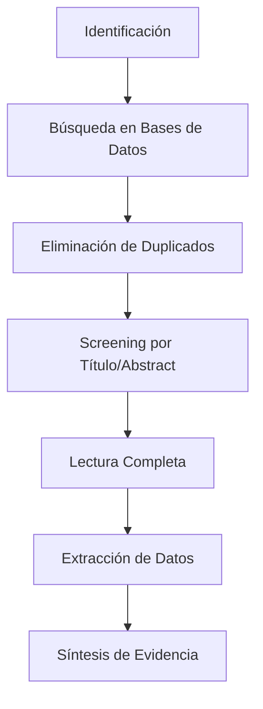

# Gu Guide to Document Systematic Literature Review

## Estado Actual

> [!WARNING]
> **CRÍTICO**: Las referencias bibliográficas en `protocolo_investigacion.md` y `anteproyecto_dlbp_coproductos.md` NO HAN SIDO VALIDADAS. Este documento proporciona una metodología sistemática para realizar la validación bibliográfica.

---

## 1. METODOLOGÍA DE REVISIÓN SISTEMÁTICA

### 1.1. Protocolo PRISMA Adaptado

Seguiremos una metodología simplificada basada en PRISMA (Preferred Reporting Items for Systematic Reviews and Meta-Analyses):



### 1.2. Criterios de Inclusión/Exclusión

**Criterios de Inclusión:**
- ✅ Estudios sobre DLBP o problemas de balanceo de líneas
- ✅ Aplicaciones en industria alimentaria o avícola
- ✅ Métodos de optimización (exactos o metaheurísticos)
- ✅ Publicados en revistas indexadas o conferencias reconocidas
- ✅ Idiomas: Inglés o Español
- ✅ Periodo: 2000-2024 (últimos 24 años para capturar trabajos seminales)

**Criterios de Exclusión:**
- ❌ Estudios sin peer review (blogs, technical reports no científicos)
- ❌ Trabajos duplicados
- ❌ Estudios sin acceso al texto completo (después de intentos razonables)
- ❌ Estudios no relevantes al dominio de coproductos

---

## 2. BASES DE DATOS Y ECUACIONES DE BÚSQUEDA

### 2.1. Scopus

**Ecuación de Búsqueda 1: DLBP General**
```
TITLE-ABS-KEY("disassembly line balancing" OR "disassembly line" OR "DLBP") 
AND PUBYEAR > 1999
```

**Ecuación de Búsqueda 2: Industria Alimentaria**
```
TITLE-ABS-KEY((disassembly OR "line balancing" OR carcass OR coproduct) 
AND (food OR poultry OR chicken OR meat OR "avícola")) 
AND PUBYEAR > 1999
```

**Ecuación de Búsqueda 3: Metaheurísticas + Balanceo**
```
TITLE-ABS-KEY(("genetic algorithm" OR "tabu search" OR metaheuristic OR PSO) 
AND ("line balancing" OR "production planning") 
AND (food OR poultry OR meat)) 
AND PUBYEAR > 1999
```

### 2.2. Web of Science

**Ecuación WoS 1:**
```
TS=("disassembly line balancing" OR DLBP) AND PY=(2000-2024)
```

**Ecuación WoS 2:**
```
TS=(("poultry processing" OR "chicken processing") AND (optimization OR "line balancing"))
AND PY=(2000-2024)
```

### 2.3. IEEE Xplore

```
("disassembly line" OR "line balancing") AND (optimization OR metaheuristic)
Filters: 2000-2024, Conferences + Journals
```

### 2.4. ScienceDirect

```
Title, abstract, keywords: 
  ("disassembly" OR "coproduct optimization") AND ("food industry" OR "poultry")
Date Range: 2000-2024
```

### 2.5. Google Scholar (Complementario)

```
"disassembly line balancing" food OR poultry -patent
Years: 2000-2024
```

---

## 3. TRACKING DE REFERENCIAS A VALIDAR

### 3.1. Referencias del Anteproyecto (PRIORITARIAS)

#### 📋 Tabla de Validación

| # | Referencia Citada | Fuente Esperada | Status | Notas |
|---|-------------------|-----------------|--------|-------|
| 1 | @AltairOptimization2019 | ¿Revista/Tesis? | ❌ NO VALIDADO | Buscar: "Altair" + "poultry" + "optimization" + "2019" |
| 2 | @PoultryEfficiencyStudy2022 | ¿Estudio sectorial? | ❌ NO VALIDADO | Posible reporte técnico, no académico |
| 3 | @SeasonalDemandPatterns2022 | ¿Paper académico? | ❌ NO VALIDADO | Verificar datos de demanda estacional |
| 4 | @ProductionCosts2023 | ¿Informe industrial? | ❌ NO VALIDADO | Podría ser FENAVI o similar |
| 5 | @InventoryManagement2022 | ¿Paper/Book? | ❌ NO VALIDADO | Contexto avícola incierto |
| 6 | @LineBalancingComplexity2021 | Probable paper académico | ⚠️ BUSCAR | Complejidad NP-hard es conocida, validar fuente |
| 7 | @FAOPoultryStats2023 | FAO Statistics | ⚠️ VALIDAR | Sitio web oficial de FAO |
| 8 | Becker & Scholl (1998) | EJOR | ⚠️ VALIDAR | Referencia clásica, probablemente válida |
| 9 | Minegishi & Thiel (2000) | Simulation Practice and Theory | ⚠️ VALIDAR | Verificar revista exacta |
| 10 | Solano-Blanco et al. (2022) | IJPE (International Journal of Production Economics) | ⚠️ ALTA PRIORIDAD | Validar existencia en IJPE 2022 |
| 11 | Awad et al. (2023) | ¿Qué revista? | ❌ NO VALIDADO | Año reciente, verificar título completo |
| 12 | Lu & Qi (2011) | ¿Journal? | ❌ NO VALIDADO | Tema: programación dinámica |
| 13 | Ji et al. (2016) | ¿Journal? | ❌ NO VALIDADO | Tema: MILP setup times |
| 14 | Boonmee & Sethanan (2016) | ¿Conference/Journal? | ❌ NO VALIDADO | Tema: PSO planificación avícola |

### 3.2. Plan de Acción por Referencia

#### ✅ Referencias Clásicas (Probablemente Válidas)

**1. Becker & Scholl (1998)**
- [ ] Buscar en Scopus: `AU(Becker) AND AU(Scholl) AND PUBYEAR = 1998`
- [ ] Confirmar título exacto y revista
- [ ] Descargar PDF
- [ ] Leer sección sobre DLBP (si aplica) o ALBP
- [ ] **Nota**: Esta es una referencia muy citada sobre balanceo de líneas

**2. Minegishi & Thiel (2000)**
- [ ] Buscar: `AU(Minegishi) AND AU(Thiel) AND PUBYEAR = 2000`
- [ ] Verificar revista "Simulation Practice and Theory"
- [ ] Confirmar que trata sistema de alimentospor desensamble
- [ ] Evaluar aplicabilidad

#### ⚠️ Referencias Recientes (ALTA PRIORIDAD)

**3. Solano-Blanco et al. (2022)**
- [ ] Buscar en Scopus: `AU(Solano-Blanco) AND PUBYEAR = 2022`
- [ ] Buscar directamente en International Journal of Production Economics 2022
- [ ] **Búsqueda alternativa**: `"broiler chicken supply chain" AND 2022`
- [ ] Si se encuentra, validar datos: "7-57% utilidad", "30-60% inventario"
- [ ] **CRÍTICO**: Esta referencia es central para justificar el proyecto

**4. Awad et al. (2023)**
- [ ] Buscar: `AU(Awad) AND PUBYEAR = 2023 AND (poultry OR chicken OR giveaway)`
- [ ] Tema: minimización de sobrepeso (overweight/giveaway optimization)
- [ ] Verificar métodos: MIP (Mixed Integer Programming)
- [ ] Contexto: porcionado avícola

#### ❌ Referencias Cuestionables (VERIFICAR/REEMPLAZAR)

**5. @AltairOptimization2019**
- [ ] Búsqueda exhaustiva: `"Altair" AND (poultry OR avícola) AND (optimization OR optimización) AND 2019`
- [ ] Revisar tesis de grado en repositorios colombianos:
  - [ ] Universidad del Norte
  - [ ] Universidad Nacional
  - [ ] UTP (cercana a Santa Marta)
- [ ] Contactar FENAVI regional Costa Atlántica
- [ ] **Si no se encuentra**: ELIMINAR del protocolo o marcar como "comunicación personal" con fuente validada

**6. @PoultryEfficiencyStudy2022**
- [ ] Probable reporte técnico o tesis
- [ ] Buscar en repositorios institucionales
- [ ] Revisar publicaciones de FENAVI 2022
- [ ] **Si no se encuentra**: Reemplazar con estudios validados o eliminar datos cuantitativos

**7-10. Referencias con Identificadores Genéricos**
- `@SeasonalDemandPatterns2022`
- `@ProductionCosts2023`
- `@InventoryManagement2022`
- `@LineBalancingComplexity2021`

**Acción**: Estos son **placeholders** que requieren:
- [ ] Búsqueda de literatura real que soporte las afirmaciones
- [ ] Reemplazo con fuentes primarias validadas
- [ ] O eliminación de datos cuantitativos hasta encontrar soporte

---

## 4. FUENTES DE DATOS INDUSTRIALES

### 4.1. Organizational Sources

#### FENAVI (Federación Nacional de Avicultores de Colombia)
- **URL**: https://fenavi.org/
- **Recursos a revisar**:
  - [ ] Informes anuales del sector avícola
  - [ ] Revista AMEVEA
  - [ ] Estadísticas de producción
  - [ ] Estudios económicos

#### FAO (Food and Agriculture Organization)
- **URL**: https://www.fao.org/poultry-production-products/
- **Datos a extraer**:
  - [ ] Estadísticas globales de producción avícola
  - [ ] Rendimientos promedio por corte
  - [ ] Benchmarks internacionales

#### DANE (Colombia)
- **URL**: https://www.dane.gov.co/
- **Secciones**:
  - [ ] Índice de precios (IPP - Componente avícola)
  - [ ] Sacrificio de ganado
  - [ ] Series históricas

#### ICA (Instituto Colombiano Agropecuario)
- **Datos regulatorios y técnicos**:
  - [ ] Normas de procesamiento
  - [ ] Estadísticas de plantas certificadas

### 4.2. Academic/Technical Literature (Grey Literature)

**Repositorios de Tesis Colombianas:**
- [ ] Universidad Nacional de Colombia
- [ ] Universidad de los Andes
- [ ] Universidad del Norte
- [ ] UTP (Universidad Tecnológica de Pereira)
- [ ] EAFIT

**Palabras clave para búsqueda:**
- "optimización avícola"
- "balanceo de carcasa"
- "planificación producción pollo"
- "coproductos avícola"

---

## 5. PLANTILLAS DE DOCUMENTACIÓN

### 5.1. Ficha de Lectura Individual

```markdown
---
ReferenceID: [Autor_Año]
ValidationDate: [Fecha de validación]
Status: [VALIDADO / NO ENCONTRADO / PARCIAL]
---

## Metadata
- **Autores**: 
- **Título completo**: 
- **Revista/Fuente**: 
- **Año**: 
- **DOI/URL**: 
- **Acceso**: [Abierto / Institucional / Solicitado]

## Contenido
### Problema abordado


### Metodología


### Resultados principales
- Cuantitativos:
- Cualitativos:

### Datos citados en nuestro anteproyecto


### Verificación de datos
- [ ] Datos numéricos coinciden
- [ ] Contexto es aplicable
- [ ] Metodología es sólida

## Evaluación
- **Calidad metodológica**: [Alta / Media / Baja]
- **Relevancia a nuestra investigación**: [1-5]
- **Aplicabilidad directa**: [Sí / Parcial / No]

## Notas adicionales


## Decisión
- [ ] INCLUIR en marco teórico
- [ ] CITAR como justificación
- [ ] USARdatos cuantitativos
- [ ] DESCARTAR
```

### 5.2. Tabla Resumen de Validación

Crear archivo Excel/Google Sheets con columnas:

| Campo | Descripción |
|-------|-------------|
| ID | Identificador único |
| Referencia_Original | Como aparece en anteproyecto |
| Autores_Reales | Después de validación |
| Título | Título completo validado |
| Fuente | Revista/Conferencia |
| Año | Año de publicación |
| DOI | Identificador digital |
| Status_Validación | VALIDADO / NO ENCONTRADO / REEMPLAZADO |
| Datos_Usados | Qué datos específicos usamos |
| Confianza | Alta / Media / Baja |
| Notas | Observaciones |

---

## 6. CRONOGRAMA DE REVISIÓN BIBLIOGRÁFICA

### Fase 1: Validación de Referencias Existentes (Semana 1-2)
- **Días 1-3**: Buscar y validar referencias clásicas (Becker, Minegishi, etc.)
- **Días 4-7**: Validar referencias recientes (Solano-Blanco, Awad, etc.)
- **Días 8-10**: Búsqueda exhaustiva de referencias no encontradas
- **Días 11-14**: Documentar resultados y actualizar protocolo

### Fase 2: Búsqueda Sistemática Nueva (Semana 3-4)
- **Semana 3**: 
  - Ejecutar búsquedas en Scopus y WoS
  - Screening por título y abstract
  - Descargar PDFs seleccionados
- **Semana 4**:
  - Lectura completa de papers seleccionados
  - Extracción de datos
  - Crear fichas bibliográficas

### Fase 3: Datos Industriales (Semana 5)
- Contactar FENAVI
- Revisar reportes de FAO y DANE
- Buscar tesis y literatura gris

### Fase 4: Síntesis y Actualización (Semana 6)
- Actualizar `protocolo_investigacion.md` con referencias validadas
- Crear sección de Estado del Arte robusta
- Actualizar `referencias_dlbp.bib`
- Eliminar o reemplazar referencias no validadas

---

## 7. HERRAMIENTAS RECOMENDADAS

### 7.1. Gestión de Referencias
- **Zotero** (gratis, open source)
  - Plugin para navegador
  - Integración con Word/LibreOffice
  - Exportación a BibTeX
- **Mendeley** (alternativa)

### 7.2. Organización
- **Notion** o **Obsidian**: Para fichas de lectura interconectadas
- **Excel/Google Sheets**: Para tracking de validación
- **GitHub**: Para control de versiones del.bib

### 7.3. Búsqueda
- **Connected Papers**: Visualización de red de citaciones
- **Semantic Scholar**: Búsqueda semántica con IA
- **Litmaps**: Mapas de literatura

---

## 8. CRITERIOS DE CALIDAD

### 8.1. Para Artículos Científicos

**Evaluación de Calidad (Checklist):**
- [ ] Publicado en revista indexada (Scopus/WoS)
- [ ] Peer-reviewed
- [ ] Metodología claramente descrita
- [ ] Resultados replicables
- [ ] Datos y código disponibles (ideal)
- [ ] Citaciones razonables (>5 citas para papers >3 años)

### 8.2. Para Datos Industriales

- [ ] Fuente oficial (gobierno, asociación reconocida)
- [ ] Fecha reciente (<5 años idealmente)
- [ ] Metodología de recolección transparente
- [ ] Contexto geográfico aplicable (Colombia o similar)

---

## 9. PRÓXIMOS PASOS INMEDIATOS

### Acción 1: Configurar Zotero
1. Descargar e instalar Zotero
2. Instalar plugin de navegador
3. Crear colección "DLBP_Avícola"
4. Configurar exportación BibTeX automática

### Acción 2: Validar Top 3 Referencias
Priorizar estas tres por impacto en el protocolo:
1. **Solano-Blanco et al. (2022)** - Fundamental para justificación
2. **Becker & Scholl (1998)** - Base teórica DLBP
3. **@AltairOptimization2019** - Caso colombiano clave (si existe)

### Acción 3: Primera Búsqueda Sistemática
- Ejecutar búsqueda 1 en Scopus (DLBP general)
- Exportar resultados a Zotero
- Hacer screening inicial de títulos

---

## 10. INDICADORES DE PROGRESO

### Metrics to Track:
- **Referencias validadas**: ___/14
- **Papers encontrados en búsqueda sistemática**: ___
- **Papers en lectura**: ___
- **Papers incluidos finalmente**: ___
- **Datos cuantitativos validados**: ___/%
- **Fuentes industriales contactadas**: ___

### Target:
- **Mínimo**: 20 referencias sólidas validadas
- **Óptimo**: 30-40 referencias de alta calidad
- **Mix**: 70% papers académicos + 30% fuentes industriales/técnicas

---

## 11. CONTACTOS Y RECURSOS

### Expertos Potenciales a Contactar:
- [ ] Profesores UTP - Departamento de Ingeniería Industrial
- [ ] Director FENAVI - Seccional (si applies)
- [ ] Investigadores en optimización (revisar autores locales)

### Bases de Datos Institucionales UTP:
- [ ] Verificar acceso institucional a Scopus
- [ ] Verificar acceso a Web of Science
- [ ] Solicitar acceso a IEEE si no disponible

---

## NOTAS FINALES

> [!IMPORTANT]
> **Rigor Científico**: Es preferible tener MENOS datos pero VALIDADOS, que muchos datos sin sustento. Si no encuentras una referencia después de búsqueda exhaustiva, es mejor ELIMINAR esa afirmación del protocolo que mantenerlas sin justificación.

> [!TIP]
> **Literatura Gris**: Para datos industriales colombianos, la literatura gris (tesis, reportes técnicos, informes de FENAVI) puede ser VÁLIDA si:
> 1. La fuente es confiable
> 2. La metodología es transparente
> 3. Los datos son verificables

🚀 **¡Comienza con las Acciones Inmediatas (Sección 9) y ve marcando tu progreso!**
