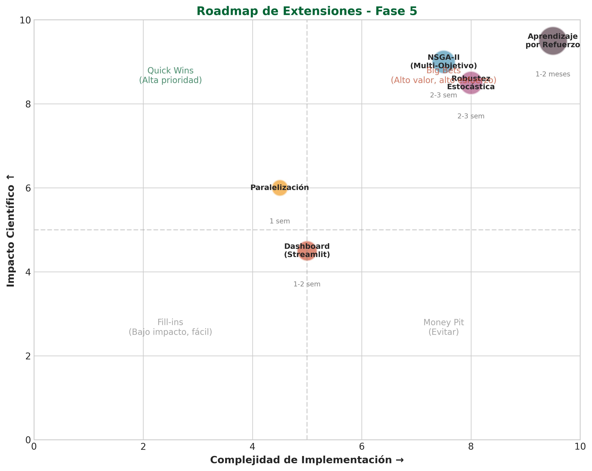
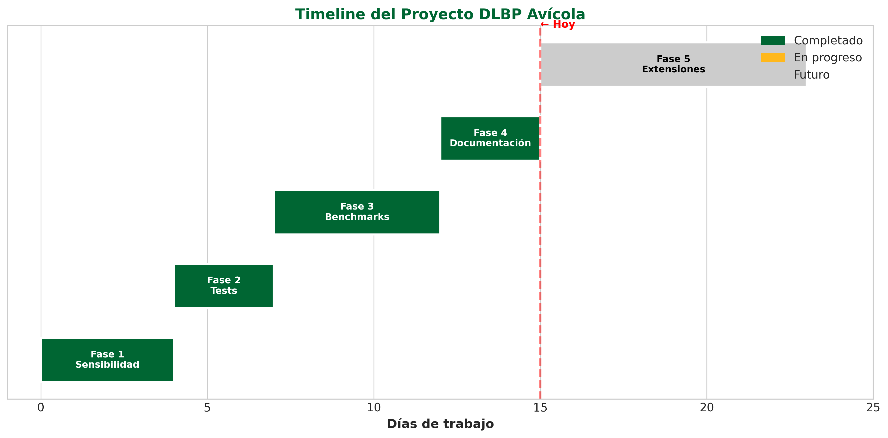

# Anexo H: Roadmap de Extensiones Futuras

## Introducción

Este anexo presenta el plan de extensiones técnicas avanzadas identificadas para el proyecto DLBP Avícola. Las extensiones se priorizan según su impacto científico y complejidad de implementación.

---

## Matriz de Priorización

**Figura H.1.** Matriz impacto vs complejidad para las extensiones identificadas. Los cuadrantes ayudan a identificar las iniciativas de mayor valor (esquina superior izquierda).

---

## Extensiones Identificadas

### H.1 Optimización Multi-Objetivo (NSGA-II)

**Complejidad:** Alta  
**Impacto:** Alto  
**Tiempo estimado:** 2-3 semanas

Esta extensión implementaría el algoritmo NSGA-II (Non-dominated Sorting Genetic Algorithm II) para optimizar simultáneamente múltiples objetivos:

1. Minimizar número de estaciones
2. Minimizar desbalance de carga
3. Minimizar costo de inventario
4. Maximizar utilización de mano de obra

**Figura H.2.** Diagrama conceptual de la arquitectura NSGA-II propuesta para el DLBP multi-objetivo.

**Entregables propuestos:**
- `src/algorithms/nsga2_dlbp.py`
- Visualización del frente de Pareto
- Análisis de trade-offs entre objetivos

---

### H.2 Optimización Robusta bajo Incertidumbre

**Complejidad:** Alta  
**Impacto:** Alto  
**Tiempo estimado:** 2-3 semanas

Extender el modelo para manejar incertidumbre en tiempos de procesamiento mediante:

| Enfoque | Descripción | Complejidad |
|---------|-------------|-------------|
| Worst-case | Optimizar el peor escenario | Media |
| CVaR | Conditional Value at Risk | Alta |
| Chance-constrained | Restricciones probabilísticas | Alta |

---

### H.3 Paralelización de Algoritmos

**Complejidad:** Media  
**Impacto:** Medio  
**Tiempo estimado:** 1 semana

Acelerar la ejecución mediante:

| Componente | Técnica | Speedup Esperado |
|------------|---------|------------------|
| Evaluación de población (GA) | `multiprocessing.Pool` | 2-4x |
| Ejecución de réplicas | `joblib.Parallel` | Nx (N=cores) |
| Generación de vecindario (TS) | `concurrent.futures` | 2-3x |

---

### H.4 Interfaz Web (Dashboard)

**Complejidad:** Media  
**Impacto:** Bajo-Medio  
**Tiempo estimado:** 1-2 semanas

Crear una interfaz web interactiva con **Streamlit** para:
- Configurar parámetros de algoritmos
- Ejecutar optimizaciones en tiempo real
- Visualizar resultados interactivamente

---

### H.5 Aprendizaje por Refuerzo

**Complejidad:** Muy Alta  
**Impacto:** Alto  
**Tiempo estimado:** 1-2 meses

Explorar el uso de RL para balanceo dinámico basado en demanda en tiempo real:
- **Agente:** Red neuronal que decide asignaciones
- **Ambiente:** Simulación de planta avícola
- **Reward:** Minimizar estaciones + bonus por balance

---

## Timeline del Proyecto

**Figura H.3.** Timeline visual mostrando el progreso de las fases completadas y el trabajo futuro planificado.

---

## Criterios para Iniciar Extensiones

Antes de iniciar cualquier extensión de Fase 5, se deben cumplir:

- [x] Fases 1-4 completadas satisfactoriamente
- [x] Proyecto con cobertura de tests ≥60% (actualmente: 50 tests)
- [x] Documentación al día
- [ ] Tiempo disponible según estimación
- [ ] Recursos de cómputo necesarios disponibles

---

## Referencias

- Deb, K. (2002). *Multi-Objective Optimization Using Evolutionary Algorithms*. Wiley.
- Ben-Tal, A., & Nemirovski, A. (2002). *Robust optimization*. Princeton University Press.
- Sutton, R. S., & Barto, A. G. (2018). *Reinforcement Learning: An Introduction*. MIT Press.

---

*Última actualización: 22 de Enero de 2026*
