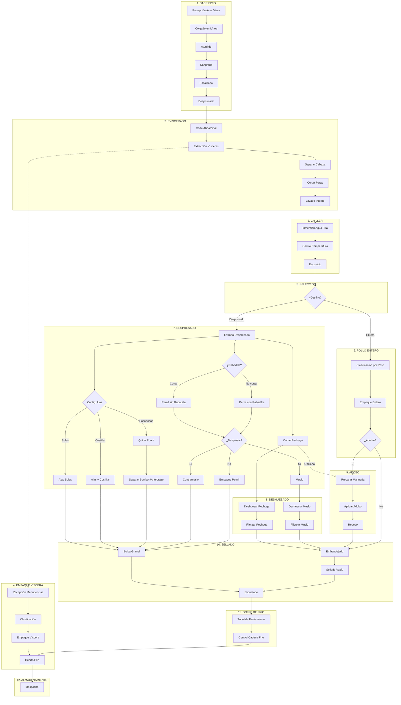

# Formulación Matemática del DLBP Avícola

Este documento contiene la formulación matemática del Problema de Balanceo de Líneas de Desensamble (DLBP) aplicado a la industria avícola. El modelo propuesto considera la incertidumbre inherente a los tiempos de procesamiento biológico [@Hu_2023; @Liu_2019] y la naturaleza secuencial-divergente del flujo de desensamble [@Kopanos_2012].

## 1. Conjuntos

| Símbolo | Descripción |
| :--- | :--- |
| $I$ | Conjunto de tareas de desensamble (cortes, deshuesado, evisceración, etc.) |
| $S$ | Conjunto de estaciones de trabajo disponibles en la línea |
| $K$ | Conjunto de tipos de carcasa (variaciones por peso, calidad, proveedor) |
| $P$ | Conjunto de partes/coproductos resultantes (pechuga, alas, muslos, vísceras) |

## 2. Parámetros y Modelado de la Incertidumbre

El modelo base se formula inicialmente como determinista, pero reconoce la naturaleza estocástica del proceso biológico. Basándonos en la literatura reciente de DLBP bajo incertidumbre [@Hu_2023; @Liu_2019], definimos los siguientes parámetros extendidos:

### 2.1. Parámetros Deterministas

| Símbolo | Descripción | Unidad |
| :--- | :--- | :--- |
| $d_{pk}$ | Demanda del coproducto $p$ para el tipo de carcasa $k$ | unidades/período |
| $v_p$ | Precio de venta del coproducto $p$ | $/unidad |
| $h_p$ | Costo de mantener inventario del coproducto $p$ | $/unidad/período |
| $C$ | Tiempo de ciclo máximo permitido (takt time) | segundos |
| $c_s$ | Costo fijo de operar una estación de trabajo (energía, equipos, operario) | $/período |
| $\pi_p$ | Penalización por unidad de demanda no satisfecha (backorder cost) | $/unidad |

### 2.2. Modelado de Incertidumbre (Extensiones)

**A. Incertidumbre en Tiempos de Procesamiento ($\tilde{t}_{ik}$)**
A diferencia del ensamblaje automatizado, el desensamble manual de productos biológicos presenta alta variabilidad. Siguiendo a **Hu et al. (2023)** y **Liu et al. (2019)**, el tiempo de procesamiento se modela como una variable aleatoria, típicamente siguiendo una distribución Normal o Weibull debido a la fatiga humana y variaciones anatómicas:
$$
\tilde{t}_{ik} \sim \mathcal{N}(\mu_{ik}, \sigma_{ik}^2)
$$
Donde $\mu_{ik}$ es el tiempo estándar y $\sigma_{ik}$ representa la variabilidad del operario y la materia prima.

**B. Incertidumbre en la Calidad/Estado ($\theta_q$)**
El punto de decisión de "Selección" (ver Sección 6) depende del estado de la carcasa. **Fang et al. (2025)** proponen modelos de optimización dinámica basados en inferencia causal para componentes con estados inciertos. En nuestro caso, definimos $\theta_q$ como la probabilidad de que una carcasa $k$ tenga calidad $q$ (A, B, Decomiso), afectando el grafo de precedencia disponible:
$$
\sum_{q \in Q} \theta_q = 1
$$

---

## 3. Variables de Decisión
*(Se mantienen las variables binarias estándar $x_{is}, y_s$ y continuas de flujo $q_{pk}$)*

---

## 4. Función Objetivo

La literatura de DLBP tradicionalmente minimiza el número de estaciones ($n_{stations}$) o el tiempo muerto (idle time) [@BeckerScholl2006]. Sin embargo, para la industria de procesamiento de commodities con márgenes estrechos, **Liang et al. (2023)** sugieren un enfoque orientado al beneficio (*profit-oriented*) que integra ingresos por recuperación de partes y costos operativos.

Nuestra función objetivo propuesta $\max Z$ es una adaptación del modelo de beneficio de Liang, incorporando los costos de penalización por servicio sugeridos en modelos robustos [@Liu_2021]:

$$
\max Z = \underbrace{\sum_{p \in P} \sum_{k \in K} v_p \cdot \min(q_{pk}, d_{pk})}_{\text{Ingresos (Revenue)}} - \underbrace{\left( \sum_{s \in S} c_s \cdot y_s + \mathcal{E}_{cost} \right)}_{\text{Costos Operativos}} - \underbrace{\sum_{p \in P} (\pi_p \cdot I_{pk}^- + h_p \cdot I_{pk}^+)}_{\text{Penalizaciones Logísticas}}
$$

Donde $\mathcal{E}_{cost}$ podría representar costos energéticos explícitos si se adopta un enfoque multi-objetivo en fases futuras [@Tian_2023].

## 5. Restricciones

### 5.1. Asignación Única
Cada tarea debe asignarse exactamente a una estación:
$$
\sum_{s \in S} x_{is} = 1 \quad \forall i \in I
$$

### 5.2. Precedencia
Si la tarea $j$ es predecesora de $i$, entonces $j$ debe asignarse a una estación anterior o igual:
$$
\sum_{s \in S} s \cdot x_{js} \leq \sum_{s \in S} s \cdot x_{is} \quad \forall i \in I, \forall j \in pred(i)
$$

### 5.3. Tiempo de Ciclo
La suma de tiempos en cada estación no puede exceder el tiempo de ciclo:
$$
\sum_{i \in I} t_{ik} \cdot x_{is} \leq C \cdot y_s \quad \forall s \in S, \forall k \in K
$$

### 5.4. Activación de Estación
Una estación solo puede tener tareas si está activada:
$$
x_{is} \leq y_s \quad \forall i \in I, \forall s \in S
$$

### 5.5. Balance de Materiales
$$
q_{pk} = I_{pk}^+ - I_{pk}^- + d_{pk} \quad \forall p \in P, \forall k \in K
$$

### 5.6. No Negatividad
$$
x_{is}, y_s \in \{0, 1\}; \quad q_{pk}, I_{pk}^+, I_{pk}^- \geq 0
$$

---

## 6. Grafo de Precedencia (Proceso Completo - 12 Áreas)

El siguiente diagrama representa el flujo completo de una planta de procesamiento avícola, organizado en las **12 áreas operativas** desde el Sacrificio hasta el Almacenamiento.

### 6.1. Nodos de Decisión (Configuraciones)

El proceso avícola tiene **puntos de bifurcación** que generan diferentes rutas:

| Punto | Opciones | Impacto |
| :--- | :--- | :--- |
| **Selección** | Entero vs Despresado | Define si entra al área de cortes |
| **Config. Alas** | Solas, Costillar, Pasabocas | Afecta tiempos y SKUs resultantes |
| **Rabadilla** | Cortar vs No cortar | Determina peso del pernil |
| **Despresar Pernil** | Sí vs No | Genera contramuslo + muslo o pernil entero |
| **Deshuesado** | Aplicar vs No aplicar | Genera filetes (mayor valor agregado) |

### 6.2. Áreas Especializadas de la Planta

El proceso avícola se organiza en **12 áreas operativas** secuenciales y paralelas:

| # | Área | Descripción | Tipo |
| :---: | :--- | :--- | :--- |
| 1 | **Sacrificio** | Recepción, aturdido, sangrado y escaldado | Secuencial |
| 2 | **Eviscerado** | Extracción de vísceras y lavado interno | Secuencial |
| 3 | **Chiller** | Enfriamiento obligatorio (inmersión en agua fría) | Secuencial |
| 4 | **Empaque de Víscera** | Procesamiento paralelo de menudencias | Paralelo |
| 5 | **Selección** | Punto de decisión: Entero vs Despresado | Decisión |
| 6 | **Pollo Entero** | Empaque de ave completa (con/sin marinado) | Opción |
| 7 | **Despresado** | Corte en piezas (alas, pechuga, pernil) | Opción |
| 8 | **Deshuesado** | Extracción de huesos de pechuga y muslos | Valor Agregado |
| 9 | **Adobo** | Marinado y condimentado de piezas | Valor Agregado |
| 10 | **Sellado** | Empaque final (bandeja, bolsa, granel) | Final |
| 11 | **Golpe de Frío** | Enfriamiento rápido para conservación | Final |
| 12 | **Almacenamiento** | Cuarto frío para inventario | Final |

**Nota:** Las áreas 1-5 son obligatorias y secuenciales. A partir de Selección, se bifurca en múltiples rutas según la configuración de producto.

---

## 7. Complejidad Computacional

El DLBP pertenece a la clase de problemas **NP-hard** [@BeckerScholl2006]. Esto implica que:
- Para instancias pequeñas (≤10 tareas): Solución óptima con MILP en segundos.
- Para instancias medianas (20-50 tareas): MILP puede tardar minutos a horas.
- Para instancias grandes (≥50 tareas): Se requieren **metaheurísticas** como Algoritmos Genéticos [@Wang_2021; @Tian_2023], Tabu Search [@Suwannarongsri2007] o enfoques híbridos [@Hu_2023].

---

*Documento generado como parte de la Fase 1 del proyecto DLBP Avícola*
*Fecha: 14 de Enero de 2026*
