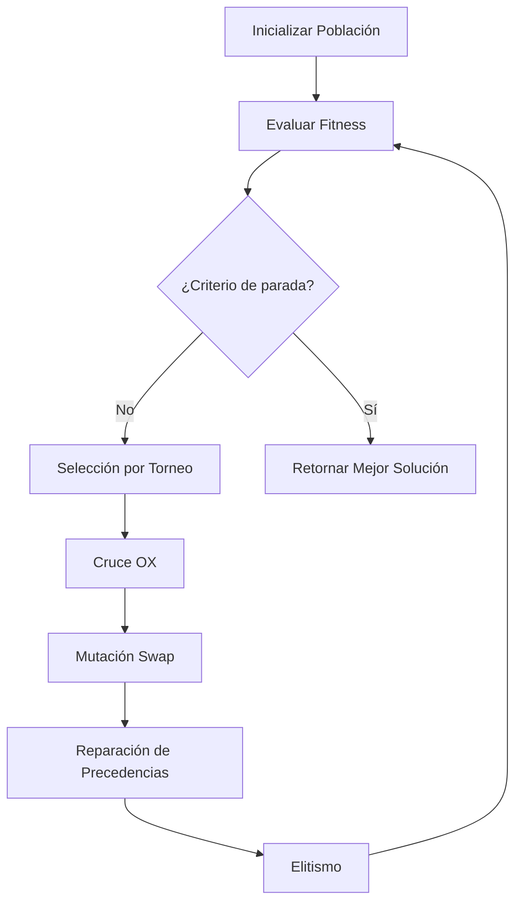
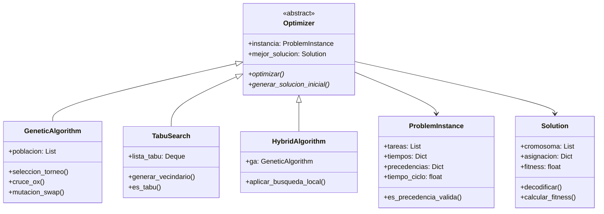

# Capítulo 4: Metodología de Solución

## 4.1. Introducción

Este capítulo presenta las metaheurísticas diseñadas para resolver el problema DLBP (Disassembly Line Balancing Problem) aplicado a la industria avícola colombiana. Dado que el DLBP pertenece a la clase NP-Hard [@BeckerScholl2006], los métodos exactos (MILP) se vuelven computacionalmente intratables para instancias de tamaño industrial. Por ello, se implementaron tres enfoques metaheurísticos:

1. **Algoritmo Genético (GA)**: Exploración global del espacio de soluciones
2. **Búsqueda Tabú (TS)**: Explotación intensiva de vecindarios prometedores  
3. **Algoritmo Híbrido (Memetic)**: Combinación sinérgica de GA y TS

---

## 4.2. Representación de Soluciones

### 4.2.1. Codificación Cromosómica

Se adoptó una representación basada en **permutaciones de tareas**, ampliamente utilizada en problemas de balanceo de líneas [@McGovern2007; @Kucukkoc2020]. Cada cromosoma $\pi = (\pi_1, \pi_2, \ldots, \pi_n)$ es una permutación de las $n$ tareas que indica el orden de prioridad para la asignación a estaciones.

**Ventajas de esta representación:**
- Manejo implícito de precedencias mediante ordenamiento topológico
- Compatibilidad con operadores genéticos estándar (OX, PMX)
- Decodificación determinista a asignación de estaciones

### 4.2.2. Decodificación (First Fit Decreasing)

La transformación de un cromosoma $\pi$ a una asignación factible $\mathcal{A}: T \rightarrow S$ se realiza mediante el algoritmo voraz descrito en el Algoritmo 1.

```
Algoritmo 1: Decodificador First-Fit
─────────────────────────────────────────────────
Entrada: Permutación π, Tiempos t, Ciclo C
Salida: Asignación A = {(tarea, estación)}

1:  s ← 1                           // Estación actual
2:  tiempo_acum ← 0
3:  Para cada tarea i en π:
4:      Si tiempo_acum + t[i] ≤ C:
5:          tiempo_acum ← tiempo_acum + t[i]
6:      Sino:
7:          s ← s + 1               // Abrir nueva estación
8:          tiempo_acum ← t[i]
9:      A[i] ← s
10: Retornar A, s
─────────────────────────────────────────────────
```

### 4.2.3. Función de Fitness

Para problemas de minimización del número de estaciones:

$$
f(\pi) = n_{estaciones}(\pi) + \alpha \cdot \text{penalización}_{precedencias}
$$

Donde $\alpha$ es un factor de penalización grande (e.g., 1000) que castiga soluciones infactibles.

---

## 4.3. Algoritmo Genético (GA)

### 4.3.1. Descripción General

El Algoritmo Genético implementado sigue el paradigma evolutivo clásico [@Holland1975], adaptado para el DLBP según las recomendaciones de @Wang2021 y @McGovern2007.



### 4.3.2. Operadores Genéticos

#### Selección por Torneo
Se seleccionan $k$ individuos aleatoriamente y se elige el de mejor fitness. Este método mantiene presión selectiva sin convergencia prematura [@Goldberg1991].

#### Cruce Order Crossover (OX)
El operador OX [@Davis1985] preserva el orden relativo de las tareas, crucial para mantener la factibilidad de precedencias.

```
Algoritmo 2: Order Crossover (OX)
─────────────────────────────────────────────────
Entrada: Padres P₁, P₂; Puntos de corte c₁, c₂
Salida: Hijos H₁, H₂

1:  H₁ ← copiar segmento P₁[c₁:c₂]
2:  Completar H₁ con genes de P₂ en orden circular
3:  H₂ ← copiar segmento P₂[c₁:c₂]  
4:  Completar H₂ con genes de P₁ en orden circular
5:  Reparar precedencias en H₁, H₂
6:  Retornar H₁, H₂
─────────────────────────────────────────────────
```

#### Mutación Swap
Intercambia dos posiciones aleatorias en el cromosoma, seguido de reparación de precedencias si es necesario.

### 4.3.3. Parámetros del GA

| Parámetro | Valor | Justificación |
|-----------|-------|---------------|
| Tamaño población | 50 | Balance entre diversidad y eficiencia [@Eiben2003] |
| Prob. cruce | 0.85 | Recomendación estándar para permutaciones |
| Prob. mutación | 0.15 | Mantiene diversidad sin destruir buenos esquemas |
| Tamaño torneo | 3 | Presión selectiva moderada |
| Elitismo | 2 | Preserva las mejores soluciones |

---

## 4.4. Búsqueda Tabú (TS)

### 4.4.1. Descripción General

La Búsqueda Tabú [@Glover1997] es una metaheurística de trayectoria que explora el espacio de soluciones mediante movimientos a vecinos, utilizando una memoria de corto plazo (lista tabú) para evitar ciclos.

```mermaid
flowchart TD
    A[Solución Inicial x*] --> B[Generar Vecindario N(x)]
    B --> C[Filtrar Movimientos Tabú]
    C --> D{¿Criterio Aspiración?}
    D -->|Sí| E[Permitir Movimiento]
    D -->|No| F[Excluir Movimiento]
    E --> G[Seleccionar Mejor Vecino]
    F --> G
    G --> H[Actualizar x, Lista Tabú]
    H --> I{¿Mejora x*?}
    I -->|Sí| J[x* ← x]
    I -->|No| K[Contador estancamiento++]
    J --> L{¿Criterio parada?}
    K --> L
    L -->|No| B
    L -->|Sí| M[Retornar x*]
```

### 4.4.2. Estructura de Vecindario

Se definieron dos tipos de movimientos:

1. **Swap $(i, j)$**: Intercambia las posiciones de las tareas en $i$ y $j$
2. **Insert $(i, j)$**: Remueve tarea de posición $i$ e inserta en posición $j$

El vecindario se genera muestreando $N_{vecinos}$ (e.g., 30) movimientos aleatorios.

### 4.4.3. Lista Tabú y Aspiración

- **Lista Tabú**: Cola FIFO de tamaño $L$ que almacena los últimos movimientos realizados
- **Criterio de Aspiración**: Un movimiento tabú se permite si genera una solución mejor que la mejor global $x^*$

### 4.4.4. Parámetros del TS

| Parámetro | Valor | Justificación |
|-----------|-------|---------------|
| Tamaño lista tabú | 20 | Evita ciclos sin restringir excesivamente |
| Tamaño vecindario | 30 | Balance entre calidad y tiempo |
| Tipo movimiento | Mixto | Combina diversificación (insert) e intensificación (swap) |
| Intensificación | 50 iter | Reinicia desde mejor si hay estancamiento |

---

## 4.5. Algoritmo Híbrido (Memetic)

### 4.5.1. Motivación

Los algoritmos meméticos [@Moscato1989] combinan la exploración global de los GA con la intensificación local de métodos como TS. Esta estrategia ha demostrado ser efectiva para problemas de balanceo de líneas [@Hu2023; @Tian2023].

### 4.5.2. Estrategia de Hibridación

```
Algoritmo 3: Algoritmo Memético (GA + TS)
─────────────────────────────────────────────────
Entrada: Instancia I, Config GA, Config TS
Salida: Mejor solución x*

1:  P ← InicializarPoblación(I)
2:  x* ← MejorIndividuo(P)
3:  gen ← 0
4:  Mientras gen < MAX_GEN:
5:      // Fase GA: N generaciones
6:      Para i = 1 hasta N_GA:
7:          P ← EvolucionarGA(P)
8:          gen ← gen + 1
9:      
10:     // Fase TS: Intensificar top-k
11:     Para cada individuo x en Top-k(P):
12:         x' ← BúsquedaTabú(x, ITER_TS)
13:         Si f(x') < f(x):
14:             Reemplazar x por x' en P
15:     
16:     Si MejorIndividuo(P) < x*:
17:         x* ← MejorIndividuo(P)
18: 
19: Retornar x*
─────────────────────────────────────────────────
```

### 4.5.3. Parámetros del Híbrido

| Parámetro | Valor | Descripción |
|-----------|-------|-------------|
| Población GA | 40 | Ligeramente menor que GA puro |
| Generaciones entre TS | 20 | Cada 20 gen se aplica intensificación |
| Iteraciones TS local | 30 | Refinamiento rápido |
| Top-k para TS | 5 | Solo los mejores reciben intensificación |

---

## 4.6. Implementación Computacional

### 4.6.1. Arquitectura de Software

Se diseñó una arquitectura orientada a objetos siguiendo el patrón Strategy, que permite intercambiar algoritmos de manera transparente.



### 4.6.2. Tecnologías Utilizadas

| Componente | Tecnología | Justificación |
|------------|------------|---------------|
| Lenguaje | Python 3.11 | Ecosistema científico maduro |
| Modelo exacto | PuLP + CBC | Solver open-source eficiente |
| Aleatoriedad | NumPy RNG | Reproducibilidad con semillas |
| Estructuras | Dataclasses | Código limpio y tipado |

---

## 4.7. Análisis de Complejidad

### 4.7.1. Complejidad Temporal

| Algoritmo | Complejidad por Iteración | Total |
|-----------|---------------------------|-------|
| GA | $O(P \cdot n)$ | $O(G \cdot P \cdot n)$ |
| TS | $O(N_v \cdot n)$ | $O(I \cdot N_v \cdot n)$ |
| Híbrido | $O(G \cdot P \cdot n + G/N_{GA} \cdot k \cdot I_{TS} \cdot N_v \cdot n)$ | Dominado por GA |

Donde:
- $P$: Tamaño de población
- $n$: Número de tareas
- $G$: Generaciones
- $N_v$: Tamaño de vecindario
- $I$: Iteraciones TS

### 4.7.2. Complejidad Espacial

Todos los algoritmos tienen complejidad espacial $O(P \cdot n)$ dominada por el almacenamiento de la población.

---

## 4.8. Resumen del Capítulo

Se presentaron tres metaheurísticas para el DLBP avícola:

| Algoritmo | Tipo | Fortaleza | Debilidad |
|-----------|------|-----------|-----------|
| GA | Poblacional | Exploración global | Convergencia lenta |
| TS | Trayectoria | Intensificación | Dependiente de solución inicial |
| Híbrido | Memético | Balance expl./expl. | Mayor complejidad de implementación |

El capítulo siguiente presenta el diseño experimental y los resultados comparativos de estos algoritmos sobre instancias representativas del problema.

---

## Referencias del Capítulo

Las referencias citadas en este capítulo se encuentran en el archivo `referencias_dlbp.bib` del proyecto.
