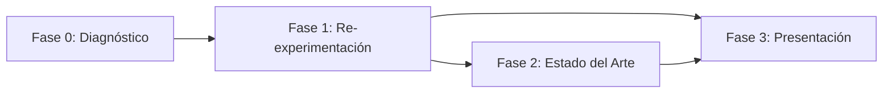

# Plan Maestro: Mejora Integral del Proceso Investigativo

## Visión General

Este plan aborda las debilidades identificadas en la auditoría del proyecto DLBP avícola, organizadas en 4 fases secuenciales.

---

## Estructura de Fases

| Fase | Nombre | Esfuerzo | Dependencia |
|------|--------|----------|-------------|
| **0** | Diagnóstico Integral | ✅ Completada | — |
| **1** | Re-ejecución Experimental Robusta | 1–2 horas compute | Fase 0 |
| **2** | Documentación Estado del Arte | 1–2 horas redacción | Fase 0 |
| **3** | Actualización Presentación | 2–3 horas desarrollo | Fases 1 + 2 |

---

## Resumen de Hallazgos Clave (Fase 0)

| Problema | Severidad | Fase que lo resuelve |
|----------|-----------|---------------------|
| Sensibilidad plana (variación 0%) | 🔴 Crítico | Fase 1 |
| Benchmark MILP solo 3 instancias pequeñas | 🔴 Crítico | Fase 1 |
| Solo 5 réplicas (protocolo dice 30) | 🔴 Crítico | Fase 1 |
| Fitness = 0.0 en todos los resultados | 🟡 Moderado | Fase 1 |
| Presentación sin SLR methodology | 🟡 Moderado | Fase 2 |
| Solo calibración GA mostrada | 🟡 Moderado | Fase 3 |
| Sin tabla comparativa 4 instancias × 4 algos | 🔴 Crítico | Fase 3 |
| Sin test estadístico en presentación | 🟡 Moderado | Fase 3 |
| Gráficos con datos hardcodeados | 🟡 Moderado | Fase 3 |

---

## Archivos del Plan

- [FASE_0_DIAGNOSTICO.md](./FASE_0_DIAGNOSTICO.md)
- [FASE_1_EXPERIMENTACION_ROBUSTA.md](./FASE_1_EXPERIMENTACION_ROBUSTA.md)
- [FASE_2_ESTADO_DEL_ARTE.md](./FASE_2_ESTADO_DEL_ARTE.md)
- [FASE_3_PRESENTACION.md](./FASE_3_PRESENTACION.md)

---

## Próximos Pasos Inmediatos

1. **Usuario revisa este plan** y aprueba/ajusta las fases
2. **Fase 1:** Ejecutar scripts experimentales (requiere Python + dependencias)
3. **Fase 2:** Usuario ejecuta queries en Scopus y reporta cifras
4. **Fase 3:** Integrar datos reales en la presentación HTML

---

*Generado: 2026-02-10*  
*Proyecto: DLBP Avícola — Maestría en Investigación de Operaciones, UTP*
