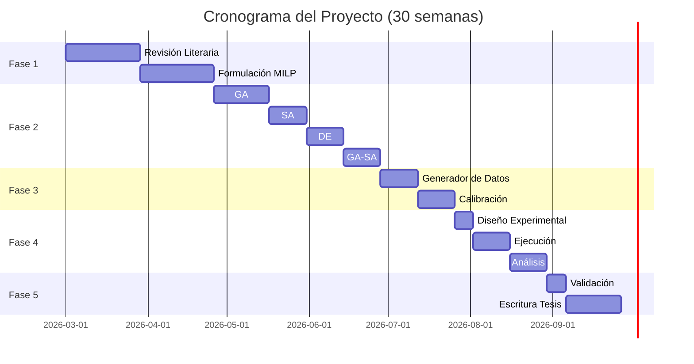

# Plan de Implementación del Proyecto — V3

**Proyecto:** Modelo de Optimización para la Planificación de Coproductos con Metaheurísticas  
**Autor:** Daniel Andrés Castañeda Rodríguez  
**Duración Total:** 30 semanas (~7.5 meses)  
**Repositorio:** `src/` en [github.com/DanAndCastRod/OBC](https://github.com/DanAndCastRod/OBC)

---

## Visión General



## Resumen de Fases

| Fase | Carpeta | Semanas | Sprints | Entregables |
|------|---------|:-------:|:-------:|-------------|
| [Fase 1](fase1_modelo_milp.md) | `src/model/` | 1–8 | 4 | Modelo MILP validado con CBC |
| [Fase 2](fase2_metaheuristicas.md) | `src/metaheuristics/` | 9–18 | 5 | GA, SA, DE, GA-SA implementados |
| [Fase 3](fase3_instancias.md) | `src/instances/` | 19–22 | 3 | Generador de datos calibrado |
| [Fase 4](fase4_experimentos.md) | `experiments/` | 23–27 | **5** | Resultados + complejidad computacional |
| [Fase 5](fase5_validacion_tesis.md) | tesis + `docs/presentacion/` | 28–30 | **4** | **Tesis + presentación + repo publicado** |

## Hipótesis a Validar

| ID | Hipótesis | Métrica | Umbral | Fase |
|----|-----------|---------|--------|:----:|
| H1 | Reducción costo total vs baseline proporcional | % reducción | ≥5% (α=0.05) | 4 |
| H2 | GA-SA gap vs mejor individual | gap optimalidad + tiempo | ≤2%, ≤50% tiempo | 4 |
| H3 | Reducción inventario baja rotación | % reducción | ≥15% (t pareada) | 4 |

## Stack Tecnológico

| Componente | Tecnología | Uso |
|------------|-----------|-----|
| Lenguaje | Python 3.11+ | Todo |
| Solver exacto | PuLP (CBC) + Gurobi académico | Baseline y gap |
| Calibración | Optuna (TPE) | Hiperparámetros |
| Datos | NumPy, Pandas | Manejo de instancias |
| Visualización | Matplotlib, Seaborn | Gráficos |
| Estadística | SciPy (stats) | Tests H1/H2/H3 |
| Testing | Pytest | Unitarios + integración |

## Convenciones de Código

```python
# Nomenclatura de archivos
src/model/parameters.py          # snake_case
src/metaheuristics/ga.py         # Abreviatura para algoritmos

# Nomenclatura de clases
class GeneticAlgorithm(BaseMetaheuristic):  # PascalCase
class SimulatedAnnealing(BaseMetaheuristic):

# Nomenclatura de funciones
def evaluate_fitness(solution):              # snake_case
def decode_solution(chromosome):
```

## Dependencias entre Fases

```
Fase 1 (Modelo MILP)
  ├── parameters.py ──────→ Fase 2 (codificación de solución)
  ├── constraints.py ─────→ Fase 2 (evaluación de factibilidad)
  ├── solver.py ──────────→ Fase 4 (baseline exacto)
  └── objective.py ───────→ Fase 2 (función fitness)
  
Fase 2 (Metaheurísticas)
  └── base.py + ga/sa/de ─→ Fase 4 (comparación)

Fase 3 (Instancias)
  └── generator.py ───────→ Fase 4 (datos de entrada)

Fase 4 (Experimentos) ────→ Fase 5 (tablas y gráficos para tesis)
Fase 5 (Entregables)
  ├── Tesis (Capítulos 1-7)
  ├── Presentación (docs/presentacion/sustentacion_coproductos.html)
  └── Repositorio público (tag v1.0.0-thesis)
```

## Elementos de Robustez

Además de las hipótesis H1/H2/H3, el plan incluye análisis avanzados para fortalecer la investigación:

| Elemento | Sprint | Propósito |
|----------|:------:|----------|
| Performance profiles (Dolan-Moré) | 4.5 | Ranking robusto de algoritmos sobre múltiples instancias |
| Convergence profiles normalizados | 4.5 | Comparar velocidad de convergencia de forma justa |
| Escalabilidad empírica (curvas $O(n^k)$) | 4.5 | Demostrar cómo escala cada algoritmo |
| Diversidad poblacional | 4.5 | Detectar convergencia prematura en GA/DE |
| Profiling por componente (cProfile) | 4.5 | Identificar cuellos de botella computacionales |
| Análisis de sensibilidad | 4.3 | Evaluar robustez ante variación de parámetros |
| Reproducibilidad (script `reproduce.py`) | 5.1 | Pipeline completa re-ejecutable desde cero |
