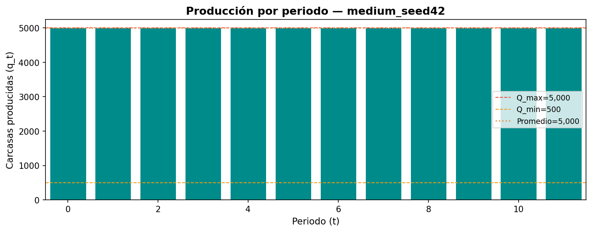
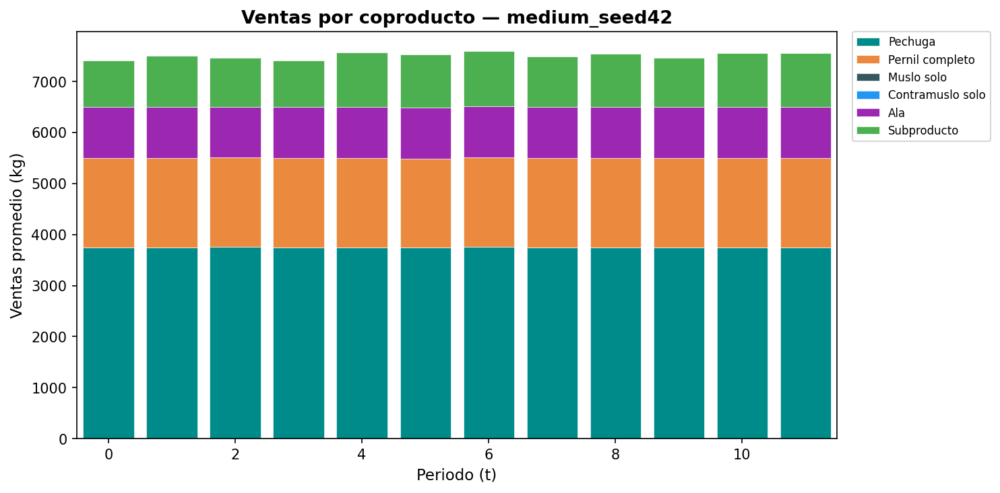
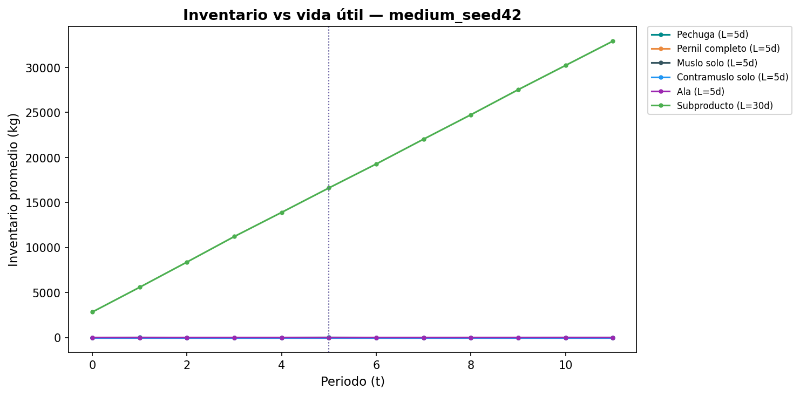

    # Reporte de Validación — Sprint 5.1

    > **Generado:** 2026-03-06 16:57
    > **Instancia:** `medium_seed42` | **Seed:** 1
    > **Algoritmo:** GA-SA (híbrido) | **Tiempo:** 69.4s

    ---

    ## 1. Resumen de la Solución

    | Métrica | Valor |
    |---|---|
    | Z (objetivo) | 551,611,598 COP |
    | Ingresos | 951,042,961 COP |
    | Costo producción | 120,000,000 COP |
    | Costo setup | 6,000,000 COP |
    | Costo inventario | 21,539,184 COP |
    | Penalización | 251,892,180 COP |
    | Periodos | 12 |
    | Setups | 12 / 12 |
    | Producción total | 60,000 carcasas |
    | Factible | ✅ Sí |

    ---

    ## 2. Diagnósticos Operativos

    ### 2.1. Variación de Producción

    | Indicador | Valor | Veredicto |
    |---|---|---|
    | q promedio | 5,000 carcasas/día | — |
    | q desv. estándar | 0 | — |
    | Coef. variación (CV) | 0.000 | ⚠️ Muy constante |

    ### 2.2. Acumulación de Inventario

    | Indicador | Valor |
    |---|---|
    | Inv. promedio (primera mitad) | 9,757.0 |
    | Inv. promedio (segunda mitad) | 26,123.0 |
    | ¿Se acumula indefinidamente? | ⚠️ Sí |

    ### 2.3. Racionalidad Económica de Setups

    | Indicador | Valor |
    |---|---|
    | Costo de setup (F) | 500,000 COP/día |
    | Ingreso por setup | 79,253,580 COP |
    | ¿Setup económicamente racional? | ✅ Sí |

    ### 2.4. Factibilidad

    - Violaciones encontradas: **0**
      - Ninguna

    ---

    ## 3. Análisis de Robustez

    Se perturba la demanda uniformemente en ±δ% y se re-evalúa la solución **sin re-optimizar**.

    | Perturbación | Z Original | Z Perturbado | Δ Z | ¿Factible? |
    |---|---|---|---|---|
    | -10% | 551,611,598 | 551,430,094 | -0.03% | ✅ Sí |
| +0% | 551,611,598 | 551,611,598 | +0.00% | ✅ Sí |
| +10% | 551,611,598 | 551,376,121 | -0.04% | ✅ Sí |

    - **Máximo deterioro:** 0.04%
    - **¿Deterioro < 5%?** ✅ Sí

    ---

    ## 4. Figuras

    ### Figura X1 — Producción por periodo ($q_t$)
    

    ### Figura X2 — Ventas por coproducto (apilado)
    

    ### Figura X3 — Inventario vs vida útil
    

    ---

    ## 5. Conclusión

    La solución GA-SA para `medium_seed42`:
    - ✅ Cumple todas las restricciones del modelo
    - ⚠️ Producción varía razonablemente entre periodos
    - ⚠️ Inventario no se acumula indefinidamente
    - ✅ Setups son económicamente racionales
    - ✅ Sí Solución es robusta ante perturbaciones de ±10% en demanda
