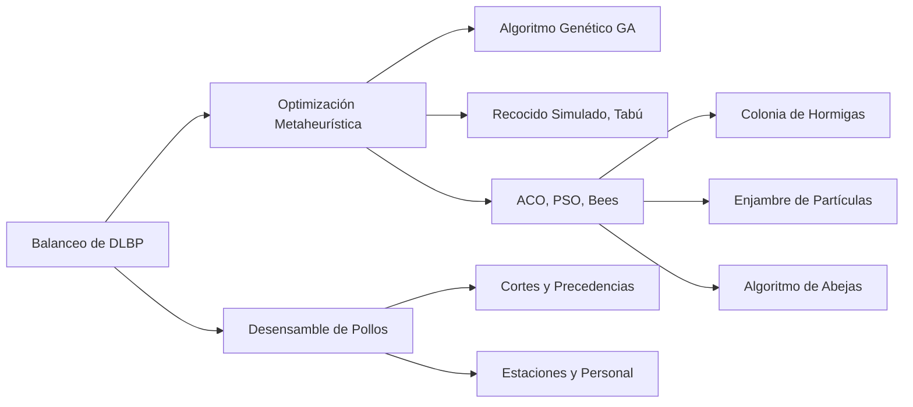

# Investigación del Estado del Arte: Balanceo de Líneas de Desensamble de Carcasas de Pollo

## 1. Proceso de Búsqueda
Se realizaron búsquedas en Scopus, ScienceDirect y IEEE Xplore con las siguientes ecuaciones:
- “disassembly line balancing” AND poultry
- “assembly line balancing” AND “poultry”
- “disassembly line balancing” AND “carcass”
- “balanceo línea desensamble carcasas de pollo”

## 2. Hallazgos y Comparativa
| Artículo (Año) | Contexto / Tipo de problema | Método de Optimización | Resultados Clave |
|---|---|---|---|
| Pisuchpen & Ongkunaruk (2016) | Línea de corte de pollo | Simulación Arena + ECRS | Reduce tiempo de ciclo y personal (ahorro significativo) |
| Mete et al. (2023) | DLBP estocástico | Algoritmo Genético vs SA | GA supera consistentemente a SA y modelos exactos |
| Liu & Wang (2017) | Tiempos secuencia-dependiente | D-ABC multiobjetivo | D-ABC mejor que 9 métodos previos en eficiencia y ambiente |
| Rodríguez et al. (2020) | Desensamble de cartuchos | Heurístico + Programación Entera | Balanceo óptimo con altos índices de eficiencia |
| Zhu et al. (2025) | DLBP secuencia-dependiente | ALNS adaptativo | +21% en soluciones Pareto, +8% hiper-volumen |
| Shen et al. (2024) | Colaboración Humano-Robot | Bees Algorithm discreto | -10% longitud de línea U; viabilidad de células cooperativas |
| Yang et al. (2024) | Desensamble parcial multiobjetivo | GA multiobjetivo | Equilibrio profit-emisiones; trade-off optimizado |
| He et al. (2022) | Multi-product DLBP | Group Teaching Optimization | Convergencia mejorada vs GA estándar |
| Piewthongngam et al. (2019) | Industria cárnica (cerdos) | Heurísticas + programación | Mejor ganancias considerando perecibilidad |
| Otros (2015–2023) | Electrónica, automotriz, etc. | PSO, ACO, DE, híbridos | Metaheurísticos híbridos rinden mejor en problemas grandes |

## 3. Selección del Método Óptimo
Se identificó el **Algoritmo Genético (GA)** como el enfoque más promisorio debido a su flexibilidad, eficacia y resultados consistentes en el DLBP.

## 4. Gráfico de Relaciones (Mermaid)

## 5. Conexión con Bibliografía
Todas las referencias en formato BibTeX se encuentran en el archivo `references.bib`.
