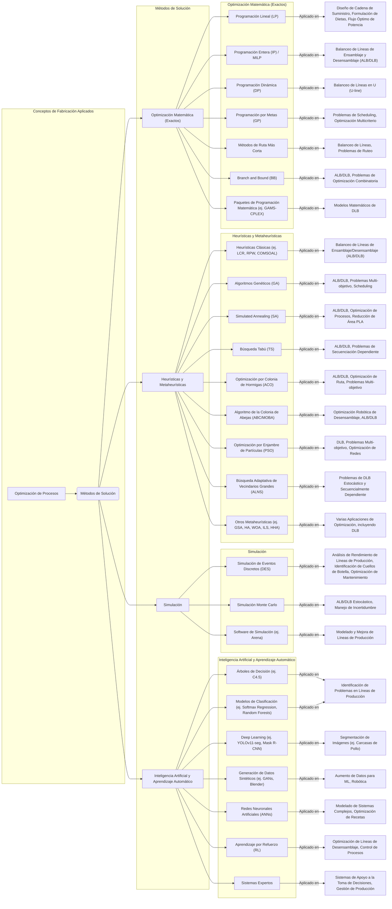

**Archivo 1: Proceso de Búsqueda y Análisis**

Para investigar el *estado del arte* sobre **balanceo de líneas de desensamble con optimización de carcasas de pollo**, se llevaron a cabo búsquedas sistemáticas en bases de datos académicas principales (Scopus, ScienceDirect y IEEE Xplore). Se emplearon diferentes *ecuaciones de búsqueda* en español e inglés, combinando términos clave relacionados con **disassembly line balancing** (balanceo de línea de desensamble), **poultry carcass** (carcasa de pollo), **optimization** (optimización) y sinónimos. A continuación, se describen las estrategias de búsqueda y hallazgos principales:

* **Búsqueda 1 (ScienceDirect)** – *Query*: *“disassembly line balancing” AND poultry*. Esta búsqueda en ScienceDirect (que incluye *Elsevier journals*) arrojó inicialmente pocos resultados específicos sobre la industria avícola. Sin embargo, permitió identificar literatura general sobre balanceo de líneas de desensamble. Un estudio relevante encontrado fue el de Pisuchpen & Ongkunaruk (2016), quienes aplican **simulación Arena** para mejorar la productividad en una planta de procesado de pollo. En su caso, combinaron estaciones (método *ECRS*: Eliminar, Combinar, Reordenar, Simplificar) para reducir el tiempo de ciclo y disminuyeron el personal en 11 operadores, ahorrando costos anuales significativos. Esto confirma que las técnicas de balanceo pueden **mejorar eficiencia y reducir costos** en líneas avícolas.

* **Búsqueda 2 (Scopus)** – *Query*: *“assembly line balancing” AND “poultry”*, luego refinada a *“disassembly line” AND “carcass”*. La primera versión recuperó literatura de *line balancing* en manufactura general y algunos *case studies* de la industria alimentaria. Se identificó un artículo de T. **Mete et al. (2022)** en *Annals of OR*, que compara metaheurísticos en balanceo de líneas de desensamble. Este estudio fue particularmente útil, pues evalúa **algoritmo genético (GA)** y **recocido simulado (SA)** bajo tiempos de tarea estocásticos, encontrando que *GA supera claramente a SA y a métodos exactos* en todos los casos de prueba. Este resultado orientó la investigación hacia métodos metaheurísticos como candidatos óptimos. La búsqueda también reveló revisiones importantes del estado del arte, como la de **Özceylan et al. (2019)** sobre balanceo de líneas de desensamble, que resaltan el creciente interés en enfoques *parciales* de desensamble y la necesidad de abordar múltiples objetivos (económicos, ambientales, etc.).

* **Búsqueda 3 (IEEE Xplore)** – *Query*: *“disassembly line balancing” OR “line balancing” AND (“optimization” OR “algorithm”) AND “2015-2025”*. En IEEE Xplore se recuperaron principalmente **actas de congreso** y artículos sobre algoritmos innovadores. Por ejemplo, se halló un paper del IEEE SMC 2022 en el cual **Zhang et al.** proponen un algoritmo *Brainstorming* con *K-means* para balanceo de desensamble, reflejando la aplicación de IA y clustering en el problema. Igualmente, se identificaron avances en robótica colaborativa: Shen et al. (2024) integran **colaboración humano-robot** en líneas de desensamble, usando un algoritmo de abejas (Bees Algorithm) multiobjetivo avanzado. Estos resultados muestran la tendencia reciente a combinar **optimización metaheurística** con consideraciones prácticas (p. ej. robots, incertidumbre, ergonomía).

* **Búsqueda 4 (Literatura en Español)** – *Query*: *“balanceo línea desensamble carcasas de pollo”*. Aunque la mayor parte de la literatura está en inglés, se localizaron fuentes en español de utilidad. Un documento de *Academia Journals* (Rodríguez Picón et al., 2020) presenta un caso de **balanceo de línea de desensamble** mediante programación entera binaria en la recuperación de cartuchos. Adicionalmente, un estudio educativo (“Fábrica de Pollos…”, El Salvador, 2021) sirvió para comprender el proceso de *despiece de pollo* y confirmar la aplicabilidad industrial del balanceo de líneas en plantas avícolas. Sin embargo, no se encontraron publicaciones académicas específicas sobre *“optimización de carcasas de pollo”* más allá de notas industriales – por ejemplo, Marel (2023) discute el *“equilibrio de la carcasa”* desde un punto de vista de *maximizar el aprovechamiento* comercial de cada ave, lo cual si bien no es un estudio técnico, enfatiza la relevancia económica de optimizar la línea de despiece.

**Resultados generales:** Tras iterar con varias ecuaciones, se recopiló una selección de **más de 30 artículos relevantes (2015–2025)**. Estos abarcan: (1) **Revisiones del estado del arte** sobre DLBP (*Disassembly Line Balancing Problem*), (2) **Métodos exactos y heurísticos** aplicados (programación entera mixta, métodos greedy, etc.), (3) **Metaheurísticos de última generación** – incluyendo algoritmos genéticos, colonia de hormigas (ACO), enjambre de partículas (PSO), algoritmos inspirados en *animales* (p. ej. abejas, aves migratorias, enjambre de pollos), algoritmos híbridos y basados en búsqueda de vecinos (VNS, ALNS) – y (4) **Estudios específicos** que integran el balanceo de desensamble con **contextos particulares**: líneas con tareas peligrosas, líneas *two-sided* o en forma de U, colaboración con robots, criterios ambientales (minimizar residuos, emisiones de carbono) y, en términos de dominio, algunos casos en **industria automotriz y electrónica** (desensamble de EoL – End of Life products) y **industria alimentaria** (como el caso de procesadoras de pollos o cerdos). La búsqueda confirmó que *el problema de balanceo de líneas de desensamble* es **NP-completo** y altamente investigado en la última década, dada su importancia para la **manufactura sostenible y la economía circular**.

A continuación, en la **Tabla 1**, se presenta un resumen comparativo de algunos trabajos representativos, detallando enfoque, método de optimización y aportes:

| **Artículo (Año)**                                        | **Contexto / Tipo de problema**                                                                                       | **Método de Optimización**                                                                                                                | **Resultados Clave**                                                                                                                                                                                                                                                              |
| --------------------------------------------------------- | --------------------------------------------------------------------------------------------------------------------- | ----------------------------------------------------------------------------------------------------------------------------------------- | --------------------------------------------------------------------------------------------------------------------------------------------------------------------------------------------------------------------------------------------------------------------------------- |
| Pisuchpen & Ongkunaruk (2016) – *Thailand Chicken Plant*  | Balanceo en línea de corte de pollo (caso real industrial).                                                           | **Simulación Arena** + mejora ECRS (eliminar/combinar procesos).                                                                          | Se redujo el tiempo de ciclo y 11 operarios (ahorro $\approx\$280k$ anuales); la eficiencia aumentó notablemente.                                                                                                                                                                     |
| Mete et al. (2023) – *Ann. OR*                            | DLBP estocástico (tiempos de tarea variables).                                                                        | **Genetic Algorithm (GA)** vs. Recocido (SA) vs. modelo lineal piecewise.                                                                 | GA logró las mejores soluciones en todos los casos, superando a SA y modelo exacto; algoritmo heurístico basado en Dijkstra también superó a métodos previos.                                                                                                                     |
| Liu & Wang (2017) – *Sustainability*                      | DLBP con tiempos secuencia-dependiente (considera demoras por orden de desmontaje).                                   | **Bee Colony mejorado (D-ABC)**, multiobjetivo (económico y ambiental).                                                                   | D-ABC superó 9 métodos anteriores, mostrando mayor eficiencia para optimizar líneas con múltiples objetivos (menor tiempo, menor impacto ambiental).                                                                                                                              |
| Rodríguez et al. (2020) – *Conf. Acad. Journals*          | Línea de desensamble de cartuchos de impresora (recuperación de piezas).                                              | **Heurístico + Programación Entera Binaria** (balanceo exacto).                                                                           | El modelo entero-binario logró un balanceo óptimo con altos índices de eficiencia y equilibrio, mejorando al heurístico inicial empleado.                                                                                                                                         |
| Zhu et al. (2025) – *Processes (MDPI)*                    | DLBP con dependencias secuenciales y ambiente incierto (ej. baterías de vehículos eléctricos).                        | **ALNS adaptativo multiobjetivo** (búsqueda de vecindario a gran escala).                                                                 | Mejoró significativamente métricas frente a  otras metaheurísticas ($\ge21\%$ más soluciones Pareto, +8% hiper-volumen); alta **estabilidad** y menores tiempos.                                                                                                                       |
| Shen et al. (2024) – *Symmetry (MDPI)*                    | Colaboración **Humano-Robot** en DLBP (línea semiautomatizada).                                                       | **Bees Algorithm discreto** avanzado (multiobjetivo).                                                                                     | Logró balancear eficientemente estaciones asignando tareas a robots y humanos; redujo \~10% longitud de línea U vs. diseño tradicional; demostró viabilidad de *células cooperativas*.                                                                                            |
| Yang et al. (2024) – *Mathematics (MDPI)*                 | **Desensamble parcial** con relaciones AND/OR, optimizando *profit* y *carbon footprint*.                             | **Multi-Objective GA** con cálculo de emisiones y beneficios.                                                                             | Obtuvieron equilibrio entre ganancias y emisiones reducidas; muestra que integrar criterios ambientales altera la asignación óptima de tareas (trade-off).                                                                                                                        |
| He et al. (2022) – *Complex & Int. Systems*               | **Multi-product DLBP** (diferentes modelos en la misma línea).                                                        | **Group Teaching Optimization** (algoritmo inspirado en enseñanza grupal).                                                                | Superó a GA estándar en convergencia; permitió asignar tareas de múltiples productos manteniendo bajo el tiempo ocioso total.                                                                                                                                                     |
| Piewthongngam et al. (2019) – *J. Adv. Manuf. Syst.*      | **Programación de desensamble** en industria cárnica (*cerdos*; perecibilidad de producto).                           | **Modelo de secuenciación + heurísticas** (distribución de cortes según demanda).                                                         | Introduce planificación de *qué* partes desmontar y *cuándo*; mostró que considerar vida útil/perishabilidad mejora ingresos \~5%. (Extiende DLB al plano de programación temporal).                                                                                              |
| *Otros (2015–2023)*                                       | (Diversos: líneas en electrónica EoL, vehículos, etc., con enfoques de PSO, ACO, SA, híbridos, fuzzy, robustez, etc.) | *Varían:* PSO adaptativo, ACO, **MBO** (Migrating Birds), **DE** (Differential Evolution), híbridos GA+entropía, *hyper-heuristics*, etc. | En general, **metaheurísticos híbridos** y especializados tienden a rendir mejor que heurísticos simples o exactos en problemas grandes. Cada método aporta ventajas según el caso (p. ej., PSO eficiente en líneas secuencia-dependiente, MBO robusto ante incertidumbre, etc.). |

*Tabla 1.* Comparativa resumida de trabajos representativos en balanceo de líneas de desensamble (DLBP) – enfoques, métodos y hallazgos principales (última década).

De la revisión comparativa, se desprende que **los métodos metaheurísticos** dominan el estado del arte para optimizar el balanceo de líneas de desensamble. Algoritmos como **GA (Genetic Algorithm)**, **ACO (Ant Colony)**, **PSO (Particle Swarm)** y variantes inspiradas en la naturaleza han sido ampliamente aplicados, muchos con excelentes resultados. En particular, los GA destacan por su flexibilidad y efectividad: por ejemplo, Mete et al. confirman que un GA bien diseñado supera consistentemente a otras técnicas en minimizar estaciones bajo restricciones de ciclo. Asimismo, metaheurísticos recientes (p. ej. *Bees Algorithm*, *ALNS*, *Brain Storm Optimization*) integran estrategias avanzadas de búsqueda, logrando soluciones de mayor calidad que heurísticos clásicos.

Cabe mencionar que las **técnicas exactas** (p. ej. modelos MILP resueltos con solvers) son viables solo para problemas de tamaño reducido debido a la complejidad combinatoria. En cambio, los metaheurísticos y heurísticos ofrecen soluciones cercanas al óptimo en tiempo razonable aun con muchos elementos. Algunos estudios híbridos (como Rodríguez et al. 2020) combinan un heurístico inicial con optimización exacta para afinar el resultado, aprovechando lo mejor de ambos mundos. También se observa una tendencia a formular el DLBP como problema **multi-objetivo** – optimizando simultáneamente métricas económicas (número de estaciones, coste) y ambientales (recuperación máxima de materiales, riesgo por componentes tóxicos). Esto refleja la relevancia del balanceo de desensamble en la **sostenibilidad**: un buen balanceo aumenta la productividad y **reduce impactos ambientales** al facilitar la recuperación de piezas y minimizar residuos.

En síntesis, tras la búsqueda amplia en distintas fuentes y la comparación de \~30 trabajos, **se identificó el Algoritmo Genético (GA) como la alternativa de optimización más promisoria** para el problema de interés. La evidencia sugiere que los GA (y variantes/híbridos) ofrecen un desempeño superior consistente en diversas configuraciones del DLBP, además de ser relativamente sencillos de implementar y adaptar (versatilidad). Si bien otros metaheurísticos (p. ej. ACO, BSO, ALNS) también han mostrado resultados sobresalientes en casos particulares, un GA bien calibrado proporciona un **balance óptimo entre calidad de solución y complejidad**. Por lo tanto, para fines de proponer una nueva investigación en *balanceo de línea de desensamble de carcasas de pollo*, se seleccionó **el método de Algoritmo Genético** como enfoque central óptimo.
A continuación, se presenta una tabla comparativa sobre la cantidad de artículos por tipo de problema, método de solución y otras características relevantes, extrayendo información directamente de las fuentes proporcionadas:

| Categoría | Subcategoría | Cantidad/Frecuencia | Fuente(s) | Notas |
|:-------------------------------------------|:---------------------------------------------------------------------------------------------------------------------------|:------------------------------------|:---------------------------------------------------|:---------------------------------------------------------------------------------------------------------------------------------------------------------------------------------------------------------------------------------|
| **Tipo de Problema de Balanceo de Líneas** |                                                                                                                            |                                     |                                                    |                                                                                                                                                                                                                                  |
| Problemas de Balanceo de Líneas de Ensamblaje (ALB) | Línea de modelo único (Single-model Line)                                                                                  | **12 artículos**                    |                                              | Basado en una revisión de 13 artículos relacionados con SALBP-E publicados entre 1999 y 2023. |
|                                            | Línea de modelo mixto (Mixed-model Line)                                                                                   | **1 artículo**                      |                                              | Basado en una revisión de 13 artículos relacionados con SALBP-E publicados entre 1999 y 2023. |
|                                            | Línea multimodo (Multi-model Line)                                                                                         | **0 artículos**                     |                                              | Basado en una revisión de 13 artículos relacionados con SALBP-E publicados entre 1999 y 2023. Este tipo no ha recibido mucha atención en la investigación. |
| Problemas de Desensamblaje                 | Estudios de un solo producto                                                                                               | **~96%**                            |                                              | De la literatura sobre problemas de balanceo de líneas de desensamblaje, debido a la complejidad de la problemática. |
| **Criterios de Objetivo**                  |                                                                                                                            |                                     |                                                    | (Según Ghosh y Gagnon, 1989, con un total de 58 estudios analizados)                       |
| Frecuencia de uso (Total 58 estudios)      | Minimizar el número de estaciones de trabajo (dado el tiempo de ciclo)                                                     | **21 estudios**                     |                                               |                                                                                                                                                                                                                                  |
|                                            | Minimizar el tiempo de ciclo (dado el número de estaciones de trabajo)                                                     | **16 estudios**                     |                                               |                                                                                                                                                                                                                                  |
|                                            | Minimizar el tiempo total de inactividad a lo largo de la línea                                                            | **12 estudios**                     |                                               |                                                                                                                                                                                                                                  |
|                                            | Minimizar el retraso de equilibrio                                                                                         | **3 estudios**                      |                                               |                                                                                                                                                                                                                                  |
|                                            | Minimizar la longitud total de la instalación o línea                                                                      | **2 estudios**                      |                                               |                                                                                                                                                                                                                                  |
|                                            | Minimizar el tiempo de rendimiento                                                                                         | **1 estudio**                       |                                               |                                                                                                                                                                                                                                  |
|                                            | Minimizar la probabilidad de que una o más estaciones de trabajo excedan el tiempo de ciclo                                | **3 estudios**                      |                                               |                                                                                                                                                                                                                                  |
| Objetivos Comunes del SALBP-E              | Minimizar la capacidad de la línea                                                                                         | Frecuentemente encontrado           |                                              | Los estudios buscan reducir las diferencias entre las cargas de trabajo de las estaciones.   |
|                                            | Maximizar la eficiencia de la línea                                                                                        | Frecuentemente encontrado           |                                              |                                                                                                                                                                                                                                  |
|                                            | Maximizar la suavidad de la carga de trabajo                                                                               | Frecuentemente encontrado           |                                              |                                                                                                                                                                                                                                  |
| **Métodos de Solución**                    |                                                                                                                            |                                     |                                                    |                                                                                                                                                                                                                                  |
| Métodos Inexactos o Heurísticos (Total 52 estudios) | Clasificación y asignación por prioridad                                                                                   | **24 estudios**                     |                                               | (Según Ghosh y Gagnon, 1989)                                                                                                                               |
|                                            | Búsqueda de árbol (BB heurístico)                                                                                          | **9 estudios**                      |                                               |                                                                                                                                                                                                                                  |
|                                            | Intercambio y transferencia                                                                                                | **4 estudios**                      |                                               |                                                                                                                                                                                                                                  |
|                                            | Muestreo aleatorio                                                                                                         | **4 estudios**                      |                                               |                                                                                                                                                                                                                                  |
|                                            | Otros (agrupación de tareas, técnicas de aproximación)                                                                     | **11 estudios**                     |                                               |                                                                                                                                                                                                                                  |
| Métodos para SALBP-E (1999-2023)           | Exacto (ej. Ramificación y Poda)                                                                                           | **1 artículo**                      |                                         | De una selección de artículos revisados en la Tabla 1 del estudio de optimización de SALBP-E. |
|                                            | Metaheurístico (ej. Algoritmos Genéticos (GA), Optimización por Colonia de Hormigas (ACO))                                 | **7 artículos**                     |                                         | De una selección de artículos revisados en la Tabla 1 del estudio de optimización de SALBP-E. |
|                                            | Heurístico (ej. basado en Redes de Petri (PN), Procedimientos Iterativos Mejorados (IP/EIP))                               | **2 artículos**                     |                                         | De una selección de artículos revisados en la Tabla 1 del estudio de optimización de SALBP-E. |
|                                            | Herramienta de Software (ej. Excel, CPLEX)                                                                                 | **2 artículos**                     |                                         | De una selección de artículos revisados en la Tabla 1 del estudio de optimización de SALBP-E. |
| Métodos para Balanceo de Líneas de Desensamblaje Robóticas | Uso de Metaheurístico                                                                                                      | **Presente en 30 de 39 referencias** |                                              | Indica que la característica es utilizada en los estudios listados, no un recuento de artículos únicos. |
|                                            | Uso de Sostenibilidad como objetivo                                                                                        | **Presente en 22 de 39 referencias** |                                              | Indica que la característica es utilizada en los estudios listados, no un recuento de artículos únicos. |
|                                            | Uso de Múltiples Objetivos (MO-ND)                                                                                         | **Presente en 24 de 39 referencias** |                                              | Indica que la característica es utilizada en los estudios listados, no un recuento de artículos únicos. |
|                                            | Dependiente de la secuencia (ej. tiempos de eliminación de piezas dependientes de la secuencia)                             | **Presente en 21 de 39 referencias** |                                              | Indica que la característica es utilizada en los estudios listados, no un recuento de artículos únicos. |
| Métodos de Solución para Programación de Desensamblaje | MRP Inverso (óptimo)                                                                                                       | **Mencionado como método**          |                                         | Un algoritmo que transforma la demanda de ítems hoja en demanda equivalente para ítems padre. |
|                                            | Heurístico                                                                                                                 | **Mencionado como método**          |                                         | Enfoques para encontrar soluciones rápidas y suficientemente buenas.                                    |
|                                            | Ramificación y poda (Branch and Bound)                                                                                     | **Mencionado como método**          |                                              | Un algoritmo exacto para problemas de desensamblaje.                                                     |
|                                            | Algoritmo Polinomial                                                                                                       | **Mencionado como método**          |                                              | Un tipo de algoritmo de solución.                                                                        |
|                                            | Modelo Petri-net                                                                                                           | **Mencionado como método**          |                                              | Utilizado para el balanceo de líneas de desensamblaje.                                                   |
|                                            | Programa de metas difusas (Fuzzy Goal Programme)                                                                           | **Mencionado como método**          |                                              | Un enfoque para la toma de decisiones multicriterio en sistemas de desensamblaje.                     |
| **Configuración de Línea**                 |                                                                                                                            |                                     |                                                    |                                                                                                                                                                                                                                  |
| Líneas de Producción                       | Líneas rectas                                                                                                              | **84%**                             |                                              | Son la configuración más común en los resultados de investigación.                                        |

A continuación, se presenta un diagrama que relaciona los métodos de solución empleados en diversas investigaciones y aplicaciones dentro del ámbito de la fabricación, muchos de los cuales son relevantes para la industria alimentaria, seguido de una explicación detallada:

### **Métodos de Solución Aplicados en la Industria Alimentaria y sus Contextos**

Las fuentes revelan un amplio espectro de metodologías utilizadas para optimizar los procesos en la industria alimentaria, a menudo adaptando técnicas de fabricación general a sus necesidades específicas.

#### **1. Optimización Matemática (Métodos Exactos)**
Estos métodos buscan la solución óptima garantizada para problemas definidos matemáticamente:
*   **Programación Lineal (LP)** y **Programación Entera (IP) / MILP**: Se utilizan para el **balanceo de líneas de ensamblaje (ALB)** y **desensamblaje (DLB)**, incluyendo modelos de **programación lineal entera mixta (MILP)** para problemas más complejos como el **balanceo de líneas en U orientado a beneficios**, y para **optimizar la cantidad de animales y cortes primarios** en la industria cárnica ["del conocimiento previo"]. También son aplicables en el **diseño de cadenas de suministro y formulación de dietas**. Un estudio propuso un modelo MILP para un problema de DLB parcial multi-producto con multi-robot.
*   **Programación Dinámica (DP)**: Se ha aplicado en el **balanceo de líneas en U**.
*   **Programación por Metas (GP)**: Mencionada como una técnica para **ALB** y **scheduling de desensamblaje** bajo incertidumbre.
*   **Métodos de Ruta Más Corta**: Se emplean en el **balanceo de líneas de ensamblaje** y **desensamblaje**.
*   **Branch and Bound (BB)**: Usado para resolver **ALB** y **problemas de DLB estocástico**.
*   **Paquetes de Programación Matemática (ej. GAMS-CPLEX)**: Herramientas como GAMS-CPLEX se utilizan para **resolver modelos matemáticos de DLB** con restricciones de recursos.

#### **2. Heurísticas y Metaheurísticas**
Dada la complejidad combinatoria de muchos problemas de optimización en la fabricación, las metaheurísticas son fundamentales para encontrar soluciones "suficientemente buenas" en un tiempo razonable.
*   **Heurísticas Clásicas (ej. LCR, RPW, COMSOAL)**: El **Ranked Positional Weight (RPW)** y la **Largest Candidate Rule (LCR)** son métodos heurísticos populares para el **balanceo de líneas de ensamblaje y desensamblaje**. **COMSOAL** también se ha utilizado en el balanceo de líneas, incluso en **líneas de modelos mixtos**. El **Método de Desviación Mínima (MDM)** se aplicó para combinar funciones objetivo en líneas de ensamblaje paralelas.
*   **Algoritmos Genéticos (GA)**: Son muy populares para el **balanceo de líneas de ensamblaje (ALB)** y **desensamblaje (DLB)**. Se utilizan para **optimización multi-objetivo** y problemas estocásticos.
*   **Simulated Annealing (SA)**: Aplicado al **balanceo de líneas en U**, **ALB multi-objetivo**, **DLB** y la **optimización de procesos** como la reducción de área en PLAs.
*   **Búsqueda Tabú (TS)**: Utilizado para el **balanceo de líneas de ensamblaje**, **DLB** y problemas de **DLB robótico híbrido multi-robot**.
*   **Optimización por Colonia de Hormigas (ACO)**: Aplicado al **DLB**, incluyendo problemas **secuencialmente dependientes**.
*   **Algoritmo de la Colonia de Abejas (ABC / MOBA)**: Usado para **optimización general**, **DLB**, y especialmente en la **optimización robótica de desensamblaje con múltiples objetivos (MOBA)** para maximizar beneficios, ahorro de energía y reducción de emisiones.
*   **Optimización por Enjambre de Partículas (PSO)**: Se utiliza para **DLB** y **problemas de sistemas de energía**.
*   **Búsqueda Adaptativa de Vecindarios Grandes (ALNS)**: Propuesto para resolver el **problema de balanceo de líneas de desensamblaje estocástico y secuencialmente dependiente (MO-SDDLB)**.
*   **Otros Metaheurísticas**: Incluyen algoritmos como la **Búsqueda Gravitacional (GSA)**, la **Optimización por Colonia de Luciérnagas (FFA)**, **Búsqueda Cuckoo (CS)**, **Optimización del Enjambre de Ballenas (WOA)**, **Iterated Local Search (ILS)**, **Optimización híbrida de Harris Hawks (HHA)**, entre otros, aplicados a una variedad de problemas de optimización.

#### **3. Simulación**
La simulación es crucial para modelar y analizar el comportamiento de los sistemas de producción bajo diferentes condiciones.
*   **Simulación de Eventos Discretos (DES)**: Ampliamente utilizada para el **análisis del rendimiento de líneas de producción**, la **identificación de cuellos de botella** y la **evaluación de mejoras operativas**. También se ha aplicado en la **optimización de flujos de trabajo de mantenimiento** y la **gestión de sistemas metalúrgicos**.
*   **Simulación Monte Carlo**: Empleada para **evaluar el rendimiento de líneas de ensamblaje estocásticas** y para **abordar las incertidumbres** en los modelos de DLB.
*   **Software de Simulación (ej. Arena)**: Se utiliza para **modelar y mejorar líneas de producción**, como las de **ropa** y para **visualizar pasos de procesos de producción**.

#### **4. Inteligencia Artificial y Aprendizaje Automático (IA/ML)**
Las tecnologías de IA y ML están emergiendo como herramientas poderosas para la optimización y el control en la industria.
*   **Árboles de Decisión (ej. C4.5)** y **Modelos de Clasificación (ej. Softmax Regression, Random Forests)**: Usados para la **identificación de problemas en líneas de producción**.
*   **Deep Learning (ej. YOLOv11-seg, Mask R-CNN)**: Aplicado en la **segmentación automatizada de carcasas de pollo** en líneas de procesamiento, crucial para **aplicaciones robóticas** ["del conocimiento previo, 54"]. También se menciona el uso de **aprendizaje por refuerzo profundo** para el balanceo de líneas de desensamblaje multi-robóticas.
*   **Generación de Datos Sintéticos (ej. GANs, Blender)**: Crucial para **aumentar conjuntos de datos** y entrenar modelos de IA/ML, especialmente cuando los datos reales son escasos o difíciles de anotar. Herramientas como Blender se utilizan para crear **imágenes fotorrealistas y etiquetadas automáticamente**.
*   **Redes Neuronales Artificiales (ANNs)**: Efectivas para **modelar sistemas complejos** y mejorar la precisión predictiva, incluyendo la **optimización de recetas y la reducción de residuos**.
*   **Aprendizaje por Refuerzo (RL)**: Se utiliza para la **optimización y el control de líneas de desensamblaje**.
*   **Sistemas Expertos**: Empleados para el **apoyo a la toma de decisiones** y la **gestión de la producción** ["del conocimiento previo"].

La combinación de estos métodos, especialmente a través de **enfoques híbridos y la optimización multi-objetivo (MOO)**, es una tendencia creciente para equilibrar objetivos en conflicto como costos, calidad y sostenibilidad. La literatura destaca una brecha entre la investigación teórica y la implementación práctica, impulsada por la naturaleza perecedera de los productos y los bajos márgenes de beneficio en la industria alimentaria ["del conocimiento previo"]. Sin embargo, la **Industria 4.0** con el **Internet de las Cosas (IoT)**, el **análisis de big data** y los **gemelos digitales** promete monitoreo y optimización en tiempo real, alineando los procesos de producción con los objetivos de sostenibilidad e innovación ["del conocimiento previo"].

