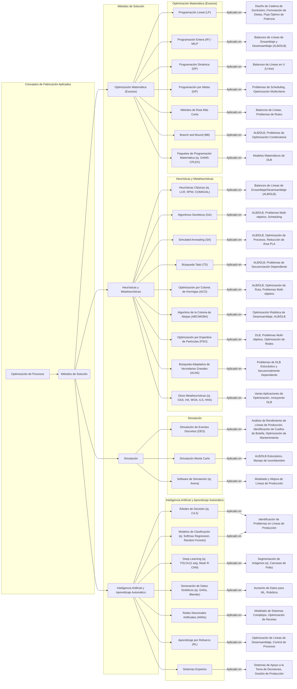

La industria alimentaria se enfrenta a una necesidad constante de optimización y eficiencia, lo que ha impulsado la adopción de diversos conceptos y métodos de fabricación ["del conocimiento previo"]. Para abordar desafíos como la **productividad**, la **seguridad alimentaria** y la **sostenibilidad**, se aplican estrategias de gestión avanzadas y sofisticadas arquitecturas de automatización ["del conocimiento previo"]. La naturaleza perecedera de los productos agrícolas, la reducción de residuos y el acortamiento de los plazos de entrega son cruciales en este sector ["del conocimiento previo"].

A continuación, se presenta un diagrama que relaciona los métodos de solución empleados en diversas investigaciones y aplicaciones dentro del ámbito de la fabricación, muchos de los cuales son relevantes para la industria alimentaria, seguido de una explicación detallada:

### **Métodos de Solución Aplicados en la Industria Alimentaria y sus Contextos**

Las fuentes revelan un amplio espectro de metodologías utilizadas para optimizar los procesos en la industria alimentaria, a menudo adaptando técnicas de fabricación general a sus necesidades específicas.

#### **1. Optimización Matemática (Métodos Exactos)**
Estos métodos buscan la solución óptima garantizada para problemas definidos matemáticamente:
*   **Programación Lineal (LP)** y **Programación Entera (IP) / MILP**: Se utilizan para el **balanceo de líneas de ensamblaje (ALB)** y **desensamblaje (DLB)**, incluyendo modelos de **programación lineal entera mixta (MILP)** para problemas más complejos como el **balanceo de líneas en U orientado a beneficios**, y para **optimizar la cantidad de animales y cortes primarios** en la industria cárnica ["del conocimiento previo"]. También son aplicables en el **diseño de cadenas de suministro y formulación de dietas**. Un estudio propuso un modelo MILP para un problema de DLB parcial multi-producto con multi-robot.
*   **Programación Dinámica (DP)**: Se ha aplicado en el **balanceo de líneas en U**.
*   **Programación por Metas (GP)**: Mencionada como una técnica para **ALB** y **scheduling de desensamblaje** bajo incertidumbre.
*   **Métodos de Ruta Más Corta**: Se emplean en el **balanceo de líneas de ensamblaje** y **desensamblaje**.
*   **Branch and Bound (BB)**: Usado para resolver **ALB** y **problemas de DLB estocástico**.
*   **Paquetes de Programación Matemática (ej. GAMS-CPLEX)**: Herramientas como GAMS-CPLEX se utilizan para **resolver modelos matemáticos de DLB** con restricciones de recursos.

#### **2. Heurísticas y Metaheurísticas**
Dada la complejidad combinatoria de muchos problemas de optimización en la fabricación, las metaheurísticas son fundamentales para encontrar soluciones "suficientemente buenas" en un tiempo razonable.
*   **Heurísticas Clásicas (ej. LCR, RPW, COMSOAL)**: El **Ranked Positional Weight (RPW)** y la **Largest Candidate Rule (LCR)** son métodos heurísticos populares para el **balanceo de líneas de ensamblaje y desensamblaje**. **COMSOAL** también se ha utilizado en el balanceo de líneas, incluso en **líneas de modelos mixtos**. El **Método de Desviación Mínima (MDM)** se aplicó para combinar funciones objetivo en líneas de ensamblaje paralelas.
*   **Algoritmos Genéticos (GA)**: Son muy populares para el **balanceo de líneas de ensamblaje (ALB)** y **desensamblaje (DLB)**. Se utilizan para **optimización multi-objetivo** y problemas estocásticos.
*   **Simulated Annealing (SA)**: Aplicado al **balanceo de líneas en U**, **ALB multi-objetivo**, **DLB** y la **optimización de procesos** como la reducción de área en PLAs.
*   **Búsqueda Tabú (TS)**: Utilizado para el **balanceo de líneas de ensamblaje**, **DLB** y problemas de **DLB robótico híbrido multi-robot**.
*   **Optimización por Colonia de Hormigas (ACO)**: Aplicado al **DLB**, incluyendo problemas **secuencialmente dependientes**.
*   **Algoritmo de la Colonia de Abejas (ABC / MOBA)**: Usado para **optimización general**, **DLB**, y especialmente en la **optimización robótica de desensamblaje con múltiples objetivos (MOBA)** para maximizar beneficios, ahorro de energía y reducción de emisiones.
*   **Optimización por Enjambre de Partículas (PSO)**: Se utiliza para **DLB** y **problemas de sistemas de energía**.
*   **Búsqueda Adaptativa de Vecindarios Grandes (ALNS)**: Propuesto para resolver el **problema de balanceo de líneas de desensamblaje estocástico y secuencialmente dependiente (MO-SDDLB)**.
*   **Otros Metaheurísticas**: Incluyen algoritmos como la **Búsqueda Gravitacional (GSA)**, la **Optimización por Colonia de Luciérnagas (FFA)**, **Búsqueda Cuckoo (CS)**, **Optimización del Enjambre de Ballenas (WOA)**, **Iterated Local Search (ILS)**, **Optimización híbrida de Harris Hawks (HHA)**, entre otros, aplicados a una variedad de problemas de optimización.

#### **3. Simulación**
La simulación es crucial para modelar y analizar el comportamiento de los sistemas de producción bajo diferentes condiciones.
*   **Simulación de Eventos Discretos (DES)**: Ampliamente utilizada para el **análisis del rendimiento de líneas de producción**, la **identificación de cuellos de botella** y la **evaluación de mejoras operativas**. También se ha aplicado en la **optimización de flujos de trabajo de mantenimiento** y la **gestión de sistemas metalúrgicos**.
*   **Simulación Monte Carlo**: Empleada para **evaluar el rendimiento de líneas de ensamblaje estocásticas** y para **abordar las incertidumbres** en los modelos de DLB.
*   **Software de Simulación (ej. Arena)**: Se utiliza para **modelar y mejorar líneas de producción**, como las de **ropa** y para **visualizar pasos de procesos de producción**.

#### **4. Inteligencia Artificial y Aprendizaje Automático (IA/ML)**
Las tecnologías de IA y ML están emergiendo como herramientas poderosas para la optimización y el control en la industria.
*   **Árboles de Decisión (ej. C4.5)** y **Modelos de Clasificación (ej. Softmax Regression, Random Forests)**: Usados para la **identificación de problemas en líneas de producción**.
*   **Deep Learning (ej. YOLOv11-seg, Mask R-CNN)**: Aplicado en la **segmentación automatizada de carcasas de pollo** en líneas de procesamiento, crucial para **aplicaciones robóticas** ["del conocimiento previo, 54"]. También se menciona el uso de **aprendizaje por refuerzo profundo** para el balanceo de líneas de desensamblaje multi-robóticas.
*   **Generación de Datos Sintéticos (ej. GANs, Blender)**: Crucial para **aumentar conjuntos de datos** y entrenar modelos de IA/ML, especialmente cuando los datos reales son escasos o difíciles de anotar. Herramientas como Blender se utilizan para crear **imágenes fotorrealistas y etiquetadas automáticamente**.
*   **Redes Neuronales Artificiales (ANNs)**: Efectivas para **modelar sistemas complejos** y mejorar la precisión predictiva, incluyendo la **optimización de recetas y la reducción de residuos**.
*   **Aprendizaje por Refuerzo (RL)**: Se utiliza para la **optimización y el control de líneas de desensamblaje**.
*   **Sistemas Expertos**: Empleados para el **apoyo a la toma de decisiones** y la **gestión de la producción** ["del conocimiento previo"].

La combinación de estos métodos, especialmente a través de **enfoques híbridos y la optimización multi-objetivo (MOO)**, es una tendencia creciente para equilibrar objetivos en conflicto como costos, calidad y sostenibilidad. La literatura destaca una brecha entre la investigación teórica y la implementación práctica, impulsada por la naturaleza perecedera de los productos y los bajos márgenes de beneficio en la industria alimentaria ["del conocimiento previo"]. Sin embargo, la **Industria 4.0** con el **Internet de las Cosas (IoT)**, el **análisis de big data** y los **gemelos digitales** promete monitoreo y optimización en tiempo real, alineando los procesos de producción con los objetivos de sostenibilidad e innovación ["del conocimiento previo"].

---

A continuación, se presenta una tabla comparativa sobre la cantidad de artículos por tipo de problema, método de solución y otras características relevantes, extrayendo información directamente de las fuentes proporcionadas:

| Categoría | Subcategoría | Cantidad/Frecuencia | Fuente(s) | Notas |
|:-------------------------------------------|:---------------------------------------------------------------------------------------------------------------------------|:------------------------------------|:---------------------------------------------------|:---------------------------------------------------------------------------------------------------------------------------------------------------------------------------------------------------------------------------------|
| **Tipo de Problema de Balanceo de Líneas** |                                                                                                                            |                                     |                                                    |                                                                                                                                                                                                                                  |
| Problemas de Balanceo de Líneas de Ensamblaje (ALB) | Línea de modelo único (Single-model Line)                                                                                  | **12 artículos**                    |                                              | Basado en una revisión de 13 artículos relacionados con SALBP-E publicados entre 1999 y 2023. |
|                                            | Línea de modelo mixto (Mixed-model Line)                                                                                   | **1 artículo**                      |                                              | Basado en una revisión de 13 artículos relacionados con SALBP-E publicados entre 1999 y 2023. |
|                                            | Línea multimodo (Multi-model Line)                                                                                         | **0 artículos**                     |                                              | Basado en una revisión de 13 artículos relacionados con SALBP-E publicados entre 1999 y 2023. Este tipo no ha recibido mucha atención en la investigación. |
| Problemas de Desensamblaje                 | Estudios de un solo producto                                                                                               | **~96%**                            |                                              | De la literatura sobre problemas de balanceo de líneas de desensamblaje, debido a la complejidad de la problemática. |
| **Criterios de Objetivo**                  |                                                                                                                            |                                     |                                                    | (Según Ghosh y Gagnon, 1989, con un total de 58 estudios analizados)                       |
| Frecuencia de uso (Total 58 estudios)      | Minimizar el número de estaciones de trabajo (dado el tiempo de ciclo)                                                     | **21 estudios**                     |                                               |                                                                                                                                                                                                                                  |
|                                            | Minimizar el tiempo de ciclo (dado el número de estaciones de trabajo)                                                     | **16 estudios**                     |                                               |                                                                                                                                                                                                                                  |
|                                            | Minimizar el tiempo total de inactividad a lo largo de la línea                                                            | **12 estudios**                     |                                               |                                                                                                                                                                                                                                  |
|                                            | Minimizar el retraso de equilibrio                                                                                         | **3 estudios**                      |                                               |                                                                                                                                                                                                                                  |
|                                            | Minimizar la longitud total de la instalación o línea                                                                      | **2 estudios**                      |                                               |                                                                                                                                                                                                                                  |
|                                            | Minimizar el tiempo de rendimiento                                                                                         | **1 estudio**                       |                                               |                                                                                                                                                                                                                                  |
|                                            | Minimizar la probabilidad de que una o más estaciones de trabajo excedan el tiempo de ciclo                                | **3 estudios**                      |                                               |                                                                                                                                                                                                                                  |
| Objetivos Comunes del SALBP-E              | Minimizar la capacidad de la línea                                                                                         | Frecuentemente encontrado           |                                              | Los estudios buscan reducir las diferencias entre las cargas de trabajo de las estaciones.   |
|                                            | Maximizar la eficiencia de la línea                                                                                        | Frecuentemente encontrado           |                                              |                                                                                                                                                                                                                                  |
|                                            | Maximizar la suavidad de la carga de trabajo                                                                               | Frecuentemente encontrado           |                                              |                                                                                                                                                                                                                                  |
| **Métodos de Solución**                    |                                                                                                                            |                                     |                                                    |                                                                                                                                                                                                                                  |
| Métodos Inexactos o Heurísticos (Total 52 estudios) | Clasificación y asignación por prioridad                                                                                   | **24 estudios**                     |                                               | (Según Ghosh y Gagnon, 1989)                                                                                                                               |
|                                            | Búsqueda de árbol (BB heurístico)                                                                                          | **9 estudios**                      |                                               |                                                                                                                                                                                                                                  |
|                                            | Intercambio y transferencia                                                                                                | **4 estudios**                      |                                               |                                                                                                                                                                                                                                  |
|                                            | Muestreo aleatorio                                                                                                         | **4 estudios**                      |                                               |                                                                                                                                                                                                                                  |
|                                            | Otros (agrupación de tareas, técnicas de aproximación)                                                                     | **11 estudios**                     |                                               |                                                                                                                                                                                                                                  |
| Métodos para SALBP-E (1999-2023)           | Exacto (ej. Ramificación y Poda)                                                                                           | **1 artículo**                      |                                         | De una selección de artículos revisados en la Tabla 1 del estudio de optimización de SALBP-E. |
|                                            | Metaheurístico (ej. Algoritmos Genéticos (GA), Optimización por Colonia de Hormigas (ACO))                                 | **7 artículos**                     |                                         | De una selección de artículos revisados en la Tabla 1 del estudio de optimización de SALBP-E. |
|                                            | Heurístico (ej. basado en Redes de Petri (PN), Procedimientos Iterativos Mejorados (IP/EIP))                               | **2 artículos**                     |                                         | De una selección de artículos revisados en la Tabla 1 del estudio de optimización de SALBP-E. |
|                                            | Herramienta de Software (ej. Excel, CPLEX)                                                                                 | **2 artículos**                     |                                         | De una selección de artículos revisados en la Tabla 1 del estudio de optimización de SALBP-E. |
| Métodos para Balanceo de Líneas de Desensamblaje Robóticas | Uso de Metaheurístico                                                                                                      | **Presente en 30 de 39 referencias** |                                              | Indica que la característica es utilizada en los estudios listados, no un recuento de artículos únicos. |
|                                            | Uso de Sostenibilidad como objetivo                                                                                        | **Presente en 22 de 39 referencias** |                                              | Indica que la característica es utilizada en los estudios listados, no un recuento de artículos únicos. |
|                                            | Uso de Múltiples Objetivos (MO-ND)                                                                                         | **Presente en 24 de 39 referencias** |                                              | Indica que la característica es utilizada en los estudios listados, no un recuento de artículos únicos. |
|                                            | Dependiente de la secuencia (ej. tiempos de eliminación de piezas dependientes de la secuencia)                             | **Presente en 21 de 39 referencias** |                                              | Indica que la característica es utilizada en los estudios listados, no un recuento de artículos únicos. |
| Métodos de Solución para Programación de Desensamblaje | MRP Inverso (óptimo)                                                                                                       | **Mencionado como método**          |                                         | Un algoritmo que transforma la demanda de ítems hoja en demanda equivalente para ítems padre. |
|                                            | Heurístico                                                                                                                 | **Mencionado como método**          |                                         | Enfoques para encontrar soluciones rápidas y suficientemente buenas.                                    |
|                                            | Ramificación y poda (Branch and Bound)                                                                                     | **Mencionado como método**          |                                              | Un algoritmo exacto para problemas de desensamblaje.                                                     |
|                                            | Algoritmo Polinomial                                                                                                       | **Mencionado como método**          |                                              | Un tipo de algoritmo de solución.                                                                        |
|                                            | Modelo Petri-net                                                                                                           | **Mencionado como método**          |                                              | Utilizado para el balanceo de líneas de desensamblaje.                                                   |
|                                            | Programa de metas difusas (Fuzzy Goal Programme)                                                                           | **Mencionado como método**          |                                              | Un enfoque para la toma de decisiones multicriterio en sistemas de desensamblaje.                     |
| **Configuración de Línea**                 |                                                                                                                            |                                     |                                                    |                                                                                                                                                                                                                                  |
| Líneas de Producción                       | Líneas rectas                                                                                                              | **84%**                             |                                              | Son la configuración más común en los resultados de investigación.                                        |