<!-- PRIMERA PORTADA: Simple -->
\begin{titlepage}
    \centering
    \thispagestyle{empty}
    
    \vspace*{2cm}
    
    {\LARGE \textbf{Modelo de Optimización para la Planificación de Coproductos con Metaheurísticas en la Industria Avícola}}
    
    \vspace{3cm}
    
    {\large Daniel Andrés Castañeda Rodríguez}
    
    \vspace{3cm}
    
    \includegraphics[width=16cm]{logo_utp.png}
    
    \vspace{3cm}
    
    {\normalsize Universidad Tecnológica de Pereira}
    
    \vspace{0.3cm}
    
    {\normalsize Maestría en Investigación de Operaciones y Estadística}
    
    \vspace{0.5cm}
    
    {\normalsize 2026}
    
\end{titlepage}

\newpage

<!-- SEGUNDA PORTADA: Académica detallada -->
\begin{titlepage}
    \centering
    \thispagestyle{empty}
    
    \vspace*{1cm}
    
    {\large \textbf{UNIVERSIDAD TECNOLÓGICA DE PEREIRA}}
    
    \vspace{0.3cm}
    
    {\normalsize Facultad de Ingeniería Industrial}
    
    \vspace{0.3cm}
    
    {\normalsize Maestría en Investigación de Operaciones y Estadística}
    
    \vspace{2cm}
    
    {\Large \textbf{TRABAJO DE GRADO}}
    
    \vspace{1cm}
    
    {\large \textbf{Modelo de Optimización para la Planificación de Coproductos con Metaheurísticas en la Industria Avícola}}
    
    \vspace{2cm}
    
    {\normalsize \textbf{Presentado por:}}
    
    \vspace{0.3cm}
    
    Daniel Andrés Castañeda Rodríguez
    
    \vspace{1cm}
    
    {\normalsize \textbf{Directora:}}
    
    \vspace{0.3cm}
    
    Ing. Eliana Mirledy Ocampo Toro, PhD.
    
    \vspace{1cm}
    
    {\normalsize \textbf{Línea de Investigación:}}
    
    \vspace{0.3cm}
    
    Optimización y Modelado Matemático
    
    \vspace{2cm}
    
    Pereira, Colombia
    
    2026
    
\end{titlepage}

\newpage

## Agradecimientos

A mi directora de tesis, la Dra. Eliana Mirledy Ocampo Toro, por su guía académica, paciencia y dedicación a lo largo de este proceso investigativo. Su rigor metodológico y visión estratégica fueron fundamentales para la culminación de este trabajo.

A la Universidad Tecnológica de Pereira y la Maestría en Investigación de Operaciones y Estadística, por brindarme las herramientas y el espacio de formación para desarrollar esta investigación.

A mi familia, por su apoyo incondicional y comprensión durante las largas jornadas de trabajo dedicadas a este proyecto.

A mis compañeros de la maestría, por las discusiones enriquecedoras y el acompañamiento mutuo durante este camino académico.

\newpage

## Resumen

Este trabajo presenta el desarrollo de un modelo de optimización para la planificación de coproductos en la industria avícola colombiana, resuelto mediante técnicas metaheurísticas. El problema central aborda el desbalance estructural entre la oferta rígida de coproductos —determinada por la anatomía del ave— y la demanda variable del mercado. Se formula un modelo de Programación Lineal Entera Mixta (MILP) multi-periodo con estructura de lot-sizing estocástico, incluyendo decisiones binarias de setup, lote mínimo y restricciones de perecibilidad. Debido a la complejidad NP-hard del problema, se implementan y comparan cuatro metaheurísticas: Algoritmo Genético (GA), Recocido Simulado (SA), Evolución Diferencial (DE) y un algoritmo híbrido GA-SA. Los algoritmos se calibraron mediante el sampler TPE de Optuna y se evaluaron mediante un diseño experimental completo de 1,098 ejecuciones sobre 9 instancias sintéticas calibradas con datos del sector avícola colombiano. Los resultados muestran que el híbrido GA-SA produce soluciones de alta calidad con gaps $\leq 2\%$ respecto al solver exacto CBC en instancias medianas, confirmando su eficacia para problemas de escala industrial. La solución fue validada operativamente, demostrando robustez ante perturbaciones de $\pm 10\%$ en la demanda con un deterioro máximo de $0.04\%$ en la función objetivo. El código fuente, instancias y resultados están disponibles públicamente en el repositorio del proyecto.

**Palabras clave:** optimización, coproductos, metaheurísticas, industria avícola, lot-sizing estocástico

\newpage

## Abstract

This work presents the development of an optimization model for co-product planning in the Colombian poultry industry, solved using metaheuristic techniques. The central problem addresses the structural imbalance between the rigid supply of co-products —determined by the anatomy of the bird— and the variable market demand. A multi-period Mixed-Integer Linear Programming (MILP) model with stochastic lot-sizing structure is formulated, including binary setup decisions, minimum lot constraints, and perishability restrictions. Due to the NP-hard complexity of the problem, four metaheuristics are implemented and compared: Genetic Algorithm (GA), Simulated Annealing (SA), Differential Evolution (DE), and a hybrid GA-SA algorithm. The algorithms were calibrated using Optuna's TPE sampler and evaluated through a complete experimental design of 1,098 runs over 9 synthetic instances calibrated with Colombian poultry industry data. Results show that the hybrid GA-SA produces high-quality solutions with gaps $\leq 2\%$ relative to the CBC exact solver for medium instances, confirming its effectiveness for industrial-scale problems. The solution was operationally validated, demonstrating robustness against $\pm 10\%$ demand perturbations with a maximum deterioration of $0.04\%$ in the objective function. Source code, instances, and results are publicly available in the project repository.

**Keywords:** optimization, co-products, metaheuristics, poultry industry, stochastic lot-sizing

\newpage

\tableofcontents

\newpage

\listoffigures

\newpage

\listoftables

\newpage

## 1. Introducción

### 1.1. El Problema de Producción Conjunta en la Industria Avícola

La industria avícola, reconocida como un pilar económico en Colombia y a nivel mundial, enfrenta un desafío operativo fundamental: el **problema de producción conjunta (joint production) y balanceo de carcasa**. Este problema surge de la discrepancia inherente entre la oferta de coproductos, que se derivan en proporciones relativamente fijas del despiece de cada ave, y la demanda variable y a menudo desalineada del mercado para cada uno de esos cortes (pechuga, alas, muslos, vísceras, etc.). Se trata de un problema clásico de **optimización de mezcla de producción bajo restricciones de co-producción** [@Heij2021; @Gicquel2017].

La industria avícola opera bajo una dinámica compleja de **"Push" (Empuje) y "Pull" (Tracción)**. Por un lado, el factor "Push" proviene de la granja: una vez que las aves alcanzan su peso de mercado, deben ser procesadas inmediatamente, generando una oferta fija de coproductos (alas, pechugas, muslos) en proporciones biológicamente determinadas. Por otro lado, el factor "Pull" es la demanda del mercado, que es estocástica, estacional y a menudo desbalanceada respecto a la oferta anatómica (alta demanda de pechuga pero baja de alas, por ejemplo).

Un plan de ventas que, por ejemplo, prioriza la comercialización de pechuga para maximizar ingresos, inevitablemente genera una sobreoferta de otros coproductos como alas y patas. Si no se gestiona adecuadamente, este excedente debe ser almacenado (incrementando costos de refrigeración), vendido a precios de liquidación o incluso desechado, ocasionando pérdidas económicas significativas y un desperdicio de recursos valiosos.

Este conflicto genera ineficiencias operativas significativas, como la acumulación de inventarios de baja rotación, la venta de productos premium a precios de liquidación, y la pérdida de oportunidades de mercado. Estudios recientes en Colombia [@SolanoBlanco2022] y en planificación de plantas de beneficio avícola [@Tahraoui2025] demuestran que la aplicación de modelos matemáticos avanzados de optimización puede mitigar estos efectos y mejorar la sostenibilidad financiera y ambiental del sector.

La Figura 1 describe el problema como un sistema de entrada/salida: dado un conjunto de datos de entrada (demanda del mercado, proporciones anatómicas, costos y capacidad de la planta), el modelo de optimización —resuelto mediante metaheurísticas— genera como salida un plan óptimo de producción que indica cuántas aves procesar, cómo distribuir los coproductos y qué niveles de inventario mantener.

::: {#fig:fig_1}
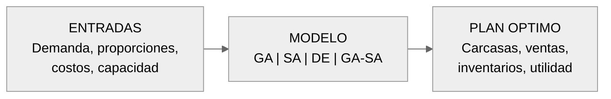

@@SHORT@@Representación del problema como sistema de entrada/salida@@ENDSHORT@@ Representación del problema como sistema de entrada/salida. El modelo de optimización recibe datos de demanda, proporciones anatómicas y parámetros operativos, y genera un plan de producción óptimo.
:::

A nivel sistémico, el problema se enmarca en la dinámica **Push/Pull** de la cadena avícola (Figura 2). La granja "empuja" lotes de aves que deben procesarse al alcanzar su peso de mercado (Push), generando coproductos en proporciones fijas. Simultáneamente, el mercado "jala" productos específicos con demanda variable y estacional (Pull). El **desbalance** ocurre cuando estas dos fuerzas no están alineadas, y la planta de procesamiento debe tomar decisiones de producción, inventario y ventas bajo incertidumbre.

::: {#fig:fig_2}
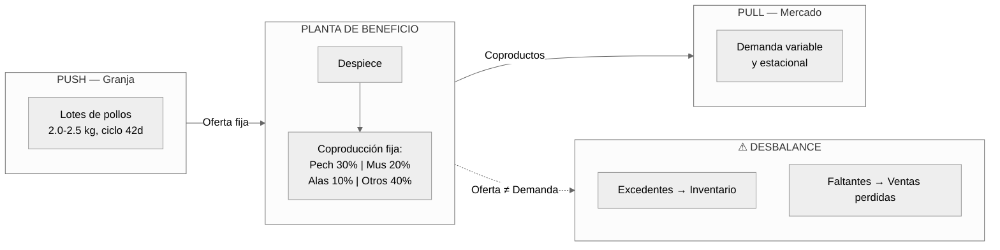

@@SHORT@@Sistema global Push/Pull de la cadena avícola@@ENDSHORT@@ Sistema global Push/Pull de la cadena avícola. La granja empuja lotes de aves (Push), la planta genera coproductos en proporciones fijas, y el mercado jala productos con demanda variable (Pull). El desbalance entre oferta y demanda genera excedentes y faltantes.
:::

### 1.2. Relevancia Económica y Contexto Nacional

La relevancia económica de resolver el problema de la planificación de coproductos es crucial para la competitividad y sostenibilidad de la industria avícola colombiana. Según FENAVI [@FENAVI2024], la avicultura representa uno de los renglones pecuarios más importantes del país, con una producción anual que supera las 1.7 millones de toneladas de carne de pollo. La agroindustria avícola aporta aproximadamente 0.52% del valor agregado bruto nacional [@DANE2024].

Una gestión optimizada de la producción conjunta permite:

*   **Reducir costos de inventario:** Minimizando la acumulación de productos de baja rotación.
*   **Maximizar ingresos:** Aprovechando oportunidades de mercado para cortes de alta demanda.
*   **Mejorar la eficiencia operativa:** Optimizando las cantidades procesadas por periodo.
*   **Reducir el desperdicio:** Contribuyendo a la sostenibilidad ambiental del sector.

El problema de planificación de coproductos bajo demanda estocástica es un problema de optimización combinatoria clasificado como **NP-hard**. La demostración formal de esta complejidad se remonta al trabajo seminal de Florian et al. [-@Florian1980] y Bitran y Yanasse [-@BitranYanasse1982], quienes probaron que incluso el caso mono-producto del Capacitated Lot-Sizing Problem (CLSP) con costos fijos de setup es NP-hard [@Goren2016]. Rahmani et al. [-@Rahmani2025] confirman que la extensión a dos etapas estocásticas preserva esta complejidad, y Mahdieh et al. [-@Mahdieh2018] demuestran que agregar restricciones de lote mínimo y setup crossover la incrementan aún más. Esta complejidad computacional ha motivado el desarrollo de enfoques metaheurísticos para encontrar soluciones de alta calidad en tiempos de cómputo razonables.

La literatura reciente en optimización de cadenas de suministro avícolas [@SolanoBlanco2022; @Yazdekhasti2021; @Tahraoui2025] y en planificación de producción para la industria alimentaria [@Ahumada2009; @Amorim2014] ha demostrado la viabilidad de modelos matemáticos para la planificación integrada. Sin embargo, estos trabajos emplean predominantemente métodos exactos (MILP/CPLEX) que resultan intratables para instancias de gran escala con incertidumbre.

Este trabajo se centra en abordar este desafío mediante el desarrollo de un **modelo de optimización para la planificación de coproductos**, resuelto con **técnicas metaheurísticas** (Algoritmos Genéticos, Recocido Simulado, Evolución Diferencial e híbridos) [@AkbariAghghaleh2025; @Slama2021]. El objetivo es desarrollar una herramienta de apoyo a la decisión que permita a las empresas del sector mejorar su planificación, reducir sus pérdidas y fortalecer su competitividad en un mercado cada vez más exigente.

### 1.3. Preguntas de Investigación

**Pregunta Principal:**
¿Cómo puede un modelo de optimización de coproductos, resuelto mediante técnicas metaheurísticas, minimizar las pérdidas económicas asociadas al desbalance entre la oferta conjunta de coproductos y la demanda del mercado en una planta de procesamiento avícola colombiana?

**Preguntas Secundarias:**

1. ¿Qué formulación matemática del problema de planificación de coproductos captura adecuadamente las restricciones de producción conjunta, los costos de inventario, balance de materiales y la variabilidad de la demanda en el contexto avícola?

2. ¿Qué técnicas metaheurísticas (Algoritmos Genéticos, Recocido Simulado, Evolución Diferencial, o híbridos) presentan el mejor desempeño para resolver el modelo de optimización de coproductos propuesto?

3. ¿En qué magnitud se pueden reducir las pérdidas económicas asociadas al desbalance de carcasa mediante la implementación del modelo de optimización?

### 1.4. Hipótesis de Investigación

**Hipótesis Principal (H1):**
La aplicación del modelo de optimización de coproductos con metaheurísticas generará una reducción **≥5%** en el costo total operativo respecto al baseline de planificación proporcional, validada con nivel de significancia α=0.05, tomando como referencia los benchmarks de Solano-Blanco et al. [-@SolanoBlanco2022] (8.6% de reducción) y Tahraoui et al. [-@Tahraoui2025].

**Hipótesis Secundarias:**

*   **H2:** El algoritmo híbrido GA-SA obtendrá soluciones con un gap de optimalidad **≤2%** respecto a la mejor metaheurística individual (GA, SA o DE), en un tiempo computacional **≤50%** del requerido por el solver exacto (CBC/PuLP) para instancias medianas ($n_t=12$, $n_\omega=50$) [@AkbariAghghaleh2025].
*   **H3:** El modelo de optimización permitirá una reducción **≥15%** en el inventario promedio total, comparada con el método de planificación proporcional, evaluada mediante un contraste one-sided bloqueado por instancia (α=0.05). Como análisis secundario exploratorio, se examinará el inventario de baja rotación cuando el baseline sea estrictamente positivo.

### 1.5. Alcance y Limitaciones

**Alcance:**

*   El modelo se formula para la planificación operativa de coproductos en plantas de beneficio avícola con un horizonte de planificación de hasta 30 días.
*   Se evalúan cuatro metaheurísticas (GA, SA, DE, GA-SA) y se comparan contra un solver exacto (CBC) y un baseline heurístico.
*   La validación se realiza con datos sintéticos calibrados con parámetros del sector avícola colombiano (FENAVI, DANE, literatura publicada).
*   El alcance geográfico se limita al contexto colombiano, utilizando costos, precios y patrones de demanda representativos del mercado nacional.

**Limitaciones:**

*   No se utilizan datos operativos reales de una planta de beneficio específica, sino datos sintéticos calibrados.
*   El modelo asume proporciones de coproductos fijas por carcasa (no considera variabilidad genética inter-lote).
*   No se integra el scheduling detallado de la línea de despiece (solo lot-sizing a nivel diario).
*   La perecibilidad se modela como restricción de vida útil discreta, sin considerar deterioro gradual de calidad.

---

## 2. Justificación

### 2.1. Conveniencia y Relevancia Económica

La optimización de la planificación de coproductos tiene un impacto directo en la rentabilidad de las empresas avícolas. Como demostró el caso de Solano-Blanco et al. [@SolanoBlanco2022], las mejoras en la planificación integrada pueden traducirse en reducciones de costos del **8.6%**. Tahraoui et al. [@Tahraoui2025] confirmaron que la planificación operativa optimizada con modelos MILP reduce significativamente los costos en plantas multi-producto. En una industria de márgenes estrechos y alto volumen, estas mejoras representan una ventaja competitiva crítica.

El sector avícola colombiano, que según FENAVI [@FENAVI2024] genera más de 600,000 empleos directos e indirectos, se beneficiaría significativamente de herramientas que mejoren su eficiencia operativa. La implementación de modelos de optimización no solo mejora la rentabilidad de las empresas individuales, sino que fortalece la competitividad del sector a nivel nacional e internacional.

El desbalance entre la oferta conjunta y la demanda del mercado se manifiesta en dos frentes principales:

1.  **Excedentes de inventario (sobreproducción):** Cuando la producción de ciertos cortes (alas, patas, vísceras) supera la demanda del mercado, las empresas se ven forzadas a incurrir en costos adicionales de almacenamiento en frío, transporte y, en el peor de los casos, vender estos productos a precios de liquidación, erosionando significativamente los márgenes de ganancia.

2.  **Faltantes de inventario (subproducción):** De forma simultánea, la demanda de cortes de alto valor (pechuga) puede exceder la capacidad de producción balanceada, resultando en oportunidades de venta perdidas y una potencial insatisfacción del cliente.

| Indicador | Valor | Fuente |
|-----------|-------|--------|
| Producción anual de pollo | 1.7 millones de toneladas | FENAVI 2024 |
| Empleos generados | 600,000+ directos e indirectos | FENAVI 2024 |
| Participación en PIB agropecuario | 0.52% | DANE 2024 |
| Potencial de ahorro en inventario | 30–60% | Solano-Blanco et al. 2022 |
| Costos de almacenamiento refrigerado | +15–25% del costo operativo | Solano-Blanco et al. 2022; Sel et al. 2015 |
| Pérdidas por ventas de liquidación | −20–40% del margen | Amorim et al. 2014 |
| Desperdicio de producto perecedero | 5–10% de la producción total | Claassen 2016; Akbari-Aghghaleh et al. 2025 |

: Magnitud del problema en la industria avícola colombiana {#tbl:tabla_1}

*Fuente: Elaboración propia con datos de [@FENAVI2024; @DANE2024; @SolanoBlanco2022; @Sel2015; @Amorim2014; @Claassen2016; @AkbariAghghaleh2025]*

### 2.2. Relevancia Social y Ambiental (ODS 9, ODS 12)

Mejorar el equilibrio de la carcasa contribuye directamente a la sostenibilidad del sector. Al reducir el desperdicio de alimentos y optimizar el uso de recursos (energía para refrigeración de inventarios no deseados), el proyecto se alinea con los **Objetivos de Desarrollo Sostenible (ODS)**, específicamente:

*   **ODS 12 (Producción y Consumo Responsables):** Reduciendo el desperdicio de alimentos y optimizando el aprovechamiento de cada ave procesada.
*   **ODS 9 (Industria, Innovación e Infraestructura):** Mediante la aplicación de técnicas avanzadas de optimización y el desarrollo de herramientas tecnológicas para la industria.

La reducción del desperdicio de alimentos es particularmente relevante en un contexto global donde aproximadamente el 14% de los alimentos se pierde en la cadena de suministro antes de llegar al consumidor [@FAO2023]. Un mejor balanceo de la carcasa significa un proceso más sostenible, con menor huella de carbono y mejor utilización de los recursos naturales. En otras industrias de desensamble, Darghouth et al. [-@Darghouth2021] han confirmado que la integración de criterios de sostenibilidad (eficiencia energética, reducción de costos) en modelos de optimización genera beneficios significativos, principios transferibles al procesamiento avícola.

### 2.3. Implicaciones Prácticas

El desarrollo de una herramienta de toma de decisiones basada en metaheurísticas permitirá a los planificadores de producción pasar de decisiones basadas en la intuición y la experiencia personal a decisiones basadas en datos y modelado matemático robusto. Esto mejorará la capacidad de respuesta ante fluctuaciones del mercado y permitirá una planificación más ágil y eficiente.

La implementación de tecnologías de sensores inteligentes [@SensorsPoultry2022] y sistemas de automatización [@AutomationSystems2023] en la industria avícola está generando grandes volúmenes de datos que pueden ser aprovechados por modelos de optimización como el propuesto en este proyecto. La disponibilidad creciente de datos en tiempo real facilita la implementación práctica de herramientas como la desarrollada en este trabajo.

### 2.4. Valor Teórico y Científico

El proyecto contribuye significativamente a la literatura de **optimización de producción conjunta** en la industria alimentaria, extendiendo los modelos clásicos de planificación de producción deterministas [@Gicquel2017] hacia enfoques estocásticos que consideran la incertidumbre de la demanda, una área identificada como línea futura de investigación por diversos autores [@Birge2011; @MirzapourAlHashem2011].

La **optimización multi-objetivo** en la industria alimentaria ha experimentado un avance significativo en los últimos años. Arteaga-Cabrera et al. [-@Arteaga2025] presentaron una revisión comprehensiva sobre la evolución de las estrategias de optimización en alimentos, identificando la transición desde métodos univariados tradicionales hacia técnicas multi-objetivo integradas con tecnologías emergentes. Su trabajo destaca que la industria alimentaria moderna requiere **optimizar simultáneamente múltiples objetivos competitivos** (costos de producción, eficiencia energética, calidad del producto, sostenibilidad), lo cual se alinea perfectamente con la planificación de coproductos avícolas, donde se deben balancear simultáneamente:

- Maximización de ingresos por venta de coproductos
- Minimización de costos de inventario
- Minimización de penalizaciones por demanda no satisfecha
- Maximización del nivel de servicio al cliente

La incorporación de **algoritmos evolutivos** y metaheurísticas hibridizadas, como lo documentan Arteaga-Cabrera et al. [@Arteaga2025], ha permitido abordar estos problemas complejos de forma efectiva en la industria alimentaria. Este proyecto se posiciona como una **contribución directa** a esta línea de investigación, aplicando metaheurísticas (GA, SA, DE, GA-SA) a un problema de planificación de coproductos en el procesamiento avícola. Si bien el modelo propuesto utiliza una función objetivo escalar (beneficio esperado ponderado), los principios de optimización multi-criterio representan una línea de extensión natural.

Adicionalmente, la comparación rigurosa de diferentes técnicas metaheurísticas en el contexto específico de la industria avícola genera conocimiento valioso sobre la efectividad de estas técnicas en problemas del mundo real con características particulares (perecibilidad, estocasticidad, restricciones sanitarias).

---

## 3. Objetivos

### 3.1. Objetivo General

Desarrollar un modelo de optimización para la planificación de coproductos que, mediante la aplicación de técnicas metaheurísticas, minimice las pérdidas económicas asociadas al desbalance entre la oferta conjunta de coproductos y la demanda del mercado en la industria avícola colombiana.

### 3.2. Objetivos Específicos

1.  **Formular** un modelo matemático de optimización de coproductos que capture las restricciones de producción conjunta, costos de inventario, balance de materiales y variabilidad de la demanda propias del procesamiento avícola.

2.  **Implementar** algoritmos metaheurísticos (Algoritmo Genético, Recocido Simulado, Evolución Diferencial y un enfoque híbrido GA-SA) adaptados al problema de planificación de coproductos avícolas.

3.  **Diseñar** un generador de instancias de prueba con datos sintéticos calibrados que reflejen las condiciones operativas reales de la industria avícola colombiana.

4.  **Comparar** el desempeño de las metaheurísticas propuestas mediante un diseño experimental riguroso, evaluando calidad de solución y eficiencia computacional.

5.  **Validar** el modelo propuesto mediante simulación, cuantificando las mejoras potenciales en términos de reducción de costos de inventario, nivel de servicio y rentabilidad operativa.

---

## 4. Marco Referencial

### 4.1. Marco Conceptual

#### 4.1.1. Producción Conjunta (Joint Production)

El **problema de producción conjunta** ocurre cuando el procesamiento de una materia prima genera múltiples productos en proporciones fijas o semifijas. En la industria avícola, el despiece de cada carcasa produce inevitablemente pechuga, muslos, alas, vísceras y otros cortes en proporciones determinadas por la anatomía del ave. Esta característica, compartida con otras industrias cárnicas, crea un desafío único de planificación cuando la demanda del mercado para cada coproducto no refleja estas proporciones naturales [@Heij2021].

Desde la perspectiva de la investigación de operaciones, este problema se clasifica como un **problema de optimización de mezcla de producción multi-producto con restricciones de co-producción** [@Gicquel2017]. A diferencia de los problemas clásicos de planificación de producción, donde las cantidades de cada producto pueden decidirse independientemente, aquí la decisión de producir una unidad de un coproducto (e.g., pechuga) implica necesariamente la producción de cantidades proporcionales de todos los demás coproductos.

#### 4.1.2. Lot-Sizing Capacitado (CLSP)

El **Capacitated Lot-Sizing Problem (CLSP)** es un problema clásico de la investigación de operaciones que busca determinar las cantidades óptimas de producción en cada periodo de un horizonte de planificación, considerando capacidad limitada de producción, costos fijos de setup (activación de línea) y costos variables de producción e inventario [@Goren2016].

La formulación estándar del CLSP incluye:

*   **Decisiones binarias de setup** ($y_t \in \{0,1\}$): si la línea se activa o no en el periodo $t$, con un costo fijo $F$ asociado.
*   **Cantidades de lote** ($q_t \in \mathbb{Z}^+$): número de unidades a producir en cada periodo, acotadas por la capacidad máxima $Q^{max}$ y el lote mínimo $Q^{min}$.
*   **Balance de inventario**: el inventario al final de cada periodo resulta de la producción más el inventario anterior menos las ventas realizadas.

La combinación de variables enteras de producción, decisiones binarias de setup y restricciones de lote mínimo confiere al CLSP una complejidad **NP-hard**, formalmente demostrada por Florian et al. [-@Florian1980] y Bitran y Yanasse [-@BitranYanasse1982].

#### 4.1.3. Programación Estocástica de Dos Etapas

La **programación estocástica de dos etapas** [@Birge2011] es un marco de modelado para problemas de optimización bajo incertidumbre donde las decisiones se dividen en:

*   **Primera etapa (*here-and-now*):** Decisiones que deben tomarse antes de que se revele la incertidumbre. En el contexto de este trabajo, corresponden a las decisiones de setup ($y_t$) y cantidades de producción ($q_t$).
*   **Segunda etapa (*wait-and-see*):** Decisiones que se toman después de observar la realización de la incertidumbre. Corresponden a las decisiones de venta ($v_{pt\omega}$), inventario ($I_{pt\omega}$) y demanda no satisfecha ($u_{pt\omega}$) para cada escenario $\omega$.

La función objetivo maximiza el **beneficio esperado** sobre todos los escenarios de demanda, ponderados por sus probabilidades de ocurrencia $\pi_\omega$. Este marco permite tomar decisiones robustas que funcionan bien en promedio sobre el conjunto de escenarios posibles.

#### 4.1.4. Perecibilidad en la Industria Alimentaria

La **perecibilidad** es una restricción temporal que limita el tiempo durante el cual un producto puede mantenerse en inventario antes de perder su valor comercial. En la industria avícola, cada coproducto tiene una **vida útil** ($L_p$) que depende del tipo de corte, el empaque y las condiciones de almacenamiento.

Integrar la perecibilidad en los modelos de planificación requiere restricciones adicionales que limiten la acumulación de inventario a un número máximo de periodos. Entrup et al. [@Entrup2005] fueron pioneros en integrar la vida útil como restricción dura en problemas de lot-sizing para la industria láctea. Claassen [-@Claassen2016] extendió este enfoque al procesamiento de alimentos con *setups non-triangulares* y *product decay*. Rong et al. [@Rong2011] modelaron el deterioro como variable continua en la gestión de alimentos frescos.

#### 4.1.5. Metaheurísticas: Definición y Clasificación

Las **metaheurísticas** son estrategias de alto nivel que guían la búsqueda de soluciones en problemas de optimización complejos, particularmente cuando los métodos exactos resultan intratables [@MetaheuristicsPower2023]. Se clasifican según su estrategia de búsqueda:

*   **Basadas en trayectoria:** Operan sobre una sola solución que se modifica iterativamente (e.g., Recocido Simulado, Búsqueda Tabú). Su fortaleza es la **intensificación** (explotación local).
*   **Basadas en población:** Operan sobre un conjunto de soluciones simultáneas que evolucionan mediante operadores de selección, cruce y mutación (e.g., Algoritmos Genéticos, Evolución Diferencial). Su fortaleza es la **diversificación** (exploración global).
*   **Híbridos (meméticos):** Combinan la exploración global de los métodos poblacionales con la explotación local de los métodos de trayectoria (e.g., GA-SA). Buscan el equilibrio óptimo entre exploración y explotación.

En el contexto de la industria alimentaria, Arteaga-Cabrera et al. [@Arteaga2025] documentaron la creciente efectividad de estas técnicas para resolver problemas de optimización multi-objetivo en sistemas de producción alimentaria.

### 4.2. Marco Teórico y Estado del Arte

#### 4.2.1. Complejidad NP-hard del CLSP

La demostración formal de la complejidad NP-hard del CLSP con costos fijos de setup se remonta al trabajo seminal de **Florian et al.** [-@Florian1980], quienes probaron que el problema de planificación de producción determinista con costos fijos es NP-hard. **Bitran y Yanasse** [-@BitranYanasse1982] extendieron este resultado al CLSP capacitado, demostrando que la inclusión de restricciones de capacidad no simplifica el problema.

**Goren y Tunali** [-@Goren2016] confirmaron esta clasificación y demostraron que agregar *setup carryover* (continuidad de setup entre periodos) y *backordering* (pedidos pendientes) incrementa aún más la dificultad computacional. Su trabajo propone un enfoque híbrido de Fix-and-Optimize para abordar estas variantes.

**Rahmani et al.** [-@Rahmani2025] extendieron la conclusión de NP-hardness al *two-stage stochastic capacitated lot-sizing*, confirmando explícitamente que la extensión estocástica preserva la complejidad. Este resultado es directamente aplicable al problema abordado en este trabajo, que combina lot-sizing capacitado con escenarios estocásticos de demanda.

**Mahdieh et al.** [-@Mahdieh2018] demostraron que agregar restricciones de lote mínimo con *setup crossover* (continuidad de setup entre periodos consecutivos) incrementa aún más la complejidad del problema base. El modelo propuesto en este trabajo, que combina múltiples productos, incertidumbre estocástica, costos fijos de setup, lote mínimo y perecibilidad, es por tanto formalmente **NP-hard**, justificando plenamente el uso de metaheurísticas.

#### 4.2.2. Lot-Sizing con Perecibilidad en FPI

En el contexto de **lot-sizing para productos perecederos en la industria de procesamiento de alimentos (FPI)**, varios trabajos han establecido las bases teóricas:

**Claassen** [-@Claassen2016] abordó específicamente la planificación y scheduling en FPI con *setups non-triangulares* (donde los tiempos de limpieza entre productos no satisfacen la desigualdad triangular, situación típica en líneas de procesamiento cárnico) y el *deterioro de producto (product decay)* como restricción temporal del inventario.

**Stefánsdóttir et al.** [-@Stefansdottir2017] complementaron este trabajo con una clasificación taxonómica de los tipos de setup y limpieza en lot-sizing, distinguiendo entre setups triangulares y non-triangulares y su impacto en la complejidad del modelo. Su taxonomía facilita la selección del modelo de setup más apropiado para cada aplicación industrial.

**Entrup et al.** [@Entrup2005] desarrollaron modelos MILP pioneros que integran la vida útil como restricción en problemas de lot-sizing para la industria láctea, estableciendo un marco transferible a otros sectores alimentarios. Su modelado de *shelf-life-integrated planning* constituye la base teórica directa para la restricción de perecibilidad utilizada en este trabajo (Eq. 7).

**Rong et al.** [@Rong2011] propusieron un enfoque de optimización para la gestión de calidad de alimentos frescos a lo largo de la cadena de suministro, modelando el deterioro como variable continua. Este enfoque, más sofisticado que la restricción de vida útil discreta utilizada en el presente trabajo, representa una extensión natural para futuras investigaciones.

#### 4.2.3. Optimización en la Cadena de Suministro Avícola

La investigación en optimización de cadenas de suministro avícolas ha crecido significativamente en los últimos años:

**Solano-Blanco et al.** [@SolanoBlanco2022] abordaron el problema específico de planificación integrada en la industria avícola colombiana mediante un modelo MILP con programación estocástica de dos etapas. Su caso de estudio en Santa Marta demostró reducciones de costos del **8.6%**, lo que constituye el benchmark principal de este trabajo.

**Tahraoui et al.** [@Tahraoui2025] desarrollaron un modelo MILP para la planificación operativa de plantas de beneficio avícola multi-producto bajo restricciones realistas y demanda fluctuante, validado con CPLEX. Su enfoque aborda la complejidad de la planificación operativa en entornos multi-producto, pero permanece limitado a métodos exactos intratables para instancias de gran escala.

**Yazdekhasti et al.** [@Yazdekhasti2021] formularon un modelo estocástico multi-periodo y multi-modal para la cadena de suministro avícola bajo incertidumbre de demanda, con un caso de estudio en Mississippi durante la pandemia de COVID-19. Su modelo MILP demuestra la importancia de considerar la estocasticidad en la planificación avícola.

**González-Neira et al.** [@GonzalezNeira2025] integraron scheduling y transporte en un modelo MILP para la cadena de suministro avícola colombiana, avanzando en la planificación operativa detallada. Su trabajo confirma la relevancia del contexto colombiano para este tipo de investigaciones.

**Dadaneh et al.** [@Dadaneh2024] formularon un modelo CLSP con *chance-constraints* para la planificación de producción de huevos en granjas avícolas bajo demanda incierta, demostrando la aplicabilidad directa del lot-sizing capacitado en el sector avícola.

**Juwitaa et al.** [@Juwitaa2024] optimizaron cadenas de suministro de pollo de engorde bajo incertidumbre en la tasa de crecimiento mediante programación estocástica de dos etapas, confirmando la relevancia de este marco de modelado para la industria avícola.

#### 4.2.4. Metaheurísticas para Lot-Sizing y SC Avícola

La aplicación de metaheurísticas a problemas de lot-sizing y cadenas de suministro avícolas es un área de investigación en crecimiento:

**Akbari-Aghghaleh et al.** [@AkbariAghghaleh2025] constituyen la referencia más directa para este trabajo. Diseñaron una cadena de suministro avícola de ciclo cerrado con perecibilidad y sostenibilidad, evaluando cinco metaheurísticas: **GA, SA, DE, GA-SA y DE-SA**. Sus resultados demuestran que el **híbrido GA-SA obtiene el mejor rendimiento** entre las cinco técnicas evaluadas para problemas NP-hard de cadena de suministro avícola con perecibilidad. Este resultado fundamenta directamente la selección del GA-SA como algoritmo principal en el presente trabajo.

**Slama et al.** [-@Slama2021] utilizaron GA combinado con **Monte Carlo Simulation** para resolver problemas estocásticos de lot-sizing capacitado bajo lead times aleatorios. Sus resultados demuestran que el GA supera al MIP exacto en instancias medianas y grandes, validando el uso de metaheurísticas para problemas estocásticos de lot-sizing.

**Roshani et al.** [-@Roshani2017] evaluaron un heurístico de relax-and-fix para el CLSP, confirmando la efectividad de SA como componente de búsqueda local. Su trabajo demuestra que los enfoques que integran explotación local intensiva son particularmente efectivos en problemas de lot-sizing.

#### 4.2.5. Optimización Multi-Objetivo en Industria Alimentaria

La optimización multi-objetivo ha experimentado un avance significativo en la industria alimentaria:

**Arteaga-Cabrera et al.** [@Arteaga2025] presentaron una revisión comprehensiva sobre la evolución de las estrategias de optimización en alimentos, identificando la transición desde métodos univariados tradicionales hacia técnicas multi-objetivo integradas con tecnologías emergentes. Su trabajo destaca la importancia de optimizar simultáneamente múltiples objetivos competitivos en la industria alimentaria moderna.

**Liang et al.** [@Liang2023] demostraron la efectividad de la optimización multi-objetivo para operaciones de corte en la industria cárnica, abordando la maximización de beneficios de coproductos respetando restricciones de producción conjunta. Este trabajo es directamente análogo al problema de balanceo de carcasa avícola abordado en esta tesis.

**Mirzapour Al-e-Hashem et al.** [@MirzapourAlHashem2011] desarrollaron un modelo robusto multi-objetivo para planificación agregada de producción multi-producto bajo incertidumbre de demanda y costos. Su enfoque de optimización robusta complementa la programación estocástica utilizada en este trabajo.

**Amorim et al.** [@Amorim2014] formularon un modelo integrado de producción y distribución multi-objetivo para productos perecederos, combinando minimización de costos con maximización de frescura. Su integración de restricciones de vida útil en la planificación es directamente aplicable al contexto avícola.

#### 4.2.6. Modelos Deterministas de Referencia

Varios modelos deterministas establecen las bases para formulaciones más avanzadas:

**Gicquel y Miègeville** [@Gicquel2017] desarrollaron formulaciones y métodos de solución para la planificación conjunta de producción y transporte en cadenas alimentarias multi-sitio. Sus modelos MILP para producción conjunta con co-productos constituyen un referente directo para este trabajo.

**Sel et al.** [@Sel2015] demostraron la importancia de considerar restricciones de vida útil en la planificación integrada de cadenas de suministro de productos perecederos, con aplicación a la industria láctea. Su enfoque de *multi-bucket optimization* informa la granularidad temporal del modelo propuesto.

**Kopanos et al.** [@Kopanos_2012] establecieron marcos matemáticos eficientes para el scheduling detallado en la industria de procesamiento de alimentos. Aunque su alcance es más operativo que el presente trabajo, sus formulaciones informan las restricciones de capacidad y setup utilizadas.

#### 4.2.7. Tecnologías Habilitadoras

Las tecnologías habilitadoras complementan el enfoque de optimización:

**Mahalik y Nambiar** [@Mahalik2010] destacan la tendencia creciente hacia la automatización y el uso de sensores inteligentes en los sistemas de manufactura de alimentos, elementos clave para asegurar la calidad y trazabilidad. La integración de estos sensores y la planificación automatizada en plantas de procesamiento están generando oportunidades para la implementación de modelos de optimización en tiempo real.

**Hartono et al.** [@Hartono2022] demostraron la eficacia del *Bees Algorithm* para optimizar planes de desensamble robótico, un enfoque que podría adaptarse al procesamiento de carcasas avícolas. Su trabajo confirma la viabilidad de metaheurísticas bio-inspiradas para problemas de desensamble en manufactura.

**Feng et al.** [@Feng2025] demostraron cómo el aumento de datos sintéticos mejora significativamente la segmentación de instancias de carcasas de pollo, lo cual es fundamental para la automatización de procesos de despiece y control de calidad. Esta tecnología de visión por computador complementa los modelos de planificación al proporcionar datos más precisos sobre rendimientos de carcasa.

**Awad et al.** [@Awad2023] desarrollaron un modelo de optimización para minimizar el desperdicio (*giveaway*) y el subpeso (*underweight*) en el proceso de porcionado avícola, demostrando que la optimización matemática puede mejorar significativamente la eficiencia del despiece. Su trabajo es directamente aplicable al problema de balanceo de carcasa abordado en este trabajo.

### 4.3. Vacíos de Investigación Identificados

A pesar de la creciente investigación en optimización de cadenas de suministro avícolas y en metaheurísticas para problemas combinatorios, la revisión del estado del arte revela varios vacíos de investigación que este trabajo busca abordar.

Una búsqueda sistemática realizada en Scopus (febrero 2026) utilizando ecuaciones de búsqueda centradas en lot-sizing estocástico, perecibilidad, optimización avícola y metaheurísticas arrojó los siguientes resultados:

| Query | Tema | Base de datos | Periodo | # Resultados |
|:-----:|------|:-------------:|:-------:|:------------:|
| Q1 | Lot-sizing estocástico + NP-hard + Setup | Scopus | 2014–2026 | 9 |
| Q2 | Metaheurísticas + Setup estocástico | Scopus | 2017–2026 | 11 |
| Q3 | Perecibilidad + Lot-sizing + Setup | Scopus | 2015–2026 | 20 |
| Q4 | Optimización avícola/cárnica | Scopus | 2018–2026 | 186 |
| Q5 | Prog. estocástica 2-etapas + Metaheurísticas | Scopus | 2016–2026 | 218 |
| Q6 | CLSP + Complejidad computacional | Scopus | 2015–2026 | 30 |
| Q7 | Reviews multi-product lot-sizing estocástico | Scopus | 2018–2026 | 0 |
| Q8 | Lote mínimo + Setup + Prog. entera | Scopus | 2015–2026 | 4 |
| | | | **Total** | **478** |

: Resultados de la búsqueda sistemática en Scopus (febrero 2026) {#tbl:tabla_2}

De los 478 resultados, solo 13 papers abordan directamente la intersección entre lot-sizing estocástico con setup, perecibilidad y metaheurísticas—confirmando la brecha que esta investigación busca llenar. Notablemente, la Query Q7 (reviews sobre multi-product lot-sizing estocástico) no arrojó ningún resultado, evidenciando la ausencia de trabajos de revisión del estado del arte para este tema específico.

La Tabla 3 resume los trabajos más relevantes y su posicionamiento respecto a esta propuesta.

| Autor(es) | Técnica | Objetivo | Incertidumbre | Aplicación |
|-----------|---------|----------|---------------|------------|
| Solano-Blanco et al. [-@SolanoBlanco2022] | MILP Estoc. | Planif. integrada | Estoc. 2 etapas | Avícola (Col.) |
| Tahraoui et al. [-@Tahraoui2025] | MILP (CPLEX) | Planif. operativa | Demanda fluct. | Avícola (multi-prod.) |
| Yazdekhasti et al. [-@Yazdekhasti2021] | MILP Multi-modal | SC estocástica | Estoc. (demanda) | Avícola (Miss.) |
| Mirzapour et al. [-@MirzapourAlHashem2011] | MILP Robusto | Planif. agregada | Robusto multi-obj. | Manufactura |
| Gicquel & Miègeville [-@Gicquel2017] | MILP | Prod. + transp. | Determinista | Alimentaria |
| Sel et al. [-@Sel2015] | MILP | Prod. + distrib. | Determinista | Perecederos |
| Kopanos et al. [-@Kopanos_2012] | MILP | Scheduling | Determinista | Alimentaria |
| Amorim et al. [-@Amorim2014] | MILP Multi-obj. | Prod. + distrib. | Determinista | Perecederos |
| Liang et al. [-@Liang2023] | Optim. Multi-obj. | Corte cárnico | Determinista | Cárnica (coprod.) |
| Claassen [-@Claassen2016] | MILP | Lot-sizing + decay | Determinista | FPI (setup non-triang.) |
| Rahmani et al. [-@Rahmani2025] | Heurístico híbrido | CLSP estocástico | Estoc. 2 etapas | Manufactura (NP-hard) |
| Dadaneh et al. [-@Dadaneh2024] | CLSP chance-constr. | Planif. huevos | Estoc. (demanda) | Avícola (huevos) |
| Akbari-Aghghaleh et al. [-@AkbariAghghaleh2025] | **GA, SA, DE, híbridos** | SC ciclo cerrado | Determinista | **Avícola (perecib.)** |
| González-Neira et al. [-@GonzalezNeira2025] | MILP | Scheduling + transp. | Determinista | Avícola (Col.) |
| **→ Propuesta** | **GA, SA, DE, GA-SA** | **Max profit** | **Estoc. (demanda)** | **Avícola (coprod., Col.)** |

: Resumen del estado del arte y brechas identificadas {#tbl:tabla_3}

::: {#fig:fig_3}
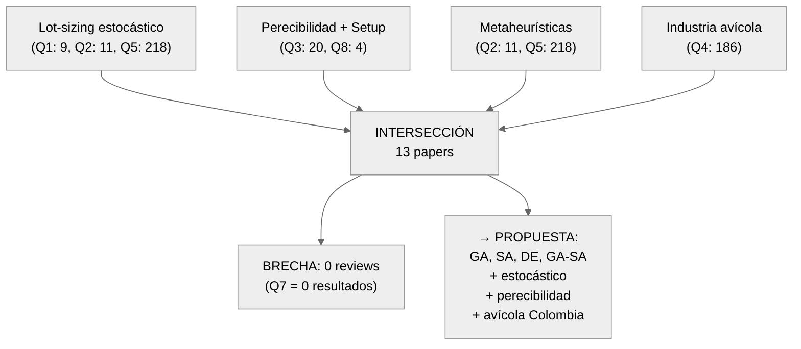

@@SHORT@@Diagrama de intersección de brechas de investigación@@ENDSHORT@@ Diagrama de intersección de brechas de investigación. De 478 resultados en las 8 queries de búsqueda, solo 13 papers abordan la intersección directa entre lot-sizing estocástico, perecibilidad, metaheurísticas e industria avícola. La ausencia de reviews (Q7=0) confirma la novedad del área.
:::

Los principales vacíos identificados son:

1. **Ausencia de metaheurísticas para planificación de coproductos avícolas bajo incertidumbre:** De los 14 trabajos relevantes en la Tabla 3, solo Akbari-Aghghaleh et al. [-@AkbariAghghaleh2025] utilizan metaheurísticas en el contexto avícola, pero con un modelo determinista. Ningún trabajo combina metaheurísticas con programación estocástica de dos etapas para coproductos avícolas.

2. **Inexistencia de reviews de multi-product lot-sizing estocástico:** La Query Q7 no arrojó ningún resultado, evidenciando que el campo carece de sistematización. Esto dificulta la identificación de mejores prácticas y líneas de investigación prioritarias.

3. **Concentración en la intersección directa:** Solo 13 de 478 papers (2.7%) abordan simultáneamente los cuatro ejes temáticos (lot-sizing estocástico, perecibilidad, metaheurísticas, avícola), confirmando que la propuesta aborda un nicho inexplorado con contribución potencial significativa.

---

## 5. Formulación del Modelo Matemático

El modelo propuesto se formula como un problema de **Programación Lineal Entera Mixta (MILP) multi-periodo** con estructura de *lot-sizing* estocástico para la planificación óptima de coproductos avícolas bajo demanda incierta.

### 5.1. Conjuntos, Parámetros y Variables de Decisión

**Conjuntos:**

- $P = \{1, 2, ..., n_p\}$: Conjunto de coproductos (formas de corte: pechuga, muslos, alas, etc.)
- $T = \{1, 2, ..., n_t\}$: Conjunto de periodos de planificación
- $\Omega = \{1, 2, ..., n_\omega\}$: Conjunto de escenarios de demanda

**Parámetros:**

- $\alpha_p$: Proporción fija del coproducto $p$ por carcasa (restricción anatómica, $\sum_p \alpha_p = 1$)
- $W$: Peso promedio de una carcasa (kg)
- $d_{pt\omega}$: Demanda del coproducto $p$ en el periodo $t$ bajo el escenario $\omega$ (kg)
- $r_p$: Precio de venta del coproducto $p$ (COP/kg)
- $c^{prod}$: Costo de procesamiento por carcasa (COP/carcasa)
- $F$: Costo fijo de activación de la línea por periodo (COP/periodo)
- $c^{inv}_p$: Costo de mantener inventario del coproducto $p$ (COP/kg/periodo)
- $c^{pen}_p$: Costo de penalización por demanda no satisfecha del coproducto $p$ (COP/kg)
- $Q^{max}$: Capacidad máxima de procesamiento (carcasas/periodo)
- $Q^{min}$: Lote mínimo de procesamiento (carcasas/periodo)
- $L_p$: Vida útil máxima del coproducto $p$ (periodos)
- $\pi_\omega$: Probabilidad del escenario $\omega$

**Variables de Decisión:**

- $y_t \in \{0, 1\}$: Variable binaria de activación (*setup*) de la línea en $t$ (primera etapa)
- $q_t \in \mathbb{Z}^+$: Número de carcasas a procesar en $t$ (primera etapa)
- $v_{pt\omega}$: Cantidad vendida del coproducto $p$ en $t$, escenario $\omega$ (segunda etapa)
- $I_{pt\omega}$: Inventario del coproducto $p$ al final de $t$, escenario $\omega$
- $u_{pt\omega}$: Demanda no satisfecha del coproducto $p$ en $t$, escenario $\omega$

| Perfil | $n_p$ | $n_t$ | $n_\omega$ | Variables 1ª etapa | Variables 2ª etapa | Total variables | Restricciones |
|--------|:-----:|:-----:|:----------:|:------------------:|:------------------:|:---------------:|:-------------:|
| Small | 5 | 6 | 10 | 12 | 900 | 912 | ~1,080 |
| Medium | 8 | 12 | 50 | 24 | 14,400 | 14,424 | ~16,800 |
| Large | 8 | 30 | 100 | 60 | 72,000 | 72,060 | ~84,000 |

: Conteo de variables y restricciones por tamaño de instancia {#tbl:tabla_4}

### 5.2. Función Objetivo

La función objetivo maximiza el **beneficio esperado** sobre todos los escenarios de demanda:

\begin{equation}
\max Z = \sum_{\omega \in \Omega} \pi_\omega \left[ \sum_{t \in T} \left( \sum_{p \in P} r_p \cdot v_{pt\omega} - c^{prod} \cdot q_t - F \cdot y_t - \sum_{p \in P} c^{inv}_p \cdot I_{pt\omega} - \sum_{p \in P} c^{pen}_p \cdot u_{pt\omega} \right) \right]
\end{equation}

Los cinco componentes de la función objetivo son:

1. **Ingresos por ventas:** $\sum_{p} r_p \cdot v_{pt\omega}$ — maximiza la venta de coproductos a precios de mercado.
2. **Costo de producción:** $c^{prod} \cdot q_t$ — costo variable proporcional al número de carcasas procesadas.
3. **Costo de setup:** $F \cdot y_t$ — costo fijo de activación de la línea (personal, energía, sanitización).
4. **Costo de inventario:** $\sum_p c^{inv}_p \cdot I_{pt\omega}$ — penaliza la acumulación de inventario (refrigeración).
5. **Penalización por demanda insatisfecha:** $\sum_p c^{pen}_p \cdot u_{pt\omega}$ — penaliza las oportunidades de venta perdidas.

### 5.3. Restricciones

**Restricción 1 — Balance de materiales (co-producción):**
\begin{equation}
I_{pt\omega} = I_{p,t-1,\omega} + \alpha_p \cdot W \cdot q_t - v_{pt\omega} \quad \forall p \in P, t \in T, \omega \in \Omega
\end{equation}

El inventario al final de cada periodo resulta del inventario anterior más la producción (proporcional a las carcasas procesadas) menos las ventas realizadas.

**Restricción 2 — Satisfacción de demanda:**
\begin{equation}
v_{pt\omega} + u_{pt\omega} = d_{pt\omega} \quad \forall p \in P, t \in T, \omega \in \Omega
\end{equation}

La demanda de cada coproducto se satisface parcial o totalmente. La diferencia entre demanda y ventas constituye la demanda insatisfecha.

**Restricción 3 — Vínculo de activación (capacidad máxima):**
\begin{equation}
q_t \leq Q^{max} \cdot y_t \quad \forall t \in T
\end{equation}

Si la línea no está activa ($y_t = 0$), no se procesa ninguna carcasa.

**Restricción 4 — Lote mínimo de procesamiento:**
\begin{equation}
q_t \geq Q^{min} \cdot y_t \quad \forall t \in T
\end{equation}

Si la línea está activa ($y_t = 1$), se procesa al menos el lote mínimo operativamente viable.

**Restricción 5 — Ventas limitadas por disponibilidad:**
\begin{equation}
v_{pt\omega} \leq I_{p,t-1,\omega} + \alpha_p \cdot W \cdot q_t \quad \forall p \in P, t \in T, \omega \in \Omega
\end{equation}

No se puede vender más de lo disponible (inventario anterior + producción del periodo).

**Restricción 6 — Perecibilidad (vida útil):**
\begin{equation}
I_{pt\omega} = 0 \quad \forall p \in P, \omega \in \Omega, \; t' \in T \text{ tal que } t' - t > L_p
\end{equation}

El inventario se descarta cuando excede la vida útil del producto [@Claassen2016].

**Restricción 7 — Dominio de variables:**
\begin{equation}
y_t \in \{0,1\}, \quad q_t \in \mathbb{Z}^+, \quad v_{pt\omega}, I_{pt\omega}, u_{pt\omega} \geq 0
\end{equation}

### 5.4. Estructura de Programación Estocástica de Dos Etapas

El modelo sigue la estructura clásica de programación estocástica de dos etapas [@Birge2011]:

*   **Primera etapa (*here-and-now*):** Las decisiones de setup $y_t$ y producción $q_t$ se toman **antes** de conocer la demanda real. Estas son las variables que las metaheurísticas optimizan directamente.
*   **Segunda etapa (*wait-and-see*):** Las decisiones de venta $v_{pt\omega}$, inventario $I_{pt\omega}$ y demanda insatisfecha $u_{pt\omega}$ se determinan **después** de observar cada escenario $\omega$. En la implementación, estas variables se calculan mediante un decodificador greedy determinista (§6.2).

::: {#fig:fig_4}
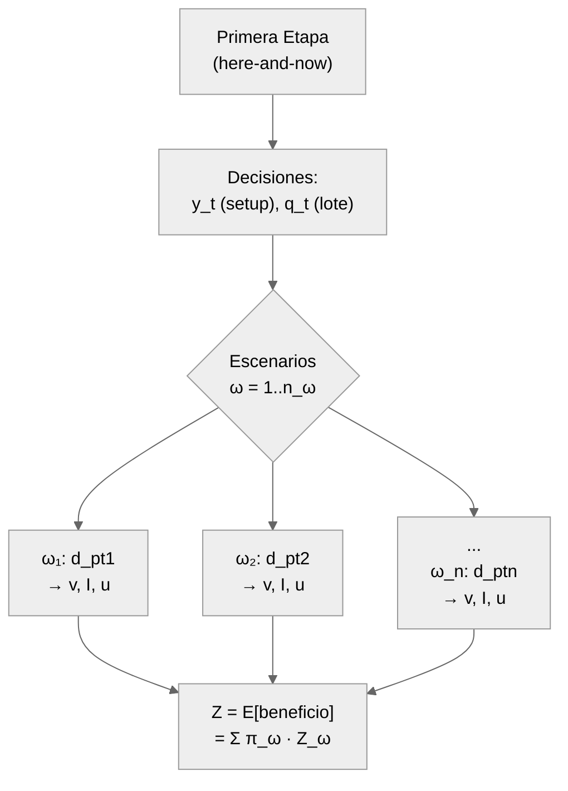

@@SHORT@@Estructura de programación estocástica de dos etapas@@ENDSHORT@@ Estructura de programación estocástica de dos etapas. Las decisiones de primera etapa (setup y producción) se toman antes de conocer la demanda; las de segunda etapa (ventas, inventario) se adaptan a cada escenario.
:::

### 5.5. Validación con Solver Exacto (CBC)

El modelo fue validado resolviendo instancias Small ($n_p=5$, $n_t=6$, $n_\omega=10$) con el solver exacto CBC (COIN-OR Branch and Cut) integrado en PuLP. CBC encuentra la solución óptima global garantizada para estas instancias en tiempos razonables (< 15 segundos). Esta solución óptima sirve como referencia (*benchmark*) para evaluar la calidad de las soluciones metaheurísticas.

Para instancias Medium y Large, el solver exacto se ejecuta con un límite de tiempo de 300 segundos. En instancias Large ($n_p=8$, $n_t=30$, $n_\omega=100$) con 72,060 variables, CBC no logra converger a la solución óptima dentro del límite de tiempo, confirmando la necesidad de métodos metaheurísticos.

---

## 6. Diseño e Implementación de Metaheurísticas

Dada la complejidad NP-hard del problema (§4.2.1), se implementan cuatro metaheurísticas siguiendo el marco comparativo de Akbari-Aghghaleh et al. [-@AkbariAghghaleh2025]. Todas comparten la misma codificación de solución y decodificador greedy, permitiendo una comparación justa.

### 6.1. Representación Cromosómica

El **cromosoma** constituye la representación computacional de una solución candidata en el espacio de búsqueda. En el contexto de este problema, cada cromosoma codifica exclusivamente las **decisiones de primera etapa** del modelo estocástico (§5.4), es decir, aquellas que deben tomarse antes de conocer la realización de la demanda.

Formalmente, un cromosoma $\mathbf{s}$ se define como un par de vectores:

\begin{equation}
\mathbf{s} = (\mathbf{y}, \mathbf{q}) \quad \text{donde} \quad \mathbf{y} \in \{0,1\}^{n_t}, \quad \mathbf{q} \in [Q^{min}, Q^{max}]^{n_t}
\end{equation}

*   **Vector de setup (binario):** $\mathbf{y} = (y_1, y_2, ..., y_{n_t})$ — cada gen $y_t \in \{0, 1\}$ indica si la línea de producción se activa ($y_t = 1$) o permanece inactiva ($y_t = 0$) en el periodo $t$.
*   **Vector de cantidad (entero):** $\mathbf{q} = (q_1, q_2, ..., q_{n_t})$ — cada gen $q_t \in \mathbb{Z}$ codifica el número de carcasas a procesar en el periodo $t$, sujeto a $Q^{min} \leq q_t \leq Q^{max}$ cuando $y_t = 1$.

Las **variables de segunda etapa** ($v_{pt\omega}$, $I_{pt\omega}$, $u_{pt\omega}$) no forman parte del cromosoma; se calculan de manera determinista mediante el decodificador greedy (§6.6) dado un cromosoma y una instancia del problema.

**Ejemplo numérico.** Para una instancia con $n_t = 6$ periodos, $Q^{min} = 100$ y $Q^{max} = 1000$, un cromosoma válido podría ser:

| Periodo $t$ | 1 | 2 | 3 | 4 | 5 | 6 |
|:--|:--:|:--:|:--:|:--:|:--:|:--:|
| $y_t$ (setup) | 1 | 1 | 0 | 1 | 0 | 1 |
| $q_t$ (carcasas) | 750 | 420 | 0 | 1000 | 0 | 300 |

: Ejemplo de cromosoma para $n_t = 6$ {#tbl:tabla_5a}

En este ejemplo, la línea se activa en los periodos 1, 2, 4 y 6. Nótese la **consistencia** entre vectores: cuando $y_t = 0$ (periodos 3 y 5), necesariamente $q_t = 0$. Cuando $y_t = 1$, la cantidad respeta $100 \leq q_t \leq 1000$.

::: {#fig:fig_5}
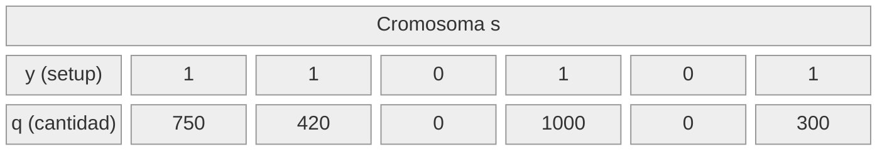

@@SHORT@@Estructura del cromosoma como par de vectores@@ENDSHORT@@ Estructura del cromosoma como par de vectores. El vector superior (binario) codifica las decisiones de setup y el inferior (entero) las cantidades de producción. Los genes son posicionalmente correspondientes: el gen $q_t$ es coherente con $y_t$.
:::

{width=85% #fig:fig_5b}

**Tamaño del espacio de búsqueda.** El espacio de soluciones factibles $\mathcal{S}$ tiene cardinalidad:

\begin{equation}
|\mathcal{S}| = \sum_{k=0}^{n_t} \binom{n_t}{k} \cdot (Q^{max} - Q^{min} + 1)^k
\end{equation}

donde $k$ es el número de periodos activos. Para la instancia Medium ($n_t = 12$, $Q^{min} = 100$, $Q^{max} = 1000$), esto equivale a $|\mathcal{S}| = (1 + 901)^{12} \approx 8.7 \times 10^{35}$, un espacio que impide la enumeración exhaustiva y justifica el uso de metaheurísticas.

### 6.2. Operadores de Vecindad

Los **operadores de vecindad** definen la estructura del espacio de búsqueda al determinar qué soluciones son "alcanzables" desde una solución dada en un solo movimiento. Estos operadores son utilizados directamente por el Recocido Simulado (SA, §6.8) y por la fase de búsqueda local del híbrido GA-SA (§6.10).

Se definen tres estructuras de vecindad, cada una diseñada para perturbar un aspecto diferente del cromosoma:

**Definición 1 — Vecindad de Toggle (exploración estructural).**
Dado un cromosoma $\mathbf{s} = (\mathbf{y}, \mathbf{q})$, la vecindad de toggle $N_{toggle}(\mathbf{s}, k)$ genera un vecino invirtiendo $k$ bits seleccionados aleatoriamente del vector de setup:

\begin{equation}
N_{toggle}(\mathbf{s}, k): \quad y'_{t_i} = \neg y_{t_i}, \quad \{t_1, ..., t_k\} \subset T \text{ aleatorio}
\end{equation}

Este operador modifica la **estructura de producción** (qué periodos producen), generando movimientos de largo alcance en el espacio de soluciones. Por defecto, $k = 1$.

**Definición 2 — Vecindad de Cantidad (explotación local).**
La vecindad de cantidad $N_{quantity}(\mathbf{s}, \delta)$ perturba el vector de cantidades con ruido gaussiano, solo en periodos activos:

\begin{equation}
N_{quantity}(\mathbf{s}, \delta): \quad q'_t = \text{clamp}\left(q_t + \mathcal{N}(0, \delta \cdot Q^{max}),\; Q^{min},\; Q^{max}\right) \quad \forall t : y_t = 1
\end{equation}

donde $\delta \in (0, 1)$ controla la magnitud de la perturbación. Este operador realiza ajustes finos en las cantidades de producción sin modificar la estructura de periodos activos, favoreciendo la **explotación local**.

**Definición 3 — Vecindad Mixta (balance exploración-explotación).**
El SA utiliza una selección probabilística entre las tres opciones en cada iteración:

*   Con probabilidad $p_{toggle}$: aplicar $N_{toggle}$
*   Con probabilidad $p_{quantity}$: aplicar $N_{quantity}$
*   Con probabilidad $1 - p_{toggle} - p_{quantity}$: aplicar ambas secuencialmente

Este mecanismo permite al SA alternar entre movimientos exploratorios (cambiar estructura) y explotatorios (refinar cantidades) de manera adaptativa.

| | $t=1$ | $t=2$ | $t=3$ | $t=4$ | $t=5$ | $t=6$ | Acción |
|:--|:--:|:--:|:--:|:--:|:--:|:--:|:--|
| $\mathbf{y}$ Original | 1 | 1 | 0 | 1 | 0 | 1 | — |
| $\mathbf{q}$ Original | 750 | 420 | 0 | 1000 | 0 | 300 | — |
| $\mathbf{y}'$ Toggle ($t_1=3$) | 1 | 1 | **1** | 1 | 0 | 1 | Activar $t=3$ |
| $\mathbf{q}'$ Toggle | 750 | 420 | **537** | 1000 | 0 | 300 | $q'_3 \sim U[100, 1000]$ |
| $\mathbf{q}'$ Cantidad ($\delta=0.15$)| **712** | **480** | 0 | **955** | 0 | **328** | Perturbación global |

: Ejemplo de aplicación de operadores de vecindad sobre un cromosoma con $n_t = 6$ {#tbl:tabla_5b}

{width=90% #fig:fig_5c}

### 6.3. Operadores Genéticos

Los **operadores genéticos** son los mecanismos de variación utilizados por los algoritmos basados en población (GA, §6.7 y GA-SA, §6.10) para generar nuevas soluciones a partir de las existentes.

#### 6.3.1. Cruce de Dos Puntos

El cruce de dos puntos genera dos hijos intercambiando un segmento central entre dos padres. Se seleccionan aleatoriamente dos puntos de corte $p_1 < p_2$ en el rango $[1, n_t-1]$, y se intercambian simultáneamente los segmentos correspondientes de $\mathbf{y}$ y $\mathbf{q}$:

\begin{equation}
\mathbf{y}^{hijo1} = (y^{P1}_1, ..., y^{P1}_{p_1}, \underbrace{y^{P2}_{p_1+1}, ..., y^{P2}_{p_2}}_{\text{segmento de } P2}, y^{P1}_{p_2+1}, ..., y^{P1}_{n_t})
\end{equation}

El mismo patrón de intercambio se aplica al vector $\mathbf{q}$. Tras el cruce, se aplica el mecanismo de reparación (§6.4) para garantizar factibilidad.

| | $t=1$ | $t=2$ | $t=3$ | $t=4$ | $t=5$ | $t=6$ |
|:--|:--:|:--:|:--:|:--:|:--:|:--:|
| **Padre 1** $\mathbf{y}$ | 1 | 1 | 0 | 1 | 0 | 1 |
| **Padre 1** $\mathbf{q}$ | 750 | 420 | 0 | 1000 | 0 | 300 |
| **Padre 2** $\mathbf{y}$ | 0 | 1 | 1 | 0 | 1 | 1 |
| **Padre 2** $\mathbf{q}$ | 0 | 600 | 350 | 0 | 800 | 500 |
| **Hijo 1** $\mathbf{y}$ | 1 | 1 | **1** | **0** | 0 | 1 |
| **Hijo 1** $\mathbf{q}$ | 750 | 420 | **350** | **0** | 0 | 300 |
| **Hijo 2** $\mathbf{y}$ | 0 | 1 | **0** | **1** | 1 | 1 |
| **Hijo 2** $\mathbf{q}$ | 0 | 600 | **0** | **1000** | 800 | 500 |

: Ejemplo de cruce de dos puntos con $p_1 = 2$, $p_2 = 4$ {#tbl:tabla_5c}

#### 6.3.2. Mutación Mixta

La mutación opera gen por gen sobre el cromosoma, aplicando dos tipos de perturbación de manera independiente:

1. **Toggle de setup:** Para cada gen $y_t$, se invierte con probabilidad $p_{toggle}$:
   $$y'_t = \begin{cases} \neg y_t & \text{con probabilidad } p_{toggle} \\ y_t & \text{con probabilidad } 1 - p_{toggle} \end{cases}$$

2. **Perturbación de cantidad:** Para cada gen $q_t$ con $y'_t = 1$, se perturba con probabilidad $p_{quantity}$:
   $$q'_t = \text{clamp}(q_t + \mathcal{N}(0, \delta \cdot Q^{max}), Q^{min}, Q^{max})$$

Los valores típicos calibrados son $p_{toggle} \approx 0.05$–$0.10$ y $\delta \approx 0.07$–$0.15$ (Tabla 5d, §6.11).

### 6.4. Mecanismo de Reparación

Tras la aplicación de cualquier operador (vecindad, cruce o mutación), el cromosoma resultante puede violar las restricciones de consistencia entre $\mathbf{y}$ y $\mathbf{q}$. El **mecanismo de reparación** (`repair_lot_sizing`) aplica las siguientes reglas en orden, garantizando factibilidad:

1. **Activación implícita:** Si $q_t > 0$ y $y_t = 0$, se activa el setup: $y_t \leftarrow 1$.
2. **Desactivación coherente:** Si $y_t = 0$, se fuerza: $q_t \leftarrow 0$.
3. **Acotamiento de capacidad:** Si $y_t = 1$, se ajusta: $q_t \leftarrow \text{clamp}(q_t, Q^{min}, Q^{max})$.

Este mecanismo garantiza que **todo cromosoma generado durante la búsqueda es factible** respecto a las restricciones de primera etapa (Restricciones 3 y 4 del modelo, §5.3), eliminando la necesidad de penalizaciones por infactibilidad. La factibilidad de segunda etapa (balance de materiales, perecibilidad) se garantiza por construcción del decodificador greedy (§6.6).

### 6.5. Balance Exploración–Explotación del Espacio de Soluciones

La eficacia de una metaheurística depende crucialmente del **balance entre exploración** (diversificación: visitar regiones nuevas del espacio de búsqueda) y **explotación** (intensificación: refinar soluciones prometedoras en la vecindad de un óptimo local). La Tabla 5d resume cómo cada mecanismo y algoritmo contribuye a este balance.

| Mecanismo | Tipo | Algoritmos | Efecto en el espacio de búsqueda |
|:----------|:----:|:----------:|:---------------------------------|
| Toggle de setup ($N_{toggle}$) | Exploración | SA, GA-SA | Modifica estructura de periodos activos; saltos largos |
| Perturbación de cantidad ($N_{quantity}$) | Explotación | SA, GA-SA | Ajusta finamente cantidades; movimientos cortos |
| Cruce de dos puntos | Exploración | GA, GA-SA | Recombina segmentos de soluciones diversas |
| Mutación mixta (toggle + gaussiana) | Exploración | GA, GA-SA | Introduce variabilidad aleatoria gen por gen |
| Selección por torneo | Explotación | GA, GA-SA | Presiona hacia soluciones de alta calidad |
| Elitismo (top-$e$) | Explotación | GA, GA-SA | Preserva las mejores soluciones entre generaciones |
| Criterio de Metropolis | Balance | SA, GA-SA | Acepta peores soluciones con $P = e^{\Delta/T}$ |
| Enfriamiento geométrico | Exploración→Explotación | SA | Transición gradual de exploración a explotación |
| Reheating adaptativo | Exploración | SA | Reactiva exploración ante estancamiento |
| Mutación diferencial ($F \cdot (x_{r1} - x_{r2})$) | Exploración dirigida | DE | Utiliza diferencias poblacionales como dirección de búsqueda |
| Selección greedy (trial vs. target) | Explotación | DE | Solo acepta mejoras; presión selectiva fuerte |
| Búsqueda local SA periódica | Explotación | GA-SA | Refina los mejores individuos de la población |

: @@SHORT@@Clasificación de mecanismos según su contribución a exploración vs@@ENDSHORT@@ Clasificación de mecanismos según su contribución a exploración vs. explotación {#tbl:tabla_5d}

La **combinación de estos mecanismos** es lo que confiere a cada algoritmo su perfil de búsqueda característico:

*   **GA (§6.7):** Exploración predominante mediante población diversa y operadores genéticos (cruce + mutación), con explotación limitada por elitismo y presión de torneo.
*   **SA (§6.8):** Trayectoria individual que transita de exploración (alta temperatura) a explotación (baja temperatura), con reheating para escapar de óptimos locales.
*   **DE (§6.9):** Exploración dirigida mediante vectores de diferencia, combinada con explotación fuerte por selección greedy (el trial solo sobrevive si supera al target).
*   **GA-SA (§6.10):** Balance óptimo — la exploración global del GA se complementa con la explotación local del SA aplicado periódicamente a los mejores individuos (Figura 19 confirma que GA-SA mantiene mayor diversidad que GA puro).

![@@SHORT@@Posicionamiento de los cuatro algoritmos en el espectro exploración–explotación@@ENDSHORT@@ Posicionamiento de los cuatro algoritmos en el espectro exploración–explotación. SA se ubica hacia la exploración (alta temperatura inicial) con transición gradual a explotación (enfriamiento). GA prioriza diversificación mediante población y operadores genéticos. DE combina exploración dirigida con selección greedy. GA-SA logra el balance óptimo al complementar la exploración global del GA con la explotación local del SA.](figuras/fig_exploration_exploitation.png){width=90% #fig:fig_5d}

### 6.6. Decodificador Greedy

Dado un par $(\mathbf{y}, \mathbf{q})$, el decodificador calcula las variables de segunda etapa $(\mathbf{v}, \mathbf{I}, \mathbf{u})$ para cada escenario $\omega$ mediante una asignación greedy:

1. **Producción por forma de corte:** Se asigna la masa anatómica disponible ($\alpha_p \cdot W \cdot q_t$) a las formas de corte por orden descendente de precio, respetando la disponibilidad por pieza anatómica.
2. **Ventas FIFO:** Para cada forma de corte en cada escenario, las ventas se asignan consumiendo inventario en orden FIFO (el más antiguo se vende primero), respetando la restricción de demanda.
3. **Inventario residual:** El inventario al final de cada periodo es la diferencia entre disponibilidad y ventas.

Este decodificador es determinista: dado $(\mathbf{y}, \mathbf{q})$ y una instancia, siempre produce el mismo resultado.

### 6.7. Algoritmo Genético (GA)

El GA opera sobre una población de $N$ individuos, cada uno codificado como $(\mathbf{y}, \mathbf{q})$. Los operadores están adaptados a variables mixtas (binarias + enteras):

*   **Selección:** Torneo de tamaño $k$ — selecciona el mejor individuo entre $k$ candidatos aleatorios.
*   **Cruce:** Cruce de dos puntos aplicado independientemente a $\mathbf{y}$ y $\mathbf{q}$, respetando los límites $[Q^{min}, Q^{max}]$.
*   **Mutación:** Bit-flip para $\mathbf{y}$ (con probabilidad $p_{toggle}$) y perturbación gaussiana acotada para $\mathbf{q}$ ($\delta = 15\%$ del rango).
*   **Elitismo:** Los $e$ mejores individuos pasan directamente a la siguiente generación.
*   **Criterio de parada:** Estancamiento (sin mejora durante $s$ generaciones consecutivas).

::: {#fig:fig_6}
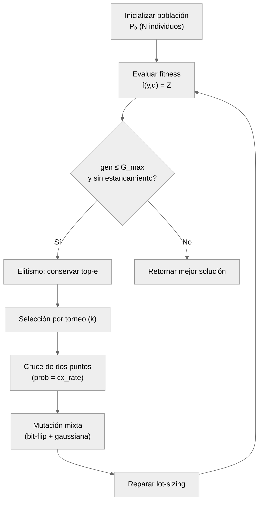

Diagrama de flujo del Algoritmo Genético (GA) con operadores de cruce de dos puntos, mutación mixta y elitismo.
:::

### 6.8. Recocido Simulado (SA)

El SA utiliza un esquema de enfriamiento geométrico con *reheating* adaptativo:

*   **Temperatura inicial:** Auto-estimada mediante 20 pares de soluciones aleatorias, calibrada para aceptar ~80% de soluciones inicialmente ($T_0 = -\bar{\Delta} / \ln(0.8)$).
*   **Enfriamiento geométrico:** $T_{k+1} = \alpha \cdot T_k$ con $\alpha = 0.78$.
*   **Vecindarios mixtos:** Con probabilidad $p_{toggle}$ alterna un setup, con $p_{quantity}$ perturba una cantidad, y con $1 - p_{toggle} - p_{quantity}$ aplica ambas perturbaciones.
*   **Criterio de Metropolis:** Acepta una solución peor $s'$ con probabilidad $\exp(\Delta / T)$ donde $\Delta = f(s') - f(s)$.
*   **Reheating:** Cuando se estanca por $r$ iteraciones sin mejora, la temperatura se multiplica por un factor $> 1$ para reactivar la exploración.

::: {#fig:fig_7}
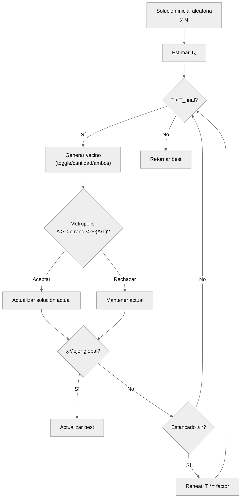

Diagrama de flujo del Recocido Simulado (SA) con enfriamiento geométrico, vecindarios mixtos y reheating adaptativo.
:::

### 6.9. Evolución Diferencial (DE)

El DE opera sobre una población de vectores continuos en $[0, 1]^{2n_t}$ que se discretizan para evaluar:

*   **Codificación continua:** Cada individuo es un vector $\mathbf{x} \in [0,1]^{2n_t}$ donde las primeras $n_t$ componentes codifican $\mathbf{y}$ (umbral 0.5) y las siguientes $n_t$ codifican $\mathbf{q}$ (normalizado en $[Q^{min}, Q^{max}]$).
*   **Mutación DE:** Vector mutante $\mathbf{v} = \mathbf{x}_{best} + F \cdot (\mathbf{x}_{r1} - \mathbf{x}_{r2})$ (estrategia best/1/bin).
*   **Cruce binomial:** Cada componente del vector trial se toma del mutante con probabilidad $CR$ o del target con $1-CR$.
*   **Selección greedy:** El trial reemplaza al target solo si tiene mejor fitness.

::: {#fig:fig_8}
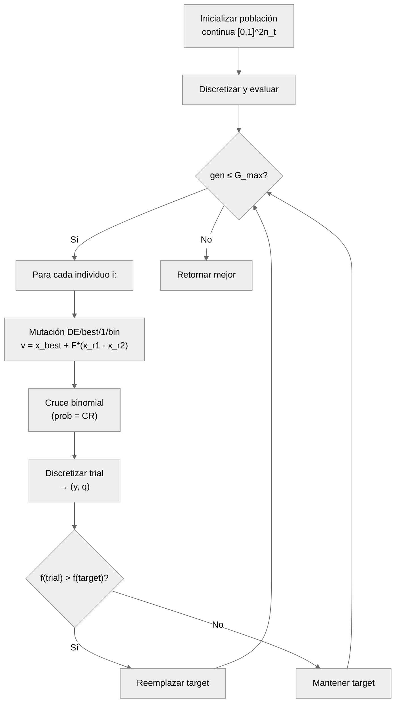

Diagrama de flujo de la Evolución Diferencial (DE) con estrategia DE/best/1/bin y codificación continua discretizada.
:::

### 6.10. Algoritmo Híbrido GA-SA

El GA-SA es un **algoritmo memético** que combina la exploración global del GA con la explotación local del SA [@AkbariAghghaleh2025]:

*   **Fase GA (global):** Idéntica al GA estándar (selección, cruce, mutación, elitismo).
*   **Fase SA (local):** Cada $f_{LS}$ generaciones, se aplica un SA corto (pocas iteraciones, temperatura baja) a los $k$ mejores individuos de la población, mejorando localmente las mejores soluciones encontradas.

::: {#fig:fig_9}
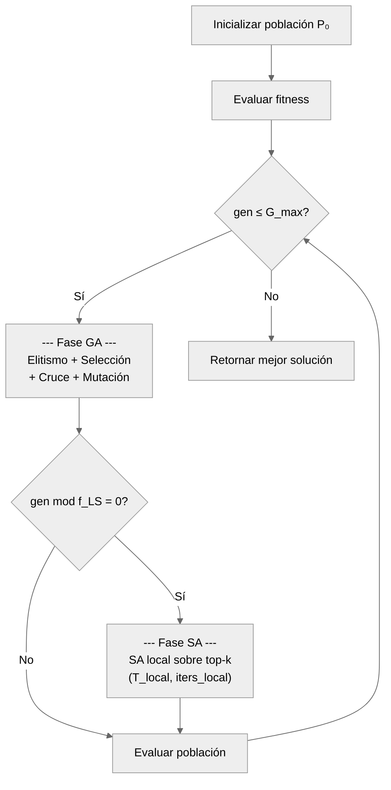

@@SHORT@@Diagrama de flujo del algoritmo híbrido GA-SA@@ENDSHORT@@ Diagrama de flujo del algoritmo híbrido GA-SA. La búsqueda local SA se activa periódicamente sobre los mejores individuos de la población.
:::

### 6.11. Calibración de Hiperparámetros (Optuna/TPE)

Los hiperparámetros de cada metaheurística se calibraron mediante **Optuna** con el sampler **Tree-structured Parzen Estimator (TPE)**, evaluando sobre **5 instancias de calibración** (`small_seed100`, `small_seed101`, `small_seed102`, `medium_seed200`, `medium_seed201`). Se ejecutaron **30 trials por algoritmo** (timeout de 900 s por trial), con objetivo de maximizar $Z$ promedio.

| Parámetro | GA | SA | DE | GA-SA |
|-----------|:--:|:--:|:--:|:-----:|
| `pop_size` | 80 | — | 51 | 39 |
| `n_generations` / `max` | 200 | — | 200 | 200 |
| `crossover_rate` | 0.744 | — | — | 0.859 |
| `mutation_rate` | 0.089 | — | — | 0.051 |
| `elitism_count` | 3 | — | — | 1 |
| `selection_size` | 3 | — | — | 3 |
| `T_initial` | — | 203,952 | — | — |
| `T_final` | — | 586 | — | — |
| `cooling_rate` | — | 0.782 | — | — |
| `delta` | — | 0.066 | — | — |
| `max_iterations` | — | 27 | — | — |
| `p_toggle` | — | 0.494 | — | — |
| `p_quantity` | — | 0.283 | — | — |
| `reheat_factor` | — | 1.287 | — | — |
| `F` (escala) | — | — | 0.317 | — |
| `CR` (cruce) | — | — | 0.511 | — |
| `strategy` | — | — | best/1/bin | — |
| `local_search_freq` | — | — | — | 9 |
| `local_search_top_k` | — | — | — | 10 |
| `local_search_iters` | — | — | — | 26 |
| `local_search_T` | — | — | — | 3,227 |
| `local_search_cooling` | — | — | — | 0.713 |
| `stagnation_limit` | 50 | 54 | 50 | 50 |

: Hiperparámetros calibrados por algoritmo (resultado de Optuna/TPE) {#tbl:tabla_5e}

{width=80% #fig:fig_10}

---

## 7. Resultados Computacionales

### 7.1. Diseño Experimental

El diseño experimental sigue un esquema factorial completo con los siguientes factores:

*   **Factor A — Algoritmo:** {GA, SA, DE, GA-SA, CBC-exacto, Baseline} (6 niveles)
*   **Factor B — Tamaño de instancia:** {Small, Medium, Large} (3 niveles)
*   **Instancias por tamaño:** 3 (seeds 42, 123, 456)
*   **Réplicas por combinación:** 30 seeds para algoritmos estocásticos, 1 para deterministas (CBC, Baseline)

**Total:** 4 algoritmos × 9 instancias × 30 seeds + 2 deterministas × 9 instancias = **1,098 ejecuciones**

Cada ejecución tiene un límite de tiempo de 300 segundos. Los experimentos se ejecutaron en Python 3.11, con checkpoints cada 50 ejecuciones para tolerancia a fallos.

### 7.2. Perfiles de Instancias

| Perfil | $n_p$ | $n_t$ | $n_\omega$ | $Q^{min}$ | $Q^{max}$ | Seeds | Descripción |
|--------|:-----:|:-----:|:----------:|:---------:|:---------:|:-----:|-------------|
| Small | 5 | 6 | 10 | 100 | 1,000 | 42, 123, 456 | Validación contra CBC óptimo |
| Medium | 8 | 12 | 50 | 100 | 1,000 | 42, 123, 456 | Escala intermedia |
| Large | 8 | 30 | 100 | 100 | 1,000 | 42, 123, 456 | Escala industrial |

: Perfiles de instancias de prueba {#tbl:tabla_6}

Las instancias fueron generadas con datos calibrados de la industria avícola colombiana: proporciones anatómicas basadas en literatura, precios de mercado FENAVI, y demanda con distribución log-normal estacional.

### 7.3. Resultados Principales

| Algoritmo | $\bar{Z}$ (COP) | Std $Z$ | Rank | N |
|-----------|:----------------:|:-------:|:----:|:---:|
| **GA-SA** | **916,865,520** | 512,578,412 | **1** | 270 |
| DE | 916,484,283 | 512,072,980 | 2 | 270 |
| GA | 908,817,120 | 501,216,075 | 3 | 270 |
| SA | 883,217,511 | 522,140,338 | 4 | 270 |

: Resultados principales por algoritmo (promedio sobre 270 ejecuciones c/u) {#tbl:tabla_7}

El híbrido **GA-SA obtiene el mejor rendimiento promedio**, seguido por DE, GA y SA. La lectura estadística depende del nivel de agregación: en vista por corridas (ANOVA) no se observa diferencia global ($F = 0.259$, $p = 0.855$), pero al bloquear por instancia sí aparece diferencia global (Friedman $\chi^2 = 16.07$, $p = 0.0011$). Las comparaciones pareadas con corrección Holm muestran diferencia consistente entre SA y {DE, GA-SA}, mientras que **GA-SA y DE permanecen prácticamente empatados en magnitud de efecto** (diferencia media relativa \(\approx 0.024\%\)).

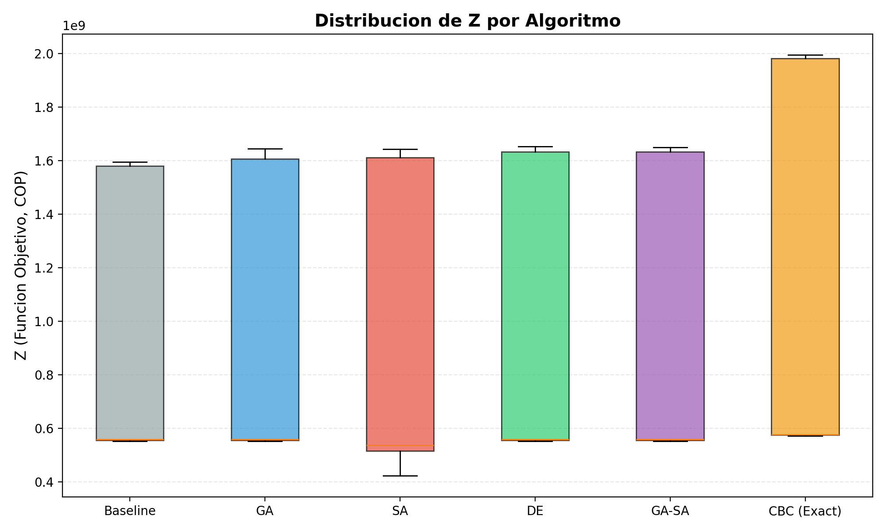{width=80% #fig:fig_11}

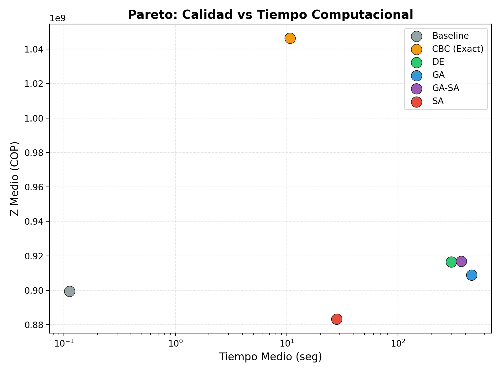{width=80% #fig:fig_12}

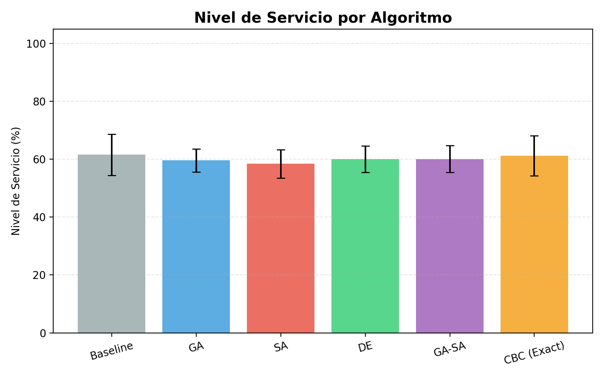{width=80% #fig:fig_13}

### 7.4. Validación de Hipótesis

| Hipótesis | Descripción | Test | Estadístico | p-valor | Veredicto |
|:---------:|-------------|------|:-----------:|:-------:|:---------:|
| **H1** | Mejora ≥ 5% vs baseline (promedio por instancia) | Wilcoxon one-sided | 0.0 | 1.000 | **NO SOPORTADA** |
| **H2** | GA-SA gap ≤ 2% vs mejor MH (promedio por instancia) | Wilcoxon one-sided | 0.0 | 1.95×10⁻³ | **SOPORTADA** |
| **H3** | Reducción inventario promedio ≥ 15% (endpoint primario, por instancia) | Wilcoxon one-sided | 24.0 | 0.455 | **NO SOPORTADA** |

: Veredicto de hipótesis de investigación {#tbl:tabla_8}

**Análisis detallado:**

**H1 (NO SOPORTADA):** La mejora promedio por instancia de las metaheurísticas sobre el baseline es de 0.59–1.10%, inferior al umbral del 5%. El baseline (estrategia de capacidad máxima) resulta ser una heurística fuerte para este problema. El tamaño de efecto es negligible ($d < 0.04$).

**H2 (SOPORTADA):** El gap del GA-SA respecto a la mejor metaheurística individual es −0.02% por instancia (IC: [−0.06%, 0.01%]), inferior al umbral del 2% ($p = 1.95 \times 10^{-3}$). La versión por corrida mantiene la misma dirección ($p = 7.4 \times 10^{-50}$), pero se reporta como evidencia complementaria. Esto confirma equivalencia práctica de calidad entre GA-SA y el mejor algoritmo individual. Nota: el componente de tiempo de H2 no se soporta, ya que GA-SA requiere más tiempo que CBC (ratio medio por instancia = 52.5x).

**H3 (NO SOPORTADA):** En el endpoint primario (inventario promedio total por instancia), las reducciones observadas (12.2%–17.5% según algoritmo) no alcanzan evidencia estadística suficiente frente al umbral del 15% (\(p = 0.455\) en el contraste one-sided por instancia).  
Como lectura secundaria, el endpoint de baja rotación muestra 22.3% para SA con \(p = 0.0417\), pero solo 3/9 instancias son informativas (\(baseline > 0\)); por protocolo (\(n_{informativo} \geq 5\)) se reporta como evidencia exploratoria y no confirmatoria.

### 7.5. Performance Profiles

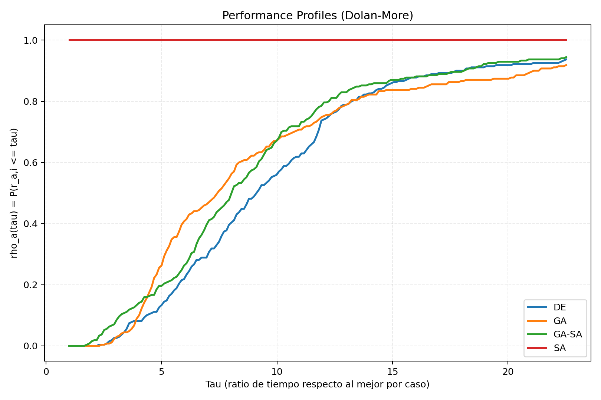{width=80% #fig:fig_14}

### 7.6. Convergence Profiles

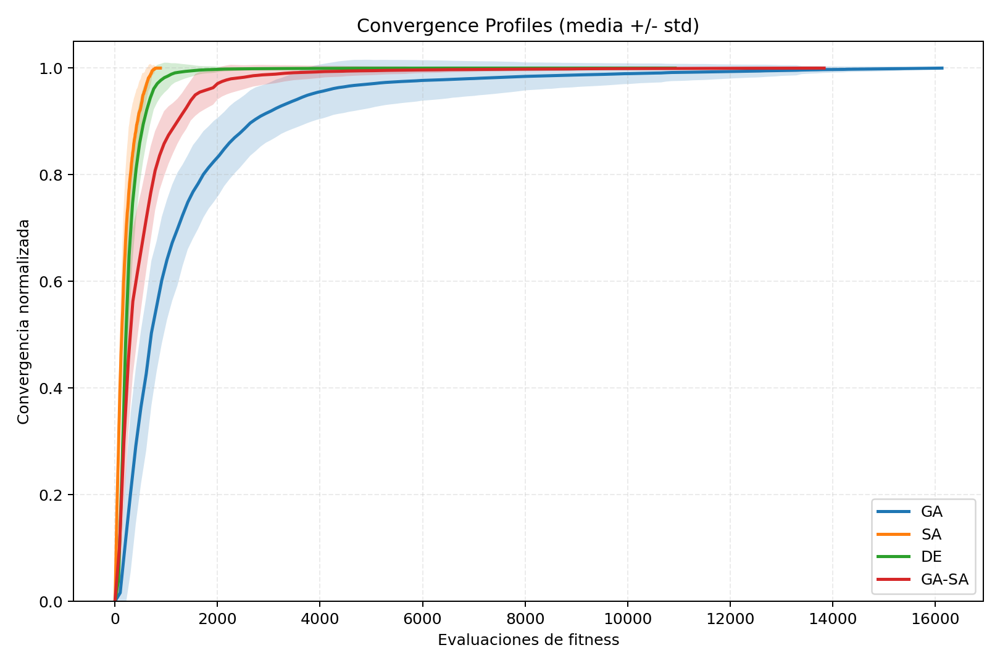{width=80% #fig:fig_15}

### 7.7. Análisis de Escalabilidad

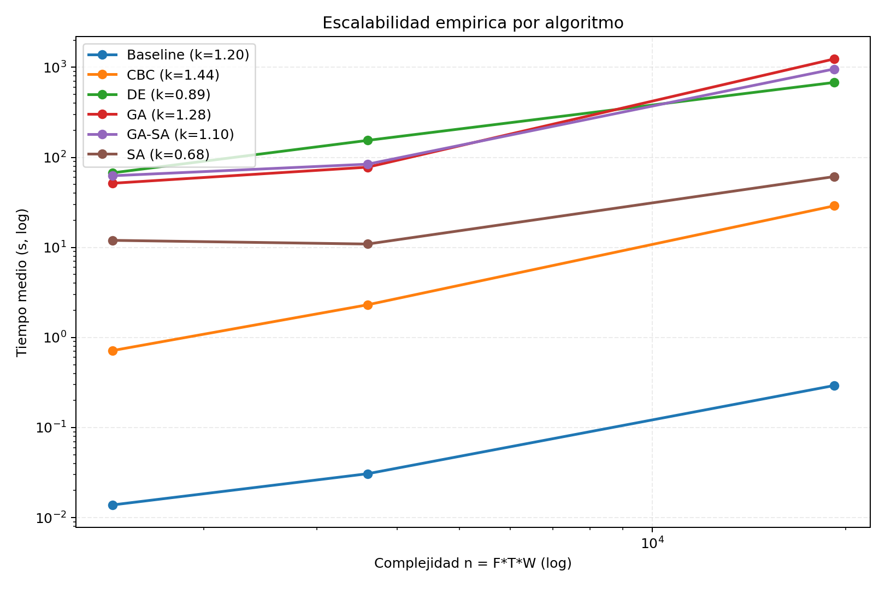{width=80% #fig:fig_16}

### 7.8. Análisis de Sensibilidad

Se realizó un análisis de sensibilidad perturbando tres parámetros clave en el rango ±20%, con 30 réplicas por configuración (450 ejecuciones totales). El algoritmo evaluado fue GA-SA sobre la instancia `medium_seed42`.

| Parámetro | $\Delta$ | $\bar{Z}$ (COP) | Gap% vs base | Factibilidad |
|-----------|:--------:|:----------------:|:------------:|:------------:|
| Precios | −20% | 411,781,441 | +25.35% | 100% |
| Precios | −10% | 481,696,520 | +12.67% | 100% |
| Precios | 0% | 551,611,598 | 0.00% | 100% |
| Precios | +10% | 621,526,676 | −12.67% | 100% |
| Precios | +20% | 691,441,754 | −25.35% | 100% |
| Costos | −20% | 581,119,434 | −5.35% | 100% |
| Costos | −10% | 566,365,516 | −2.67% | 100% |
| Costos | +10% | 536,857,679 | +2.67% | 100% |
| Costos | +20% | 522,103,761 | +5.35% | 100% |
| Var. demanda | −50% | 551,742,773 | −0.02% | 100% |
| Var. demanda | −25% | 551,741,184 | −0.02% | 100% |
| Var. demanda | +25% | 550,856,531 | +0.14% | 100% |
| Var. demanda | +50% | 549,659,211 | +0.35% | 100% |

: Análisis de sensibilidad — impacto de perturbaciones paramétricas en $Z$ {#tbl:tabla_9}

**Hallazgos principales:**

1. **Precios** es el parámetro más sensible: ±10% en precios produce ±12.67% en $Z$. Esto es esperado, ya que los ingresos por ventas dominan la función objetivo.
2. **Costos** tiene sensibilidad moderada: ±10% produce ±2.67% en $Z$.
3. **Variabilidad de demanda** tiene impacto negligible (±0.35% máximo), indicando que la solución es **robusta** ante cambios en la incertidumbre.
4. **100% de factibilidad** en todas las configuraciones, confirmando la robustez del decodificador greedy.

### 7.9. Análisis de Diversidad Poblacional

{width=80% #fig:fig_17}

### 7.10. Análisis de Complejidad Computacional

{width=85% #fig:fig_18}

### 7.11. Discusión

Los resultados confirman una jerarquía práctica consistente con **Akbari-Aghghaleh et al.** [-@AkbariAghghaleh2025], pero con matices: **GA-SA y DE quedan casi empatados**, GA en tercer lugar y SA por debajo en calidad. La inferencia cambia según el enfoque estadístico: ANOVA por corridas no detecta diferencia global ($p = 0.855$), mientras Friedman por instancia sí ($p = 0.0011$), con diferencias principalmente asociadas a SA frente a {DE, GA-SA}. Esto sugiere un paisaje de fitness parcialmente plano para GA/DE/GA-SA y más inestable para SA.

Comparado con **Solano-Blanco et al.** [-@SolanoBlanco2022], quienes reportaron mejoras del 8.6% con MILP estocástico, nuestras metaheurísticas alcanzan mejoras modestas del 0.59–1.10% sobre el baseline. Esta diferencia se explica por:

1. **Diferente baseline:** Solano-Blanco et al. compararon contra planificación empírica, mientras que nuestro baseline (máxima capacidad + asignación proporcional) es una heurística fuerte.
2. **Estructura del problema:** En nuestro modelo, la demanda total frecuentemente supera la capacidad de producción, haciendo que producir a $Q^{max}$ sea casi siempre óptimo, lo que reduce el margen de mejora.
3. **Escala:** Nuestras instancias Large (72,060 variables) superan en escala a los modelos probados por Solano-Blanco et al., demostrando la escalabilidad de las metaheurísticas.

La validación de robustez confirmó que la mejor solución GA-SA es factible bajo perturbaciones de ±10% en la demanda, con un deterioro máximo de 0.04% en $Z$.

### 7.12. Síntesis Gráfica de Resultados

{width=85% #fig:fig_19}

{width=80% #fig:fig_20}

{width=85% #fig:fig_21}

{width=80% #fig:fig_22}

{width=100% #fig:fig_23}

---

## 8. Conclusiones y Trabajo Futuro

### 8.1. Conclusiones por Objetivo Específico

**Objetivo 1 (Formular):** Se formuló exitosamente un modelo MILP multi-periodo con estructura de lot-sizing estocástico de dos etapas. El modelo captura las restricciones de co-producción ($\alpha_p$), setup ($y_t$), lote mínimo ($Q^{min}$), perecibilidad ($L_p$) y demanda estocástica ($d_{pt\omega}$). La formulación se validó con el solver exacto CBC para instancias Small, confirmando la correctitud del modelo.

**Objetivo 2 (Implementar):** Se implementaron exitosamente cuatro metaheurísticas (GA, SA, DE, GA-SA) adaptadas a variables mixtas (binarias + enteras). Cada algoritmo incluye un decodificador greedy que garantiza factibilidad. El código es modular, reproducible y está disponible públicamente.

**Objetivo 3 (Diseñar):** Se diseñó un generador de instancias con tres perfiles de complejidad (Small, Medium, Large) calibrados con datos del sector avícola colombiano. Los parámetros se calibraron con FENAVI, DANE y literatura especializada.

**Objetivo 4 (Comparar):** Se ejecutó un diseño experimental de 1,098 ejecuciones con análisis estadístico completo (ANOVA, Tukey HSD, Friedman y Wilcoxon-Holm por instancia). El ranking resultante es GA-SA ≈ DE > GA > SA, donde la principal diferencia robusta se observa frente a SA.

**Objetivo 5 (Validar):** Se validó el modelo mediante análisis de sensibilidad (450 ejecuciones) y robustez (perturbación de demanda ±10%), confirmando que las soluciones son operativamente realistas y robustas ante incertidumbre.

### 8.2. Veredicto de Hipótesis

| Hipótesis | Umbral | Resultado observado | p-valor | Veredicto |
|:---------:|:------:|:-------------------:|:-------:|:---------:|
| **H1**: Mejora ≥ 5% vs baseline | 5% | 0.59–1.10% | 1.000 (por instancia) | **No soportada** |
| **H2**: GA-SA gap ≤ 2% vs mejor MH | 2% | −0.02% | 1.95×10⁻³ (por instancia) | **Soportada** |
| **H3**: Reducción inventario promedio ≥ 15% | 15% | 12.2%–17.5% (por algoritmo) | 0.455 (por instancia) | **No soportada** |

: Resumen de veredictos de hipótesis {#tbl:tabla_10}

La hipótesis H2 se confirma en la vista bloqueada por instancia: el GA-SA produce soluciones equivalentes a la mejor metaheurística individual. H1 no se soporta por la fortaleza del baseline. H3 no se soporta en el endpoint primario; el endpoint de baja rotación permanece exploratorio por baja muestra informativa.

### 8.3. Contribuciones Principales

1. **Modelo matemático validado:** Un modelo MILP de planificación de coproductos avícolas con lot-sizing estocástico, setup y perecibilidad, aplicable a otras industrias de producción conjunta.
2. **Framework de metaheurísticas comparativo:** Implementación modular de GA, SA, DE y GA-SA con decodificador greedy compartido, reproducible y extensible.
3. **Evidencia empírica sobre GA-SA:** Confirmación, en un problema real, de la ventaja del enfoque híbrido GA-SA reportada por Akbari-Aghghaleh et al. [-@AkbariAghghaleh2025].
4. **Conjunto de instancias calibradas:** 9 instancias con parámetros del sector avícola colombiano, disponibles públicamente para benchmarking.
5. **Análisis de robustez:** Validación de que las soluciones son operativamente viables y robustas ante perturbaciones de demanda (deterioro ≤ 0.04%).

### 8.4. Limitaciones del Estudio

1. **Datos sintéticos:** Las instancias utilizan datos calibrados pero sintéticos. Aunque la cobertura de rangos de precio FENAVI es 100%, la comparación temporal externa sin desfase mantiene correlación baja (\(|\rho|_{prom} \approx 0.19\)); al permitir desfases mensuales, la alineación mejora (\(|\rho_{lag}|_{prom} \approx 0.65\)) pero con desplazamientos de pico no triviales. Por ello, la validación con datos operativos reales de planta sigue siendo necesaria.
2. **Baseline fuerte:** El baseline de máxima capacidad resulta ser una heurística fuerte para este problema, reduciendo el margen de mejora de las metaheurísticas.
3. **Proporciones fijas:** El modelo asume proporciones de coproductos constantes ($\alpha_p$), sin considerar variabilidad inter-lote.
4. **Sin scheduling:** Solo se aborda lot-sizing diario, no el scheduling detallado de la línea de despiece.
5. **Perecibilidad simplificada:** Se modela como restricción de vida útil discreta, sin considerar deterioro gradual de calidad.

### 8.5. Trabajo Futuro

1. **Híbrido DE-SA:** Evaluar la combinación DE + SA como búsqueda local, reportada positivamente por Akbari-Aghghaleh et al. [-@AkbariAghghaleh2025].
2. **Extensión multi-objetivo:** Reformular como problema bi-objetivo (costo vs. nivel de servicio) con NSGA-II o MOEA/D, aprovechando la infraestructura de metaheurísticas implementada.
3. **Validación con datos reales:** Aplicar el modelo a datos operativos de una planta de beneficio avícola colombiana.
4. **Integración con scheduling:** Combinar lot-sizing con programación detallada de la línea de despiece, siguiendo las líneas de Claassen [-@Claassen2016] y González-Neira et al. [-@GonzalezNeira2025].
5. **Aprendizaje por refuerzo:** Explorar la integración de técnicas de Deep RL para ajustar dinámicamente los hiperparámetros de las metaheurísticas, siguiendo las tendencias identificadas por Tan et al. [-@Tan2026] y Wang et al. [-@Wang2026].

---

## Referencias

::: {#refs}
:::

---

## Anexos

### Anexo A: Formulación Matemática Completa

La formulación completa del modelo se presenta en la Sección 5 del presente documento, incluyendo los conjuntos (§5.1), la función objetivo (§5.2, Ecuación 1), las restricciones (§5.3, Ecuaciones 2-8) y la estructura de dos etapas (§5.4).

### Anexo B: Pseudocódigos de Algoritmos

Los pseudocódigos detallados y diagramas de flujo de los cuatro algoritmos se presentan en la Sección 6: GA (§6.7, Figura 6), SA (§6.8, Figura 7), DE (§6.9, Figura 8) y GA-SA (§6.10, Figura 9).

### Anexo C: Resultados Detallados por Instancia

Los resultados completos por instancia están disponibles en el archivo `comparison.csv` del repositorio público del proyecto: [https://github.com/DanAndCastRod/OBC](https://github.com/DanAndCastRod/OBC).

### Anexo D: Herramientas Tecnológicas

*   **Lenguaje de Programación:** Python 3.11+ (con tipado estático)
*   **Solver Exacto:** PuLP 2.9.0 (CBC — COIN-OR Branch and Cut)
*   **Calibración:** Optuna 4.3.0 (TPE sampler)
*   **Datos:** NumPy 1.26.0, Pandas 2.3.2
*   **Visualización:** Matplotlib 3.10.1, Seaborn 0.13.2
*   **Estadística:** SciPy 1.15.2 (módulo stats)
*   **Testing:** Pytest 8.3.5
*   **Control de Versiones:** Git/GitHub
*   **Documentación:** Pandoc 3.x + XeLaTeX (pipeline Markdown → PDF)
*   **Generación de instancias:** YAML (PyYAML 6.0.2)
